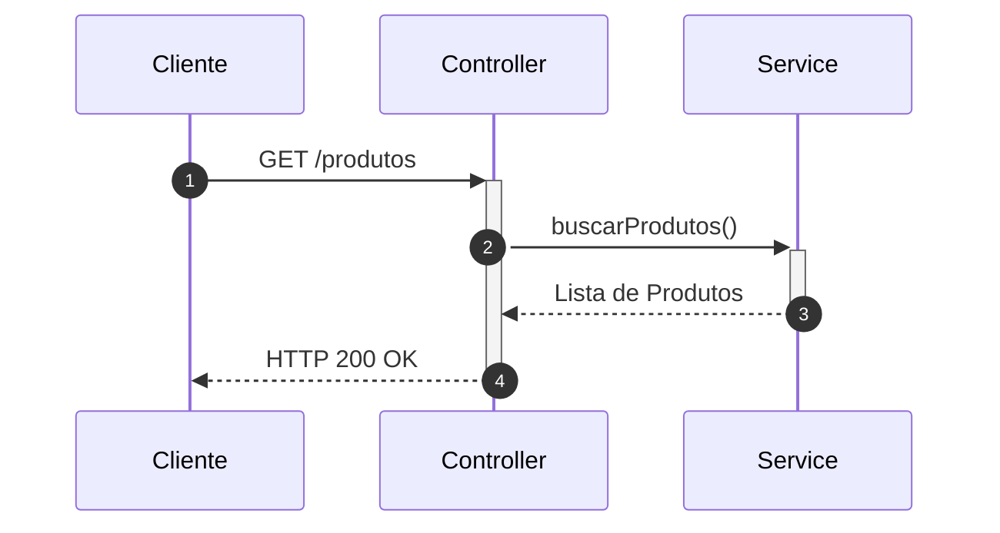
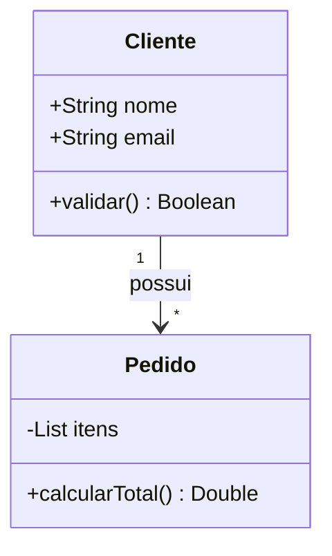

# Habilidade Auxiliar: Designer de Documentação e Diagramas (Mermaid)

Esta skill guia a inteligência artificial a elaborar documentações de software visualmente ricas, estruturadas e a desenhar diagramas e fluxogramas usando a sintaxe correta do **Mermaid.js**.

---

## 📐 Diretrizes de Sintaxe de Fluxogramas (Flowcharts)

Ao desenhar fluxogramas, utilize a declaração `flowchart` (em vez de `graph`) para obter renderizações modernas. 

### 1. Orientação do Fluxo
Defina a direção correta do diagrama na primeira linha:
- `TB` ou `TD` (Top to Bottom / Top-Down): Fluxo vertical de cima para baixo.
- `LR` (Left to Right): Fluxo horizontal da esquerda para a direita.
- `BT` (Bottom to Top) e `RL` (Right to Left).

### 2. Formatos e Formas de Nós
Escolha o nó que melhor represente o elemento semântico:
- **Retângulo Padrão**: `id1[Texto]`
- **Bordas Arredondadas**: `id2(Texto)` (Início/Fim de processos)
- **Estádio (Stadium)**: `id3([Texto])`
- **Sub-rotina**: `id4[[Texto]]` (Processos predefinidos)
- **Cilindro (Database)**: `id5[(Texto)]` (Armazenamento de dados)
- **Círculo**: `id6((Texto))`
- **Nó Assimétrico**: `id7>Texto]`
- **Losango (Decisão)**: `id8{Texto}` (Condicionais `if/else`)
- **Hexágono**: `id9{{Texto}}` (Preparação/Iterações)
- **Paralelogramo**: `id10[/Texto/]` ou `id11[\Texto\]` (Entrada/Saída de dados)
- **Trapézio**: `id12[/Texto\]` ou `id13[\Texto/]`
- **Duplo Círculo**: `id14(((Texto)))`

### 3. Conexões e Edges (Linhas)
Ajuste a semântica visual dos fluxos:
- **Seta Simples**: `A --> B`
- **Linha sem Seta**: `A --- B`
- **Linha com Texto**: `A -->|Texto| B` ou `A -- Texto --> B`
- **Linha Pontilhada**: `A -.-> B`
- **Linha Pontilhada com Texto**: `A -. Texto .-> B`
- **Linha Grossa (Thick)**: `A ==> B`
- **Linha Grossa com Texto**: `A == Texto ==> B`
- **Múltiplas Conexões**: `A --> B & C` ou `A & B --> C & D`
- **Setas Circulares ou Cruzadas**: `A --o B` (círculo) ou `A --x B` (cruz)
- **Comprimento customizado** (Adicione hifens/sinais para esticar linhas):
  - `--->` (mais longa que `-->`)
  - `====>` (mais longa que `==>`)
  - `-.-.->` (mais longa que `-.->`)

### 4. Subgrafos (Subgraphs)
Utilize subgrafos para agrupar e delimitar contextos (ex: Camadas lógicas em arquiteturas):
```mermaid
subgraph Camada_Dominio ["Camada de Domínio"]
    direction TB
    Entidade --> ObjetoValor
end
```

---

## 🚫 Prevenção de Erros de Sintaxe (Crítico)

Para evitar que o renderizador de Markdown ou a IDE quebrem ao processar o Mermaid, siga rigidamente estas regras:

1. **Palavras Reservadas**:
   - A palavra **`end`** (toda minúscula) é um delimitador de bloco em subgrafos. Se precisar escrever "end" em um nó ou texto, capitalize-a (`End`, `END`) ou cerque-a de aspas duplas: `id["Finalizar e fechar (end)"]`.
2. **Caracteres Especiais**:
   - Evite usar parênteses `()`, colchetes `[]`, chaves `{}`, barras `/` ou aspas soltas diretamente no rótulo do nó.
   - **Solução**: Sempre cerque rótulos contendo caracteres especiais ou espaços com aspas duplas, utilizando o formato: `id["Meu Rótulo (Contendo Parênteses)"]`.
3. **Conexões Ambíguas**:
   - Não inicie rótulos de nós conectados com as letras `o` ou `x` coladas nos hifens (ex: `A---oB` ou `A---xB` são interpretados como setas circulares ou cruzadas). Use espaços: `A --- oB`.

---

## 📚 Outros Diagramas Suportados

### 🔹 Diagramas de Sequência (`sequenceDiagram`)
Útil para detalhar fluxos transacionais e chamadas de APIs:


### 🔹 Diagramas de Classe (`classDiagram`)
Útil para detalhar a modelagem tática do DDD ou a estrutura interna de Design Patterns:


---

## 🤝 Integração com Outras Skills

- **Sob a Skill [software-architect](../software-architect/SKILL.md)**: Use diagramas do Mermaid para mapear a separação lógica de camadas (Layers), fluxo de integração de APIs e topologias de rede.
- **Sob as Skills de Design Patterns [dp-*](../dp-factory-method/SKILL.md)**: Use diagramas de classe (`classDiagram`) do Mermaid para esboçar a relação conceitual de herança, composição e interfaces dos padrões estruturados ou comportamentais envolvidos.
