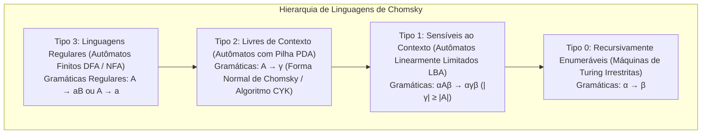
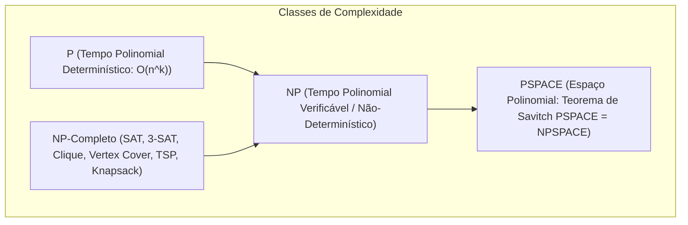

# Algoritmos Avançados, Estruturas de Dados e Teoria da Computação

Esta skill estabelece a fundamentação matemática, limites formais de computabilidade, análise assintótica rigorosa e projeto de estruturas de dados e algoritmos de alto desempenho, unificando os tratados clássicos do **CLRS** (*Introduction to Algorithms*), **Michael Sipser** (*Introduction to the Theory of Computation*) e **Donald Knuth** (*TAOCP*).

---

## 🏛️ 1. Hierarquia de Chomsky, Autômatos e Linguagens Formais



### 1.1 Autômatos Finitos e Lema do Bombeamento (*Pumping Lemma*)
- **DFA**: 5-tupla $(Q, \Sigma, \delta, q_0, F)$ com função determinística de transição $\delta: Q \times \Sigma \to Q$.
- **Lema do Bombeamento para Regulares**: Para toda linguagem regular $L$, existe $p \ge 1$ tal que $\forall s \in L$ com $|s| \ge p$, $s = xyz$ com $|xy| \le p$, $|y| > 0$ e $x y^i z \in L, \forall i \ge 0$.

### 1.2 Máquinas de Turing, Decidibilidade e Teorema de Rice
- **Problema da Parada ($A_{TM}$)**: Indecidível por contradição através do argumento de diagonalização de Cantor.
- **Teorema de Rice**: Qualquer propriedade semântica não-trivial (que não seja satisfeita por nenhuma linguagem ou seja satisfeita por todas) das linguagens reconhecíveis por Máquinas de Turing é indecidível.

---

## ⚡ 2. Teoria da Complexidade Computacional (P vs NP vs PSPACE)



- **Teorema de Cook-Levin**: O problema SAT (Satisfatibilidade Booleana) é NP-Completo.
- **Redução de Karp ($A \le_P B$)**: $A$ se reduz em tempo polinomial a $B$. Se $B \in P$, então $A \in P$. Se $A$ é NP-Difícil, então $B$ é NP-Difícil.

---

## 📊 3. Análise Assintótica e Teorema Mestre (CLRS)

### 3.1 Teorema Mestre para Divisão e Conquista ($T(n) = aT(n/b) + f(n)$)
Expoente crítico $c_{\text{crit}} = \log_b a$:
1. **Caso 1**: Se $f(n) = \mathcal{O}(n^c)$ com $c < c_{\text{crit}}$, então $T(n) = \Theta(n^{\log_b a})$.
2. **Caso 2**: Se $f(n) = \Theta(n^{c_{\text{crit}}} \log^k n)$ com $k \ge 0$, então $T(n) = \Theta(n^{\log_b a} \log^{k+1} n)$.
3. **Caso 3**: Se $f(n) = \Omega(n^c)$ com $c > c_{\text{crit}}$ e $a f(n/b) \le k f(n)$ para $k < 1$, então $T(n) = \Theta(f(n))$.

---

## 🌲 4. Estruturas de Dados Balanceadas e Indexação Espacial

| Estrutura | Inserção | Busca | Remoção | Invariante & Aplicação |
| :--- | :---: | :---: | :---: | :--- |
| **Árvore AVL** | $\mathcal{O}(\log n)$ | $\mathcal{O}(\log n)$ | $\mathcal{O}(\log n)$ | Fator de Balanceamento $|h_L - h_R| \le 1$. Rotações simples e duplas. |
| **Rubro-Negra (Red-Black)** | $\mathcal{O}(\log n)$ | $\mathcal{O}(\log n)$ | $\mathcal{O}(\log n)$ | Raiz preta, filhos de nó vermelho são pretos. Padrão em `std::map`. |
| **B/B+ Tree** | $\mathcal{O}(\log_B n)$ | $\mathcal{O}(\log_B n)$ | $\mathcal{O}(\log_B n)$ | Indexação de blocos em sistemas de arquivos e bancos de dados. |
| **Segment Tree** | $\mathcal{O}(\log n)$ | $\mathcal{O}(\log n)$ | $\mathcal{O}(\log n)$ | Consultas de intervalo (Range Sum/Min) com *Lazy Propagation*. |
| **Fenwick Tree (BIT)** | $\mathcal{O}(\log n)$ | $\mathcal{O}(\log n)$ | - | Prefix Sums em espaço $\mathcal{O}(n)$ usando manipulação de bits (`x & -x`). |
| **Disjoint Set Union (DSU)** | $\mathcal{O}(\alpha(n))$ | $\mathcal{O}(\alpha(n))$ | - | Union by Rank + Path Compression. Quase tempo constante ($\alpha(n) \le 4$). |

---

## 🕸️ 5. Algoritmos em Grafos e Otimização Combinatória

```python
import heapq
from typing import TypeVar, Callable, List, Optional, Dict, Tuple

T = TypeVar('T')

def a_star(
    initial: T,
    goal_test: Callable[[T], bool],
    successors: Callable[[T], List[Tuple[T, float]]],
    heuristic: Callable[[T], float]
) -> Optional[List[T]]:
    """Algoritmo de Busca Heurística A* com Heurística Admissível e Consistente."""
    frontier: List[Tuple[float, float, T]] = []
    heapq.heappush(frontier, (heuristic(initial), 0.0, initial))
    came_from: Dict[T, Optional[T]] = {initial: None}
    cost_so_far: Dict[T, float] = {initial: 0.0}

    while frontier:
        _, current_cost, current = heapq.heappop(frontier)
        if goal_test(current):
            path: List[T] = [current]
            while came_from[current] is not None:
                current = came_from[current]
                path.append(current)
            path.reverse()
            return path

        for neighbor, edge_cost in successors(current):
            new_cost = current_cost + edge_cost
            if neighbor not in cost_so_far or new_cost < cost_so_far[neighbor]:
                cost_so_far[neighbor] = new_cost
                priority = new_cost + heuristic(neighbor)
                heapq.heappush(frontier, (priority, new_cost, neighbor))
                came_from[neighbor] = current
    return None
```
