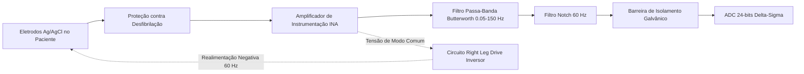

# Engenharia Biomédica, Instrumentação, Sinais Fisiológicos e Imagens Médicas

Esta skill estabelece os princípios teóricos, circuitos eletrônicos de condicionamento, física médica de radiação ionizante/não-ionizante e padrões de informática em saúde baseados nas obras clássicas de **John G. Webster** (*Medical Instrumentation*) e **Jerrold T. Bushberg** (*The Essential Physics of Medical Imaging*).

---

## 🫀 1. Instrumentação de Biopotenciais e Condicionamento de Sinais

### 1.1 Amplificador de Instrumentação (INA) com Circuito de Perna Direita (RLD)
Para sinais de microvolts a milivolts (ECG: $\approx 1\text{ mV}$, EEG: $\approx 50\ \mu\text{V}$, EMG: $\approx 1-5\text{ mV}$):
$$V_{out} = \left( 1 + \frac{2 R_1}{R_{gain}} \right) \left( \frac{R_3}{R_2} \right) (V_2 - V_1)$$

- **Circuito Right Leg Drive (RLD)**: Captura a tensão de modo comum $V_{cm} = \frac{V_1 + V_2}{2}$, inverte a fase através de um amplificador operacional auxiliar e reinjeta uma corrente contrária no corpo do paciente (eletrodo RL), elevando a Rejeição de Modo Comum efetiva para $\text{CMRR} > 100\text{ dB}$ e suprimindo o ruído de rede elétrica de 60 Hz.
- **Isolamento Galvânico & Segurança Elétrica (IEC 60601-1)**:
  - Uso de optoacopladores ou transformadores de isolamento galvânico ($> 4\text{ kV}$).
  - Limite de corrente de fuga no paciente: $< 10\ \mu\text{A}$ (Tipo CF - contato cardíaco direto) e $< 100\ \mu\text{A}$ (Tipo BF).

---

## 🩻 2. Física das Imagens Médicas e Reconstrução Tomográfica

### 2.1 Tomografia Computadorizada (CT) e Transformada de Radon
A atenuação linear de raios-X em um feixe colimado segue a lei de Beer-Lambert:
$$I = I_0 \exp\left( -\int_L \mu(x,y) \, ds \right)$$
A projeção tomográfica $p(\theta, r)$ é a **Transformada de Radon** da distribuição de atenuação $\mu(x,y)$:
$$p(\theta, r) = \mathcal{R}\{\mu(x,y)\} = \int_{-\infty}^\infty \int_{-\infty}^\infty \mu(x,y) \delta(x\cos\theta + y\sin\theta - r) \, dx \, dy$$

- **Teorema do Corte Central (Fourier Slice Theorem)**: A transformada de Fourier 1D de uma projeção em ângulo $\theta$ é idêntica a uma fatia radial passando pela origem da transformada de Fourier 2D do objeto $\mu(x,y)$:
  $$\mathcal{F}_{1D}\{p(\theta, r)\} = \mathcal{F}_{2D}\{\mu(x,y)\}(u = \omega\cos\theta, v = \omega\sin\theta)$$
- **Retroprojeção Filtrada (Filtered Backprojection - FBP)**: Aplicação do filtro de rampa (*Ram-Lak Filter* $|\omega|$) no domínio da frequência antes da retroprojeção espacial para eliminar o borramento $1/r$.

### 2.2 Ressonância Magnética Nuclear (MRI)
- **Equações de Bloch e Relaxamento**:
  $$\frac{d\vec{M}}{dt} = \vec{M} \times \gamma \vec{B} - \frac{M_x \hat{i} + M_y \hat{j}}{T_2} - \frac{(M_z - M_0)\hat{k}}{T_1}$$
  onde $T_1$ é o tempo de relaxamento longitudinal (spin-rede) e $T_2$ é o tempo de relaxamento transversal (spin-spin).
- **Codificação Espacial e Espaço-$k$**: Os gradientes magnéticos lineares $G_x$ (leitura de frequência) e $G_y$ (codificação de fase) mapeiam a magnetização transversal diretamente no espaço-$k$:
  $$k_x(t) = \frac{\gamma}{2\pi} \int_0^t G_x(\tau)\, d\tau, \quad k_y(t) = \frac{\gamma}{2\pi} \int_0^t G_y(\tau)\, d\tau$$
  A imagem anatômica final é obtida aplicando a Transformada Inversa de Fourier 2D ($\text{iFFT}$) sobre a matriz do espaço-$k$.

### 2.3 Ultrassonografia e Medicina Nuclear
- **Ultrassom Doppler**: Desvio de frequência $\Delta f = \frac{2 f_0 v \cos\theta}{c}$ para quantificação de velocidade do fluxo sanguíneo em artérias e válvulas cardíacas.
- **Tomografia por Emissão de Pósitrons (PET)**: Detecção em coincidência temporal de pares de fótons gama colineares de 511 keV gerados pela aniquilação pósitron-elétron ($e^+ + e^- \rightarrow 2\gamma$).

---

## 🏥 3. Informática em Saúde e Interoperabilidade (DICOM & HL7/FHIR)

- **DICOM (Digital Imaging and Communications in Medicine)**: Padrão binário IOD contendo cabeçalho rico de tags (Patient ID `(0010,0020)`, Modality `(0008,0060)`, Pixel Data `(7FE0,0010)`).
- **HL7 FHIR (Fast Healthcare Interoperability Resources)**: Recursos RESTful em JSON/XML (ex: `Patient`, `Observation`, `DiagnosticReport`, `ImagingStudy`) integrados com autenticação OAuth 2.0 / OpenID Connect sob o perfil **SMART on FHIR**.
