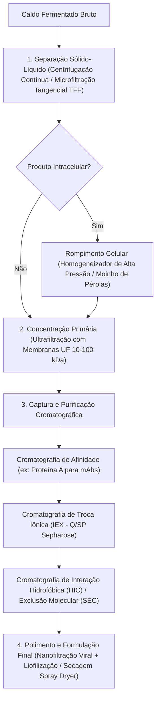

# Biotecnologia e Engenharia de Bioprocessos (Doran & Shuler)

Esta skill estabelece os fundamentos cinéticos, matemáticos e operacionais para o cultivo em larga escala de microrganismos, células vegetais e de mamíferos, dimensionamento e automação de biorreatores, recuperação e purificação a jusante (*downstream processing*), além de conformidade com normas regulatórias de biossegurança e qualidade biofarmacêutica.

---

## 🦠 1. Cinética Microbiana e Modelagem de Crescimento Celular

### 1.1 Modelo de Monod e Fases de Crescimento
A velocidade específica de crescimento celular $\mu$ ($h^{-1}$) em função da concentração de substrato limitante $S$ ($g/L$):

$$\mu = \mu_{max} \frac{S}{K_s + S}$$

onde $\mu_{max}$ é a taxa máxima de crescimento e $K_s$ é a constante de afinidade pelo substrato (concentração onde $\mu = \frac{\mu_{max}}{2}$).

- **Variação da Biomassa ($X$) e Consumo de Substrato ($S$) em Batelada**:
  $$\frac{dX}{dt} = \mu X - k_d X$$
  $$\frac{dS}{dt} = -\frac{1}{Y_{X/S}} \frac{dX}{dt} - m_s X$$
  onde $Y_{X/S} = \frac{\Delta X}{-\Delta S}$ é o fator de rendimento de biomassa e $m_s$ é o coeficiente de manutenção celular ($g_{subs}/g_{bio} \cdot h$).

### 1.2 Cinética de Formação de Produtos (Luedeking-Piret)
A taxa de formação de produto $q_p = \frac{1}{X}\frac{dP}{dt}$ correlaciona-se com o crescimento e a manutenção:

$$q_p = \alpha \mu + \beta \implies \frac{dP}{dt} = \alpha \frac{dX}{dt} + \beta X$$

- **Classificação de Produtos**:
  1. **Associados ao Crescimento ($\beta \approx 0$):** Ex.: Etanol, ácido lático.
  2. **Não-associados ao Crescimento ($\alpha \approx 0$):** Ex.: Antibióticos secundários, metabólitos idiotróficos na fase estacionária.
  3. **Mistos / Parcialmente Associados ($\alpha > 0, \beta > 0$):** Ex.: Ácido cítrico, enzimas induzidas.

---

## ⚗️ 2. Tipologia, Hidrodinâmica e Dimensionamento de Biorreatores

```
Classificação de Biorreatores Industriais:
├── Tanque Agitado Mecanicamente (STR - Stirred Tank Reactor):
│   ├── Impelidores Rushton (fluxo radial - alta dispersão de gás)
│   ├── Impelidores Hidrofólio/Pitch-Blade (fluxo axial - baixo cisalhamento)
│   └── Defletores (baffles) para supressão de vórtices
├── Pneumáticos (Pneumatically Agitated):
│   ├── Airlift (com circulação interna por tubo concêntrico ou externa)
│   └── Coluna de Bolhas (Bubble Column)
├── Leito Fixo e Leito Fluidizado: Células e enzimas imobilizadas
└── Biorreatores Descartáveis (Single-Use Bioreactors - SUBs):
    ├── Bolsas poliméricas multicamadas (Bags de PE/EVOH)
    ├── Biorreatores de ondas (Wave/Rocking Bioreactors)
    └── Biorreatores agitados de uso único (STR descartável até 2.000 L)
```

### 2.1 Coeficiente Volumétrico de Transferência de Oxigênio ($k_L a$)
O suprimento de oxigênio é o gargalo fundamental em bioprocessos aeróbios:

$$OTR = k_L a (C^* - C_L)$$

onde $OTR$ é a Taxa de Transferência de Oxigênio ($mmol \, O_2 / L \cdot h$), $k_L a$ é o coeficiente global volumétrico ($h^{-1}$), $C^*$ é a solubilidade de oxigênio na saturação e $C_L$ é o oxigênio dissolvido no meio.

- **Balanço Dinâmico para Determinação Experimental do $k_L a$ (Método Dinâmico de Gaseificação / Degasagem)**:
  $$\frac{dC_L}{dt} = k_L a (C^* - C_L) - OUR$$
  onde $OUR = q_{O2} X$ é a Taxa de Consumo de Oxigênio celular.

### 2.2 Correlação Empírica de Potência e Escala (Van't Riet)
Para vasos agitados e aerados em meio aquoso:

$$k_L a = C \left(\frac{P_g}{V}\right)^\alpha (v_s)^\beta$$

onde $\frac{P_g}{V}$ é a potência dissipada por unidade de volume sob aeração ($W/m^3$) e $v_s$ é a velocidade superficial do gás ($m/s$).

---

## 🧪 3. Operações Unitárias de Purificação a Jusante (*Downstream Processing*)



### 3.1 Teoria da Filtração Tangencial (TFF)
O fluxo de permeado $J$ ($L/m^2 \cdot h$) através da membrana de ultrafiltração sob polarização de concentração:

$$J = k \ln\left( \frac{C_m - C_p}{C_b - C_p} \right)$$

onde $k$ é o coeficiente de transferência de massa, $C_m$ é a concentração na superfície da membrana, $C_b$ é a concentração no seio do fluido (*bulk*) e $C_p$ é a concentração no permeado.

---

## 🧬 4. Biologia Molecular, Enzimologia e DNA Recombinante

### 4.1 Cinética Enzimática de Michaelis-Menten e Inibições
Velocidade de reação enzimática inicial $v_0$:

$$v_0 = \frac{V_{max} [S]}{K_m + [S]}$$

- **Transformação Linear de Lineweaver-Burk (Duplo-Recíproco)**:
  $$\frac{1}{v_0} = \frac{K_m}{V_{max}} \frac{1}{[S]} + \frac{1}{V_{max}}$$
- **Inibição Competitiva**: $K_{m,app} = K_m \left(1 + \frac{[I]}{K_i}\right)$, $V_{max}$ inalterado.
- **Inibição Não-Competitiva**: $V_{max,app} = \frac{V_{max}}{1 + [I]/K_i}$, $K_m$ inalterado.

### 4.2 Tecnologia do DNA Recombinante e Expressão
- **Design de Vetores Plasmídicos**: Promotores fortes e reguláveis (T7, tac, pGAP para *Pichia pastoris*), marcadores de seleção (resistência a antibióticos), sítios múltiplos de clonagem (MCS) e caudas de purificação (His-tag 6xHis, GST, FLAG).
- **Sistemas de Expressão Hospedeiros**:
  - *Escherichia coli*: Alto rendimento, sem glicosilação complexa, formação de corpos de inclusão.
  - *Pichia pastoris / Saccharomyces cerevisiae*: Glicosilação eucariótica inicial, secreção eficiente.
  - Células CHO (Chinese Hamster Ovary): Padrão ouro para biofármacos humanos e anticorpos monoclonais com glicosilação humana complexa autêntica.

---

## 🛡️ 5. Boas Práticas, Biossegurança e Marco Regulatório

| Nível de Biossegurança | Agentes Biológicos | Barreiras de Contenção & Requisitos |
| :--- | :--- | :--- |
| **NB-1** | Microrganismos bem caracterizados, não causadores de doenças em humanos adultos sadios (ex: *E. coli* K12, *S. cerevisiae*). | Bancada aberta, descontaminação diária, uso de jaleco e luvas. |
| **NB-2** | Agentes associados a doenças humanas de gravidade moderada, perigo de inoculação e ingestão (ex: *Staphylococcus aureus*, HBV). | Cabine de Segurança Biológica (CSB Classe II A2/B2), autoclave acessível, controle de acesso. |
| **NB-3** | Agentes autóctones ou exóticos com potencial de transmissão respiratória que podem causar doenças graves/letais (ex: *Mycobacterium tuberculosis*, SARS-CoV-2). | Pressão diferencial negativa contínua, ar exaurido com duplo filtro HEPA, antecâmaras com portas intertravadas. |
| **NB-4** | Agentes de alto risco individual e comunitário, sem tratamento ou vacina disponíveis (ex: Vírus Ebola, Marburg). | Trajes pressurizados com suprimento de ar autônomo, contenção máxima de isolamento absoluto. |

- **Marco Legal no Brasil**:
  - **CTNBio (Comissão Técnica Nacional de Biossegurança)**: Lei Federal nº 11.105/2005 (Lei de Biossegurança de OGM) e Certificado de Qualidade em Biossegurança (CQB).
  - **ANVISA**: RDC nº 658/2022 (Diretrizes Gerais de BPF para Medicamentos), RDC nº 166/2017 (Validação de Métodos Analíticos) e RDC nº 55/2010 (Registro de Produtos Biológicos).
  - **Inmetro / NIT-DICLA-035**: Acreditação de ensaios segundo os Princípios das Boas Práticas de Laboratório (BPL/OECD).
