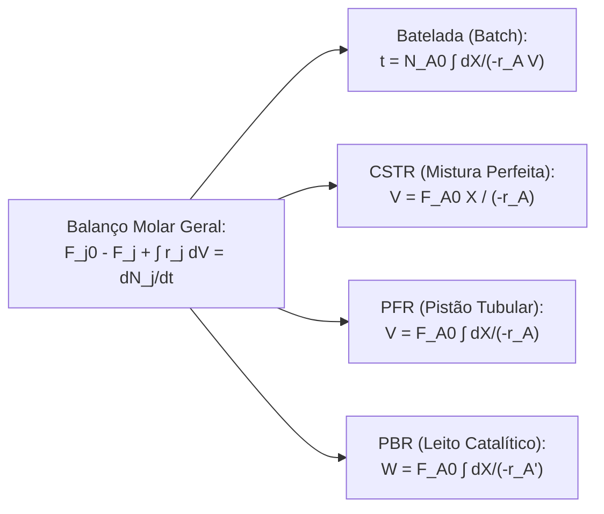

# Engenharia Química, Reatores, Fenômenos de Transporte e CFD

Esta skill estabelece os balanços diferenciais e integrais rigorosos de matéria, quantidade de movimento e energia aplicados ao dimensionamento de reatores industriais, processos de separação química e simulação numérica de transporte de fluidos, calor e massa baseada nas obras de **H. Scott Fogler**, **Bird, Stewart & Lightfoot** e **John D. Anderson**.

---

## 🧪 1. Equações de Projeto dos Reatores Químicos Ideais (Fogler)

| Reator | Tipo de Operação | Equação Diferencial de Projeto | Equação Integrada |
| :--- | :--- | :--- | :--- |
| **Batelada (Batch)** | Transiente, mistura uniforme | $N_{A0}\frac{dX}{dt} = -r_A V$ | $t = N_{A0} \int_0^X \frac{dX}{-r_A V}$ |
| **CSTR** | Regime permanente, homogêneo | $F_{A0} - F_A + r_A V = 0$ | $V = \frac{F_{A0} X}{-r_A(X_{saida})}$ |
| **PFR** | Regime permanente tubular | $\frac{dF_A}{dV} = r_A \iff F_{A0}\frac{dX}{dV} = -r_A$ | $V = F_{A0} \int_0^X \frac{dX}{-r_A}$ |
| **PBR** | Leito fixo com massa $W$ | $F_{A0}\frac{dX}{dW} = -r_A'$ | $W = F_{A0} \int_0^X \frac{dX}{-r_A'}$ |

### 1.1 Catálise Heterogênea, Módulo de Thiele ($\phi$) e Efetividade ($\eta$)
- **Módulo de Thiele para Grão Catalítico Esférico**:
  $$\phi_1 = R \sqrt{\frac{k}{D_e}}$$
- **Fator de Efetividade Interna ($\eta$)**:
  $$\eta = \frac{\text{Taxa Real com Limitação Difusional}}{\text{Taxa na Superfície}} = \frac{3}{\phi_1^2} (\phi_1 \coth\phi_1 - 1)$$
  - Se $\phi_1 \ll 1 \implies \eta \approx 1$ (Controle por reação química).
  - Se $\phi_1 \gg 1 \implies \eta \approx \frac{3}{\phi_1}$ (Forte limitação difusional intrapartícula).

---

## 🌡️ 2. Reatores Não-Isotérmicos e Estabilidade Térmica

- **Balanço de Energia Diferencial em PFR**:
  $$\frac{dT}{dV} = \frac{U a (T_a - T) + (-r_A)(-\Delta H_{Rx}^\circ)}{\sum F_i C_{pi}}$$
- **Múltiplos Estados Estacionários em CSTR Exotérmico**:
  O cruzamento da curva de calor gerado $Q_g(T) = (-r_A V)(-\Delta H_{Rx})$ com a reta de calor removido $Q_r(T) = (\sum F_{i0} C_{pi} + U A)(T - T_c)$ pode originar 3 pontos de operação estacionários (dois estáveis e um instável de ignição/extinção).

---

## 🌊 3. Fenômenos de Transporte (Bird, Stewart & Lightfoot)

### 3.1 Equações Fundamentais de Navier-Stokes (Momento)
Para fluido Newtoniano incompressível com viscosidade dinâmica constante $\mu$:
$$\begin{aligned}
\nabla \cdot \mathbf{v} &= 0 \quad &\text{(Conservação de Massa/Continuidade)} \\
\rho \left( \frac{\partial \mathbf{v}}{\partial t} + \mathbf{v} \cdot \nabla \mathbf{v} \right) &= -\nabla p + \mu \nabla^2 \mathbf{v} + \rho \mathbf{g} \quad &\text{(Conservação de Quantidade de Movimento)}
\end{aligned}$$

### 3.2 Transferência de Calor (Energia)
Equação geral de conservação de energia com geração térmica $\dot{q}$:
$$\rho C_p \left( \frac{\partial T}{\partial t} + \mathbf{v} \cdot \nabla T \right) = k \nabla^2 T + \dot{q} + \mu \Phi$$
onde $k$ é a condutividade térmica e $\Phi$ é a função de dissipação viscosa.

### 3.3 Transferência de Massa e Leis de Fick
- **1ª Lei de Fick (Difusão Molecular em Regime Estacionário)**:
  $$\mathbf{J}_A = -D_{AB} \nabla C_A$$
- **Equação Convectivo-Difusiva de Transporte de Espécie Química com Reação**:
  $$\frac{\partial C_A}{\partial t} + \mathbf{v} \cdot \nabla C_A = D_{AB} \nabla^2 C_A + r_A$$

---

## 💻 4. Dinâmica dos Fluidos Computacional (CFD - Anderson)

- **Método dos Volumes Finitos (FVM)**: Integração das equações diferenciais sobre volumes de controle discretos $\Omega_P$ de uma malha computacional estruturada ou não-estruturada.
- **Algoritmo SIMPLE (Semi-Implicit Method for Pressure-Linked Equations)**:
  1. Resolve a equação de momento discretizada usando uma estimativa inicial do campo de pressão $p^*$.
  2. Calcula a correção de pressão $p'$ através da equação de continuidade discretizada.
  3. Corrige as velocidades nas faces e o campo de pressão ($p = p^* + \alpha_p p'$).
  4. Resolve as equações de transporte de energia ($T$) e espécies ($C_A$).
  5. Itera até que os resíduos normalizados de momento e massa atinjam tolerância $< 10^{-5}$.
