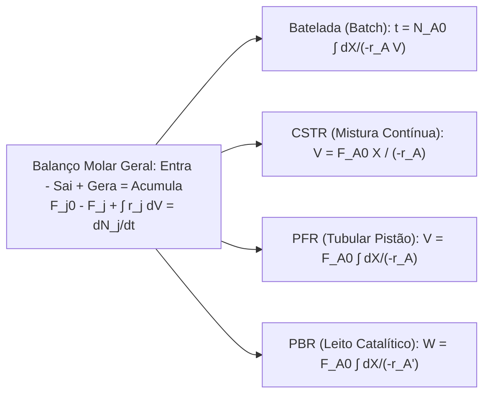

# Engenharia de Reações Químicas e Termodinâmica (Fogler & Smith)

Esta skill estabelece os balanços diferenciais e integrais de matéria e energia aplicados ao projeto de reatores industriais contínuos e descontínuos, cinética catalítica heterogênea e equilíbrio de fases para separações químicas.

---

## 🧪 1. Equações de Projeto dos Reatores Ideais (Fogler)

| Reator | Tipo de Operação | Equação de Projeto Diferencial | Equação de Projeto Integrada |
| :--- | :--- | :--- | :--- |
| **Batelada (Batch)** | Transiente, mistura uniforme | $N_{A0}\frac{dX}{dt} = -r_A V$ | $t = N_{A0} \int_0^X \frac{dX}{-r_A V}$ |
| **CSTR** | Regime permanente, perfeitamente misturado | $F_{A0} - F_A + r_A V = 0$ | $V = \frac{F_{A0} X}{-r_A(X_{saida})}$ |
| **PFR** | Regime permanente, sem mistura axial | $\frac{dF_A}{dV} = r_A \iff F_{A0}\frac{dX}{dV} = -r_A$ | $V = F_{A0} \int_0^X \frac{dX}{-r_A}$ |
| **PBR** | Leito fixo com massa de catalisador $W$ | $F_{A0}\frac{dX}{dW} = -r_A'$ | $W = F_{A0} \int_0^X \frac{dX}{-r_A'}$ |

---

## 🔬 2. Catálise Heterogênea e Limitações Difusionais

### 2.1 Mecanismo de Langmuir-Hinshelwood
Para a reação catalítica superficial $A + B \to C$:
$$-r_A' = \frac{k K_A K_B P_A P_B}{(1 + K_A P_A + K_B P_B + K_C P_C)^2}$$

### 2.2 Módulo de Thiele ($\phi$) e Fator de Efetividade Interna ($\eta$)
Avalia a competição entre a taxa de reação química intrínseca no interior dos poros do catalisador e a difusão efetiva ($D_e$):
- **Módulo de Thiele para Reação de 1ª Ordem em Grão Esférico de Raio $R$**:
  $$\phi_1 = R \sqrt{\frac{k}{D_e}}$$
- **Fator de Efetividade Interna ($\eta$)**:
  $$\eta = \frac{\text{Taxa de Reação Real com Difusão}}{\text{Taxa se Toda a Superfície Estivesse exposta a } C_{As}} = \frac{3}{\phi_1^2} (\phi_1 \coth\phi_1 - 1)$$
  - Se $\phi_1 \ll 1 \implies \eta \approx 1$ (Regime cinético controlado por reação).
  - Se $\phi_1 \gg 1 \implies \eta \approx \frac{3}{\phi_1}$ (Regime fortemente limitado por difusão intrapartícula).

---

## 🌡️ 3. Reatores Não-Isotérmicos e Estabilidade Térmica

### 3.1 Balanço de Energia em Reatores Tubulares PFR/PBR
$$\frac{dT}{dV} = \frac{U a (T_a - T) + (-r_A)(-\Delta H_{Rx}^\circ)}{\sum_{i} F_i C_{pi}}$$
onde $U$ é o coeficiente global de transferência de calor, $a$ é a área de troca térmica por unidade de volume, $T_a$ é a temperatura do fluido refrigerante e $\Delta H_{Rx}$ é a entalpia de reação.

### 3.2 Múltiplos Estados Estacionários em CSTR Exotérmico
Cruzamento da curva de calor gerado $Q_g(T) = (-r_A V)(-\Delta H_{Rx})$ com a reta de calor removido $Q_r(T) = (\sum F_{i0} C_{pi} + U A)(T - T_c)$:
- Podem existir até 3 pontos de operação estacionária: Dois estáveis (baixa conversão e alta conversão/temperatura) e um ponto intermediário instável (*Ignition/Extinction behavior*).

---

## ⚗️ 4. Termodinâmica de Equilíbrio Líquido-Vapor (ELV) e Destilação

- **Coeficientes de Atividade ($\gamma_i$) em Misturas Líquidas Reais**:
  $$y_i P = x_i \gamma_i P_i^{sat}(T)$$
  onde $\gamma_i$ é modelado por equações de energia livre de Gibbs em excesso ($G^E$): **NRTL**, **UNIQUAC** ou **Wilson**.
- **Método de McCabe-Thiele para Colunas de Fracionamento**:
  - Reta de Operação de Retificação (ROL): $y = \frac{R}{R+1} x + \frac{x_D}{R+1}$.
  - Reta da Carga ($q$-line): $y = \frac{q}{q-1} x - \frac{z_F}{q-1}$.
  - Reta de Operação de Esgotamento (SOL): $y = \frac{L_m}{V_m} x - \frac{W x_W}{V_m}$.
