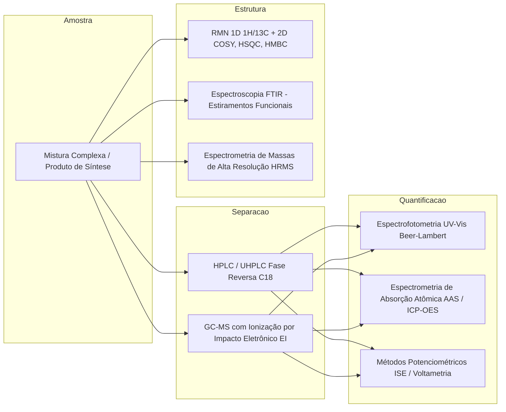

# Síntese Química, Físico-Química e Análise Instrumental (Clayden & Skoog)

Esta skill estabelece os fundamentos teóricos rigorosos, mecanismos de síntese orgânica e inorgânica, termodinâmica e cinética de sistemas reacionais, espectroscopia molecular e validação metrológica instrumental.

---

## ⚗️ 1. Mecanismos Orgânicos Avançados e Retrossíntese

```
Reatividade e Mecanismos Centrais em Química Orgânica:
├── Substituições e Eliminações Alifáticas:
│   ├── SN2: Ataque dorsal estereoespecífico com inversão de Walden, solventes polares apróticos
│   ├── SN1: Intermediário carbocátion planar com racemização, rearranjos de Wagner-Meerwein
│   └── E2 / E1: Regra de Zaitsev (alceno mais estável) vs Regra de Hofmann (impedimento estéreo)
├── Substituição Eletrofílica Aromática (SEAr):
│   ├── Complexo de Wheland / Íon Arenônio
│   ├── Ativadores orto/para-dirigentes (efeito mesomérico +M: -OH, -NH2, -OCH3)
│   └── Desativadores meta-dirigentes (efeito indutivo/mesomérico -I/-M: -NO2, -CN, -COR)
├── Química de Enolatos e Condensações Carbonílicas:
│   ├── Condensação Aldólica e Desidratação crotônica
│   ├── Condensação de Claisen e Dieckmann (ésteres)
│   └── Adição 1,4-Conjugada de Michael e Anelação de Robinson
└── Acoplamentos Cruzados Catalisados por Metais de Transição (Paládio [Pd(0)/Pd(II)]):
    ├── Ciclo Catalítico: Adição Oxidativa → Transmetalação → Isomerização cis-trans → Eliminação Redutiva
    ├── Reação de Suzuki-Miyaura: Ar-X + Ar'-B(OH)2 em meio básico
    ├── Reação de Heck: Ar-X + Alceno na presença de amina terciária
    └── Reação de Sonogashira: Ar-X + Alcino terminal com cocatalisador de Cu(I)
```

---

## 💎 2. Química Inorgânica, Teoria de Coordenação e Organometálicos

### 2.1 Teoria do Campo Cristalino (TCC) e Campo Ligante
O desdobramento dos orbitais $d$ sob simetria do campo ligante:
- **Campo Octaédrico ($O_h$)**: Desdobramento em orbitais de menor energia $t_{2g}$ ($d_{xy}, d_{xz}, d_{yz}$) e maior energia $e_g$ ($d_{z^2}, d_{x^2-y^2}$) com energia de desdobramento $\Delta_o = 10 \, Dq$.
- **Energia de Estabilização do Campo Cristalino (EECC)**:
  $$EECC = \left( -0.4 n_{t2g} + 0.6 n_{eg} \right) \Delta_o + m P$$
  onde $P$ é a energia de emparelhamento eletrônico (Campo Forte $\Delta_o > P \implies$ Baixo Spin; Campo Fraco $\Delta_o < P \implies$ Alto Spin).
- **Teorema de Jahn-Teller**: Qualquer molécula não-linear em estado eletrônico degenerado sofrerá distorção geométrica espontânea (alongamento/compressão axial $D_{4h}$) para quebrar a degenerescência e diminuir a energia global (ex.: complexos de $Cu^{2+}$ $d^9$ e $Cr^{2+}$ $d^4$ alto spin).

### 2.2 Regra dos 18 Elétrons em Complexos Organometálicos
A estabilidade termodinâmica de complexos organometálicos de metais de transição baseia-se no preenchimento de seus 9 orbitais de valência (um $s$, três $p$, cinco $d$):

$$N_{valencia} = N_{metal} + \sum n_{ligantes} - q_{complexo} = 18$$

---

## 🌡️ 3. Físico-Química: Termodinâmica, Cinética e Eletroquímica

### 3.1 Equilíbrio Líquido-Vapor e Equação de Antoine
Para cálculo da pressão de vapor $P^{sat}$ ($mmHg$) de substâncias puras à temperatura $T$ ($^\circ C$):

$$\log_{10}(P^{sat}) = A - \frac{B}{T + C}$$

- **Lei de Raoult Modificada com Coeficientes de Atividade ($\gamma_i$)**:
  $$y_i P = x_i \gamma_i P_i^{sat}(T)$$
  onde desvios positivos acentuados geram azeótropos de mínimo ponto de ebulição (ex.: Etanol-Água a $95.6\%$ em massa).

### 3.2 Eletroquímica e Condutometria de Debye-Hückel-Onsager
- **Equação de Nernst para Potencial de Eletrodo**:
  $$E = E^\circ - \frac{RT}{nF} \ln Q = E^\circ - \frac{0.05916}{n} \log_{10}\left( \frac{\prod a_{produtos}^{\nu_p}}{\prod a_{reagentes}^{\nu_r}} \right)$$
- **Equação de Limite de Condutividade Molar de Onsager**:
  $$\Lambda_m = \Lambda_m^\circ - (A + B \Lambda_m^\circ) \sqrt{C}$$

---

## 🔬 4. Química Analítica Instrumental e Elucidação Estrutural



### 4.1 Ressonância Magnética Nuclear (RMN de $^1H$ e $^{13}C$)
- **Frequência de Larmor**: $\nu_0 = \frac{\gamma B_0}{2\pi}$.
- **Deslocamento Químico ($\delta$ em ppm)**: $\delta = \frac{\nu_{amostra} - \nu_{TMS}}{\nu_{operacao}} \times 10^6$.
- **Correlações 2D**:
  - **COSY ($^1H$-$^1H$)**: Acoplamentos escalares vicinais ($^3J_{HH}$) e geminais ($^2J_{HH}$).
  - **HSQC / HMQC ($^1H$-$^{13}C$)**: Conectividades diretas C-H através de uma ligação ($^1J_{CH}$).
  - **HMBC ($^1H$-$^{13}C$)**: Conectividades de longo alcance heteronucleares ($^2J_{CH}$ e $^3J_{CH}$) essenciais para elucidação de carbonilas quaternárias e anéis aromáticos.

### 4.2 Teoria Cromatográfica Quantitativa
- **Resolução de Picos ($R_s$)**:
  $$R_s = \frac{2 (t_{R2} - t_{R1})}{W_1 + W_2} = \frac{\sqrt{N}}{4} \left( \frac{\alpha - 1}{\alpha} \right) \left( \frac{k_2}{1 + k_2} \right)$$
- **Equação de van Deemter para Altura de Prato Teórico ($H = L/N$)**:
  $$H = A + \frac{B}{u} + C \cdot u$$
  onde $A$ é a difusão por caminhos múltiplos (Eddy diffusion), $B$ é a difusão molecular longitudinal e $C$ é a resistência à transferência de massa na fase móvel/estacionária.

---

## ⚖️ 5. Metrologia ISO/IEC 17025, Segurança GHS e Legislação Química

| Framework / Norma | Requisito Central | Aplicação Prática |
| :--- | :--- | :--- |
| **ABNT NBR ISO/IEC 17025:2017** | Competência técnica de laboratórios de ensaio | Validação analítica de métodos (Linearidade $R^2 \ge 0.995$, Precisão/Repetibilidade RSD $< 2\%$, Limite de Detecção LoD e Quantificação LoQ, Rastreabilidade Metrológica ao SI e Cálculo de Incerteza Expandida $U = k \cdot u_c$). |
| **ABNT NBR 14725 / GHS** | Sistema Globalmente Harmonizado | Elaboração de FDS (Ficha com Dados de Segurança em 16 seções) e Rotulagem Preventiva com pictogramas de perigo físico, à saúde e ao meio ambiente. |
| **Lei Federal nº 2.800/1956 / CFQ** | Regulamentação Profissional | Atribuições privativas do químico (RN 36/1974), responsabilidade técnica legal (AFT - Anotação de Função Técnica) e controle de precursores químicos da Polícia Federal (Portaria MJSP 240/2019). |
