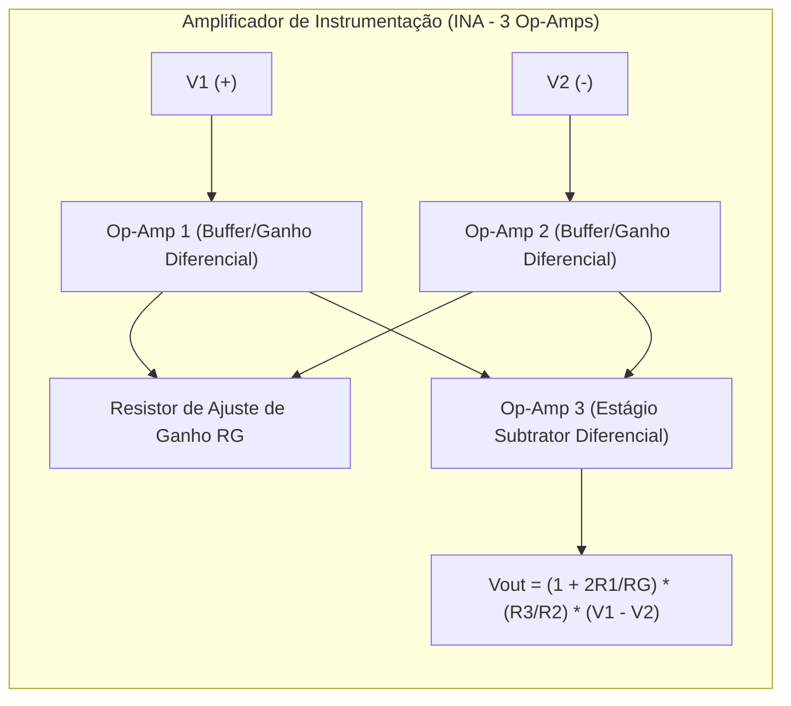

# Análise de Circuitos Elétricos e Microeletrônica (Sedra & Alexander-Sadiku)

Esta skill estabelece a engenharia analítica de redes elétricas lineares em corrente contínua (CC) e alternada (CA), regimes transitórios, resposta em frequência, além da modelagem de pequenos e grandes sinais em semicondutores e amplificadores operacionais.

---

## ⚡ 1. Teoremas de Redes e Análise em Regime Permanente CA

### 1.1 Teoremas Fundamentais de Redes
- **Leis de Kirchhoff**: $\sum_{k} I_k = 0$ (LKC nos nós) e $\sum_{k} V_k = 0$ (LKV nas malhas).
- **Teoremas de Thévenin e Norton**:
  $$V_{th} = V_{oc}, \quad I_n = I_{sc}, \quad \mathbf{Z}_{th} = \frac{\mathbf{V}_{oc}}{\mathbf{I}_{sc}}$$
- **Teorema da Máxima Transferência de Potência em CA**:
  A máxima potência ativa é entregue à carga quando a impedância da carga é o complexo conjugado da impedância equivalente de Thévenin:
  $$\mathbf{Z}_L = \mathbf{Z}_{th}^* = R_{th} - j X_{th} \implies P_{max} = \frac{|V_{th}|^2}{4 R_{th}}$$

### 1.2 Fasores e Triângulo de Potências
Para tensão fasorial $\mathbf{V} = V_{rms} \angle \theta_v$ e corrente $\mathbf{I} = I_{rms} \angle \theta_i$:
- **Potência Complexa**: $\mathbf{S} = \mathbf{V} \mathbf{I}^* = P + j Q = |\mathbf{S}| \angle \theta$ ($[\text{VA}]$).
- **Potência Ativa (Real)**: $P = V_{rms} I_{rms} \cos(\theta_v - \theta_i)$ ($[\text{W}]$).
- **Potência Reativa**: $Q = V_{rms} I_{rms} \sin(\theta_v - \theta_i)$ ($[\text{var}]$).
- **Fator de Potência**: $FP = \cos(\theta_v - \theta_i) = \frac{P}{|\mathbf{S}|}$.

---

## ⏱️ 2. Transitórios em Circuitos de 1ª e 2ª Ordem (RL, RC e RLC)

### 2.1 Circuitos de 1ª Ordem (RC e RL)
A resposta completa para degrau unitário com condição inicial $x(0)$ e regime permanente $x(\infty)$:
$$x(t) = x(\infty) + [x(0) - x(\infty)] e^{-t/\tau}, \quad \tau_{RC} = R C, \; \tau_{RL} = \frac{L}{R}$$

### 2.2 Circuitos RLC de 2ª Ordem
Equação diferencial: $\frac{d^2 x}{dt^2} + 2\zeta\omega_0 \frac{dx}{dt} + \omega_0^2 x = f(t)$, com $\omega_0 = \frac{1}{\sqrt{LC}}$ e $\alpha = \zeta\omega_0 = \frac{R}{2L}$ (RLC série):
1. **Superamortecido ($\zeta > 1 \iff \alpha > \omega_0$)**: $x(t) = A_1 e^{s_1 t} + A_2 e^{s_2 t}$.
2. **Criticamente Amortecido ($\zeta = 1 \iff \alpha = \omega_0$)**: $x(t) = (A_1 + A_2 t) e^{-\alpha t}$ (retorno mais rápido ao equilíbrio sem oscilações).
3. **Subamortecido ($\zeta < 1 \iff \alpha < \omega_0$)**: $x(t) = e^{-\alpha t} (A_1 \cos\omega_d t + A_2 \sin\omega_d t)$ com $\omega_d = \sqrt{\omega_0^2 - \alpha^2}$.

---

## 🔬 3. Modelagem de Dispositivos Semicondutores (BJT e MOSFET)

### 3.1 Transistor de Efeito de Campo MOSFET (Canal N)
- **Região de Triodo / Linear ($V_{DS} < V_{GS} - V_{th}$)**:
  $$I_D = \mu_n C_{ox} \frac{W}{L} \left[ (V_{GS} - V_{th}) V_{DS} - \frac{1}{2} V_{DS}^2 \right]$$
- **Região de Saturação ($V_{DS} \ge V_{GS} - V_{th} = V_{OV}$)**:
  $$I_D = \frac{1}{2} \mu_n C_{ox} \frac{W}{L} (V_{GS} - V_{th})^2 (1 + \lambda V_{DS})$$
- **Parâmetros de Pequenos Sinais (Modelo Híbrido-$\pi$)**:
  $$g_m = \left. \frac{\partial I_D}{\partial V_{GS}} \right|_{Q} = \frac{2 I_D}{V_{OV}} = \sqrt{2 \mu_n C_{ox} \frac{W}{L} I_D}, \quad r_o = \frac{1}{\lambda I_D} \approx \frac{V_A}{I_D}$$

### 3.2 Transistor Bipolar de Junção (BJT)
- **Corrente de Coletor em Ativa Direta**: $I_C = I_S e^{V_{BE}/V_T} (1 + V_{CE}/V_A)$, com tensão térmica $V_T = \frac{k_B T}{q} \approx 25.8\text{ mV}$ a $300\text{ K}$.
- **Pequenos Sinais**: $g_m = \frac{I_C}{V_T}$, $r_\pi = \frac{\beta}{g_m} = \frac{V_T}{I_B}$, $r_e = \frac{\alpha}{g_m} \approx \frac{V_T}{I_E}$, $r_o = \frac{V_A}{I_C}$.

---

## 🎛️ 4. Amplificadores Operacionais e Filtros Ativos

### 4.1 Filtro Ativo Passa-Baixas de 2ª Ordem Sallen-Key
Função de transferência:
$$H(s) = \frac{V_{out}(s)}{V_{in}(s)} = \frac{K \omega_0^2}{s^2 + \frac{\omega_0}{Q} s + \omega_0^2}$$
onde $\omega_0 = \frac{1}{\sqrt{R_1 R_2 C_1 C_2}}$ e o fator de qualidade $Q$ determina a resposta:
- **Butterworth ($Q = \frac{1}{\sqrt{2}} \approx 0.707$)**: Resposta maximamente plana na banda passante sem ondulações (*ripple*).
- **Chebyshev ($Q > 0.707$)**: Transição mais abrupta na banda de rejeição ao custo de ondulação na banda passante.
