# Engenharia de Compiladores e Processadores de Linguagem (Dragon Book)

Esta skill estabelece a arquitetura completa de pipelines de tradução de código-fonte de alto nível para representações intermediárias e código de máquina otimizado, cobrindo o front-end léxico/sintático, a análise semântica, o middle-end SSA e o back-end de geração e alocação de registradores.

---

## 🔄 1. Pipeline Completo de Compilação

```mermaid
flowchart LR
    A["Código Fonte"] --> B["Análise Léxica (Scanner / Flex)"]
    B -->|Tokens| C["Análise Sintática (Parser / Bison)"]
    C -->|AST| D["Análise Semântica (Type Checker)"]
    D -->|Decorated AST| E["Geração de Código Intermediário"]
    E -->|LLVM IR / SSA| F["Otimizador de Código (LLVM Opt Passes)"]
    F -->|Otimizado IR| G["Alocação de Registradores & Geração de Código"]
    G --> H["Código Objeto / Assembly Nativo (x86_64 / ARM / RISC-V)"]
```



---

## 🔡 2. Análise Léxica: De Expressões Regulares a Autômatos Finitos

### 2.1 Construção de Thompson (Regex $\to$ NFA-$\varepsilon$)
Converte operadores regulares ($a|b$, $ab$, $a^*$) em autômatos finitos não-determinísticos com $\varepsilon$-transições lineares em relação ao tamanho da expressão.

### 2.2 Algoritmo de Construção de Subconjuntos (Subset Construction: NFA $\to$ DFA)
- **Fecho-$\varepsilon$ ($\varepsilon\text{-closure}(S)$)**: Conjunto de estados alcançáveis a partir de $S$ apenas por transições vazias $\varepsilon$.
- **Transição $\delta_{DFA}(T, a) = \varepsilon\text{-closure}(\text{move}(T, a))$**: Mapeia estados do DFA para conjuntos disjuntos de estados do NFA.
- **Minimização de DFA (Algoritmo de Hopcroft)**: Particiona os estados em equivalências distinguíveis com complexidade $\mathcal{O}(k |S| \log |S|)$.

---

## 🌲 3. Análise Sintática: Gramáticas Formais e Parsers Top-Down / Bottom-Up

### 3.1 Conjuntos FIRST e FOLLOW
Dada uma gramática $G = (V, \Sigma, R, S)$:
- $\text{FIRST}(\alpha)$: Conjunto de terminais que iniciam cadeias derivadas de $\alpha$.
- $\text{FOLLOW}(A)$: Conjunto de terminais que podem aparecer imediatamente à direita da variável $A$ em alguma forma sentencial derivada da raiz $S$.

### 3.2 Tabela de Parsing LL(1) vs LR(1) / LALR(1)
| Família de Parser | Direção e Derivação | Conflitos Comuns | Poder Expressivo |
| :--- | :--- | :--- | :--- |
| **LL(1) (Top-Down)** | Left-to-right, Derivação Mais à Esquerda | Conflitos FIRST/FIRST e FIRST/FOLLOW (exige fatoração à esquerda e eliminação de recursão à esquerda). | Menor (não lida com recursão à esquerda direta). |
| **LR(0) / SLR(1)** | Left-to-right, Derivação Mais à Direita Reversa (*Shift-Reduce*) | Conflitos Shift-Reduce e Reduce-Reduce quando FOLLOW não discrimina o estado. | Intermediário. |
| **LR(1)** | Shift-Reduce com Lookahead canônico de 1 símbolo | Explosão no número de estados da tabela canônica. | Máximo para gramáticas determinísticas livres de contexto. |
| **LALR(1) (Bison/Yacc)** | Mescla estados LR(1) com mesmo núcleo (*core*) | Pode introduzir conflitos Reduce-Reduce, mas preserva a compacidade do SLR(1). | Padrão da indústria para compiladores de produção. |

---

## 🏷️ 4. Análise Semântica e Verificação de Tipos

- **Tabelas de Símbolos em Pilha de Escopos Léxicos**: Suporte a sombreamento (*shadowing*), fechamentos (*closures*) e resolução de identificadores por tempo de vida de blocos (`Scope::enter()`, `Scope::exit()`).
- **Sistema de Tipos e Inferência de Hindley-Milner (Algoritmo W)**: Unificação de tipos via substituições de variáveis de tipo com detecção de ciclos (*occurs check*).

---

## ⚡ 5. Middle-End: Static Single Assignment (SSA Form) e Cytron

No formato SSA, cada variável é atribuída exatamente uma vez, e funções $\phi$ (*phi-nodes*) são inseridas nas fronteiras de dominância:

### 5.1 Árvore de Dominância e Fronteira de Dominância ($DF$)
- Um nó $d$ domina $n$ ($d \, \text{dom} \, n$) se todo caminho do nó de entrada até $n$ passa por $d$.
- A Fronteira de Dominância $DF(X)$ contém nós $Y$ onde $X$ domina um predecessor de $Y$, mas $X$ não domina estritamente $Y$.
- **Algoritmo de Cytron**: $\phi$-nodes para a variável $v$ são inseridos no fecho transitivo das fronteiras de dominância dos blocos que contêm atribuições a $v$:
  $$DF^+(Def(v))$$

```llvm
; Representação LLVM IR em SSA canônico
define i32 @fatorial(i32 %n) {
entry:
  %cmp = icmp sle i32 %n, 1
  br i1 %cmp, label %base, label %recurse

base:
  br label %exit

recurse:
  %n.sub = sub nsw i32 %n, 1
  %call = call i32 @fatorial(i32 %n.sub)
  %res.rec = mul nsw i32 %n, %call
  br label %exit

exit:
  %retval = phi i32 [ 1, %base ], [ %res.rec, %recurse ]
  ret i32 %retval
}
```

---

## 🚀 6. Otimizações de Código e Back-End

### 6.1 Catálogo de Otimizações em SSA (LLVM Passes)
1. **Mem2Reg**: Promove alocações de pilha (`alloca`) para registradores SSA puras via análise de dominância.
2. **GVN (Global Value Numbering) & CSE**: Identifica e elimina computações redundantes equivalentes através de números de valor.
3. **LICM (Loop Invariant Code Motion)**: Move instruções independentes do loop para o pré-cabeçalho (*pre-header*).
4. **DCE (Dead Code Elimination)**: Varredura reversa eliminando instruções cujos resultados não são lidos por nenhuma instrução viva.
5. **Inlining de Funções**: Substitui chamadas diretas pelo corpo da função expandido quando o custo de heurística compensa o overhead de chamada.

### 6.2 Alocação de Registradores por Coloração de Grafos (Chaitin-Briggs)
- **Grafo de Interferência**: Vértices são variáveis temporárias; arestas conectam temporários simultaneamente vivos (*live ranges* sobrepostos).
- **Algoritmo de Coloração com $K$ Registradores**:
  1. **Simplify**: Remove nós com grau $< K$ e os empilha.
  2. **Spill**: Se todos os nós têm grau $\ge K$, escolhe um candidato de spill baseado no custo de memória / loop nesting.
  3. **Select**: Desempilha os nós e atribui registradores físicos de cor compatível sem colisões com vizinhos.
