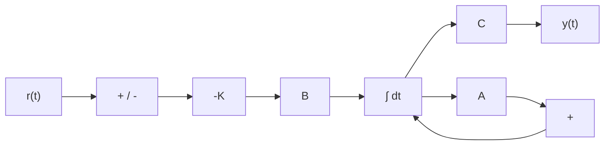

# Teoria de Controle Clássico, Moderno, Digital e Preditivo (Ogata & Franklin)

Esta skill estabelece a engenharia rigorosa de análise de estabilidade, sintetização de controladores por realimentação, observadores de estado, controle ótimo, discretização digital em tempo real e controle preditivo multivariável.

---

## 🎯 1. Controle Clássico no Domínio da Frequência e Laplace

### 1.1 Controladores PID e Compensadores de Avanço/Atraso de Fase
- **Controlador PID com Filtro de Derivada e Anti-Windup**:
  $$C(s) = K_p \left( 1 + \frac{1}{T_i s} + \frac{T_d s}{1 + \frac{T_d}{N} s} \right)$$
- **Compensador por Avanço de Fase (*Phase Lead*)**: $G_c(s) = K_c \frac{s + 1/T}{s + 1/(\alpha T)}$ com $\alpha < 1$ (eleva a Margem de Fase e acelera a resposta transitória).
- **Compensador por Atraso de Fase (*Phase Lag*)**: $G_c(s) = K_c \frac{s + 1/T}{s + 1/(\beta T)}$ com $\beta > 1$ (eleva o ganho estático em baixa frequência eliminando o erro de regime estacionário).

### 1.2 Critérios de Estabilidade de Nyquist e Margens de Ganho/Fase
Para a função de transferência em malha aberta $L(s) = G(s)H(s)$:
- **Critério de Estabilidade de Nyquist**:
  $$Z = N + P$$
  onde $Z$ é o número de polos em malha fechada no semiplano direito (instáveis), $N$ é o número de voltas no sentido horário em torno do ponto crítico $(-1 + j0)$ e $P$ é o número de polos instáveis em malha aberta.
- **Margem de Ganho ($MG$) e Margem de Fase ($MF$)**:
  $$MG = \frac{1}{|L(j\omega_{pc})|} \quad [\text{dB}], \quad MF = 180^\circ + \angle L(j\omega_{gc})$$
  onde $\angle L(j\omega_{pc}) = -180^\circ$ e $|L(j\omega_{gc})| = 1$.

---

## 🔄 2. Controle Moderno em Espaço de Estados (State-Space)

### 2.1 Equações de Estado Contínuas
$$\dot{\mathbf{x}}(t) = \mathbf{A}\mathbf{x}(t) + \mathbf{B}\mathbf{u}(t), \quad \mathbf{y}(t) = \mathbf{C}\mathbf{x}(t) + \mathbf{D}\mathbf{u}(t)$$

- **Critério de Controlabilidade de Kalman**:
  $$\text{rank}(\mathcal{C}) = \text{rank}\begin{bmatrix} \mathbf{B} & \mathbf{AB} & \mathbf{A}^2\mathbf{B} & \dots & \mathbf{A}^{n-1}\mathbf{B} \end{bmatrix} = n$$
- **Critério de Observabilidade de Kalman**:
  $$\text{rank}(\mathcal{O}) = \text{rank}\begin{bmatrix} \mathbf{C} \\ \mathbf{CA} \\ \mathbf{CA}^2 \\ \vdots \\ \mathbf{CA}^{n-1} \end{bmatrix} = n$$

### 2.2 Regulador Linear Quadrático (LQR - Optimal Control)
Minimiza a função de custo quadrática com matrizes de ponderação simétricas $\mathbf{Q} \ge 0$ e $\mathbf{R} > 0$:

$$J = \int_0^\infty \left( \mathbf{x}^T \mathbf{Q} \mathbf{x} + \mathbf{u}^T \mathbf{R} \mathbf{u} \right) dt$$

- **Lei de Controle Ótima**: $\mathbf{u}(t) = -\mathbf{K} \mathbf{x}(t) = -\mathbf{R}^{-1} \mathbf{B}^T \mathbf{P} \mathbf{x}(t)$, onde $\mathbf{P}$ é a única solução semi-definida positiva da **Equação Algébrica de Riccati (ARE)**:
  $$\mathbf{A}^T \mathbf{P} + \mathbf{P} \mathbf{A} - \mathbf{P} \mathbf{B} \mathbf{R}^{-1} \mathbf{B}^T \mathbf{P} + \mathbf{Q} = \mathbf{0}$$

### 2.3 Observadores de Estado de Luenberger
$$\dot{\hat{\mathbf{x}}}(t) = \mathbf{A}\hat{\mathbf{x}}(t) + \mathbf{B}\mathbf{u}(t) + \mathbf{L}(\mathbf{y}(t) - \mathbf{C}\hat{\mathbf{x}}(t))$$
- **Princípio da Separação**: Os autovalores do controlador $\mathbf{A} - \mathbf{BK}$ e do observador $\mathbf{A} - \mathbf{LC}$ são desacoplados e podem ser projetados de forma independente.

---

## 💻 3. Controle Digital e Espaço Discreto (Plano Z)

- **Discretização por Segurador de Ordem Zero (ZOH)** com período de amostragem $T_s$:
  $$\mathbf{\Phi} = e^{\mathbf{A} T_s}, \quad \mathbf{\Gamma} = \left( \int_0^{T_s} e^{\mathbf{A}\tau} d\tau \right) \mathbf{B}$$
- **Mapeamento de Polos $s \to z$**: $z = e^{s T_s}$. O interior do círculo unitário $|z| < 1$ no plano complexo $Z$ corresponde ao semiplano esquerdo estável $\text{Re}(s) < 0$.
- **Controlador Deadbeat**: Projeta os polos em malha fechada exatamente na origem $z = 0$, garantindo tempo de acomodação finito em exatamente $n$ passos de amostragem.

---

## 🔮 4. Controle Preditivo Baseado em Modelo (MPC) e Estimação de Kalman

### 4.1 Controle Preditivo Baseado em Modelo (MPC)
Em cada instante $k$, resolve online um problema de programação quadrática (QP) sobre o horizonte de predição $N_p$ e horizonte de controle $N_c$:

$$\min_{\Delta \mathbf{U}} \sum_{i=1}^{N_p} \|\hat{\mathbf{y}}(k+i|k) - \mathbf{r}(k+i)\|_{\mathbf{Q}_y}^2 + \sum_{j=0}^{N_c-1} \|\Delta \mathbf{u}(k+j)\|_{\mathbf{R}_u}^2$$
sujeito a restrições operacionais de atuador e estado:
$$\mathbf{u}_{min} \le \mathbf{u}(k) \le \mathbf{u}_{max}, \quad \Delta\mathbf{u}_{min} \le \Delta\mathbf{u}(k) \le \Delta\mathbf{u}_{max}, \quad \mathbf{y}_{min} \le \mathbf{y}(k) \le \mathbf{y}_{max}$$
Aplica-se apenas o primeiro comando de controle $\mathbf{u}(k)$ (*Princípio do Horizonte Deslizante / Receding Horizon*).

### 4.2 Filtro de Kalman Discreto (Fusão Sensorial e Estimação Ótima)
$$\begin{aligned}
\text{Predição:} \quad &\hat{\mathbf{x}}_k^- = \mathbf{A}\hat{\mathbf{x}}_{k-1} + \mathbf{B}\mathbf{u}_{k-1}, \quad \mathbf{P}_k^- = \mathbf{A}\mathbf{P}_{k-1}\mathbf{A}^T + \mathbf{Q} \\
\text{Ganho:} \quad &\mathbf{K}_k = \mathbf{P}_k^- \mathbf{C}^T (\mathbf{C}\mathbf{P}_k^- \mathbf{C}^T + \mathbf{R})^{-1} \\
\text{Atualização:} \quad &\hat{\mathbf{x}}_k = \hat{\mathbf{x}}_k^- + \mathbf{K}_k (\mathbf{y}_k - \mathbf{C}\hat{\mathbf{x}}_k^-), \quad \mathbf{P}_k = (\mathbf{I} - \mathbf{K}_k \mathbf{C}) \mathbf{P}_k^-
\end{aligned}$$
