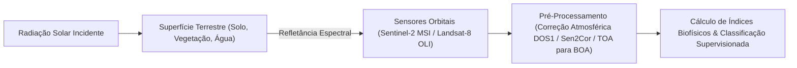

# Geociências, Sensoriamento Remoto e Análise Espacial (Lillesand & Longley)

Esta skill estabelece a engenharia de processamento de dados geoespaciais, física da radiação eletromagnética aplicada ao sensoriamento remoto, modelagem de relevo e bacias hidrográficas, geoestatística espacial e conformidade com marcos legais de planejamento territorial e ambiental.

---

## 🛰️ 1. Sensoriamento Remoto e Índices Espectrais de Satélite



### 1.1 Assinaturas Espectrais e Índices Biofísicos de Diferença Normalizada
- **NDVI (Normalized Difference Vegetation Index)**: Vigor da biomassa fotossinteticamente ativa:
  $$NDVI = \frac{\rho_{NIR} - \rho_{Red}}{\rho_{NIR} + \rho_{Red}}$$
- **EVI (Enhanced Vegetation Index)**: Otimizado para altas densidades de biomassa com correção de solo e aerossóis atmosféricos:
  $$EVI = 2.5 \times \frac{\rho_{NIR} - \rho_{Red}}{\rho_{NIR} + 6 \rho_{Red} - 7.5 \rho_{Blue} + 1}$$
- **NDWI (Normalized Difference Water Index - Gao / McFeeters)**:
  $$NDWI_{McFeeters} = \frac{\rho_{Green} - \rho_{NIR}}{\rho_{Green} + \rho_{NIR}}, \quad NDWI_{Gao} = \frac{\rho_{NIR} - \rho_{SWIR}}{\rho_{NIR} + \rho_{SWIR}}$$
- **NBR (Normalized Burn Ratio)**: Mapeamento de cicatrizes de fogo e severidade de queimadas:
  $$NBR = \frac{\rho_{NIR} - \rho_{SWIR2}}{\rho_{NIR} + \rho_{SWIR2}}$$

### 1.2 Classificação Digital de Uso e Cobertura da Terra (LULC)
- **Supervisionada por Machine Learning**: Treinamento de classificadores Random Forest e Support Vector Machines (SVM) sobre conjuntos de bandas e índices espectrais em ambientes de nuvem (Google Earth Engine).
- **Matriz de Confusão e Validação**: Índice Kappa ($\hat{K}$) e Acurácia Global (*Overall Accuracy*):
  $$\hat{K} = \frac{N \sum_{i=1}^k x_{ii} - \sum_{i=1}^k (x_{i+} x_{+i})}{N^2 - \sum_{i=1}^k (x_{i+} x_{+i})}$$

---

## 🗺️ 2. Cartografia Digital, Geodésia e Análise Espacial (GIS)

### 2.1 Sistemas de Coordenadas e Geodésia
- **Modelo Geodésico**: Diferenciação entre Geoide (superfície equipotencial do campo de gravidade) e Elipsoide de Revolução (modelo matemático).
- **Datum Geodésico Oficial no Brasil**: **SIRGAS2000** (Sistema de Referência Geocêntrico para as Américas, Elipsoide GRS80), compatível com **WGS84**.
- **Projeção Transversa Universal de Mercator (UTM)**: Projeção conforme em 60 fusos de $6^\circ$ de longitude com fator de escala central $k_0 = 0.9996$, meridiano central com falso leste $X_0 = 500.000\text{ m}$ e falso norte $Y_0 = 10.000.000\text{ m}$ (hemisfério sul).

### 2.2 Análise Geoespacial com PostGIS e GeoPandas
```sql
-- Exemplo: Consulta espacial com buffer e interseção em PostGIS
SELECT 
    l.id_imovel,
    ST_Area(ST_Intersection(l.geom, a.geom)) / 10000.0 AS area_sobreposta_ha
FROM 
    imoveis_rurais_car l
JOIN 
    areas_preservacao_permanente a 
ON 
    ST_Intersects(l.geom, a.geom)
WHERE 
    l.municipio = 'Ribeirão Preto';
```

---

## 🏔️ 3. Geomorfologia, Pedologia e Modelagem Hidrológica

### 3.1 Modelagem Digital de Terreno (MDE / DEM)
- **Topographic Wetness Index (TWI / Índice Topográfico de Umidade)**:
  $$TWI = \ln\left( \frac{\alpha}{\tan\beta} \right)$$
  onde $\alpha$ é a área de contribuição específica a montante por unidade de contorno ($m^2/m$) e $\beta$ é a declividade local em radianos.
- **Hierarquização Fluvial de Strahler**: Delimitação automática de redes de drenagem onde dois rios de ordem $u$ confluem para formar uma ordem $u+1$.

### 3.2 Pedologia e Classificação de Solos no Brasil (SiBCS - Embrapa)
- **Ordem dos Solos Diagnósticos**:
  - *Latossolos*: Horizonte B latossólico (Bw), avançado intemperismo, profundos, bem drenados e álicos/distróficos.
  - *Argissolos*: Horizonte B textural (Bt), forte gradiente textural com suscetibilidade à erosão laminar e voçorocas.
  - *Neossolos*: Solos rasos e pouco desenvolvidos sobre rocha mãe (Horizonte A sobre R ou C).

---

## 📋 4. Gestão Territorial, Perícia Ambiental e Marcos Legais

| Instrumento / Legislação | Marco Legal | Aplicação Técnica pelo Geógrafo |
| :--- | :--- | :--- |
| **Código Florestal Brasileiro** | Lei Federal nº 12.651/2012 | Delimitação georreferenciada de Áreas de Preservação Permanente (APPs de cursos d'água, topos de morro e encostas $> 45^\circ$) e Reserva Legal (RL - $80\%$ Amazônia, $35\%$ Cerrado na Amazônia Legal, $20\%$ demais regiões) via CAR/SICAR. |
| **Estatuto da Cidade** | Lei Federal nº 10.257/2001 | Elaboração de Planos Diretores Participativos, Zoneamento Urbano (ZEIS), IPTU Progressivo no Tempo e Outorga Onerosa do Direito de Construir. |
| **Setorização de Riscos Geológicos** | Metodologia CPRM / IPT / Defesa Civil | Mapeamento de perigo e vulnerabilidade a deslizamentos planares/rotacionais, corridas de massa (*debris flow*) e inundações graduais/bruscas. |
| **Licenciamento Ambiental** | Resoluções CONAMA 001/86 e 237/97 | Coordenação de Estudos de Impacto Ambiental e Relatórios de Impacto Ambiental (EIA/RIMA) e Planos de Recuperação de Áreas Degradadas (PRAD). |
