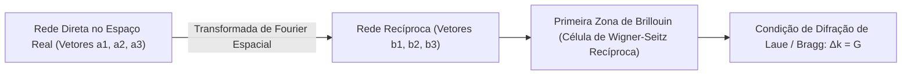

# Física do Estado Sólido e Dispositivos Semicondutores (Kittel & Neamen)

Esta skill estabelece a física quântica da matéria condensada cristalina, dispersão de fônons, estrutura de bandas eletrônicas, dinâmica de transporte de portadores de carga em semicondutores e física de junções e heteroestruturas.

---

## 💎 1. Estrutura Cristalina, Rede Recíproca e Difração

### 1.1 Vetores da Rede Recíproca e Índices de Miller
Dada uma rede de Bravais tridimensional com vetores primitivos $\mathbf{a}_1, \mathbf{a}_2, \mathbf{a}_3$:
$$\mathbf{b}_1 = 2\pi \frac{\mathbf{a}_2 \times \mathbf{a}_3}{\mathbf{a}_1 \cdot (\mathbf{a}_2 \times \mathbf{a}_3)}, \quad \mathbf{b}_2 = 2\pi \frac{\mathbf{a}_3 \times \mathbf{a}_1}{\mathbf{a}_1 \cdot (\mathbf{a}_2 \times \mathbf{a}_3)}, \quad \mathbf{b}_3 = 2\pi \frac{\mathbf{a}_1 \times \mathbf{a}_2}{\mathbf{a}_1 \cdot (\mathbf{a}_2 \times \mathbf{a}_3)}$$
- **Condição de Difração de Bragg**: $2d_{hkl} \sin\theta = n \lambda$, onde a distância interplanar $d_{hkl} = \frac{2\pi}{|\mathbf{G}_{hkl}|}$ para o vetor recíproco $\mathbf{G}_{hkl} = h\mathbf{b}_1 + k\mathbf{b}_2 + l\mathbf{b}_3$.

---

## 🔊 2. Vibrações de Rede, Fônons e Capacidade Térmica

- **Ramos Acústicos e Ópticos**: Para redes com base diatômica, surgem $3$ ramos acústicos ($\omega \to 0$ quando $k \to 0$) e $3(p-1)$ ramos ópticos ($\omega(0) > 0$).
- **Modelo de Debye de Capacidade Térmica da Rede**:
  - Temperatura de Debye $\Theta_D = \frac{\hbar \omega_D}{k_B}$.
  - Em baixas temperaturas ($T \ll \Theta_D$):
    $$C_v = \frac{12\pi^4}{5} N k_B \left( \frac{T}{\Theta_D} \right)^3 \propto T^3$$

---

## ⚡ 3. Teoria de Bandas Eletrônicas e Dinâmica de Portadores

### 3.1 Teorema de Bloch e Massa Efetiva
- **Autofunções de Bloch**: $\psi_{\mathbf{k}}(\mathbf{r}) = e^{i\mathbf{k}\cdot\mathbf{r}} u_{\mathbf{k}}(\mathbf{r})$.
- **Tensor de Massa Efetiva do Elétron ($m^*_{ij}$)**:
  $$(m^*_{ij})^{-1} = \frac{1}{\hbar^2} \frac{\partial^2 E(\mathbf{k})}{\partial k_i \partial k_j}$$
- **Diferenciação de Gap Direto vs Indireto**:
  - *Gap Direto (ex: GaAs, InP)*: Mínimo da banda de condução alinhado com o máximo da banda de valência em $\mathbf{k}=0$ ($\Gamma$). Eficiente para emissão de luz (LEDs e Lasers).
  - *Gap Indireto (ex: Si, Ge)*: Transições ópticas requerem emissão/absorção de fônon para conservar momento cristalino $\hbar\mathbf{k}$.

---

## 🔬 4. Estatística e Transporte em Semicondutores (Neamen)

### 4.1 Concentrações de Portadores e Nível de Fermi
- **Concentração Intrínseca ($n_i$)**:
  $$n_i = \sqrt{N_c N_v} e^{-\frac{E_g}{2 k_B T}}$$
- **Lei de Ação das Massas**: Em equilíbrio térmico com dopagem tipo N ($N_d$) e tipo P ($N_a$):
  $$n \cdot p = n_i^2$$
  - Semicondutor tipo N: $n_0 \approx N_d$, $p_0 \approx \frac{n_i^2}{N_d}$, com $E_F = E_c - k_B T \ln\left(\frac{N_c}{N_d}\right)$.
  - Semicondutor tipo P: $p_0 \approx N_a$, $n_0 \approx \frac{n_i^2}{N_a}$, com $E_F = E_v + k_B T \ln\left(\frac{N_v}{N_a}\right)$.

### 4.2 Equações de Deriva e Difusão (Drift-Diffusion)
Densidade total de corrente $J_{total} = J_n + J_p$:
$$J_n = q n \mu_n \mathcal{E} + q D_n \frac{dn}{dx}, \quad J_p = q p \mu_p \mathcal{E} - q D_p \frac{dp}{dx}$$
- **Relação de Einstein**: $\frac{D_n}{\mu_n} = \frac{D_p}{\mu_p} = \frac{k_B T}{q} = V_T$.
- **Efeito Hall**: Medição da tensão transversal $V_H = \frac{I B}{q p t}$, determinando a concentração $p$ e a mobilidade de Hall $\mu_H$.

---

## 🔌 5. Junções P-N e Dispositivos

- **Potencial Interno de Contato (*Built-in Potential* $V_{bi}$)**:
  $$V_{bi} = V_T \ln\left( \frac{N_a N_d}{n_i^2} \right)$$
- **Largura da Região de Depleção ($W$)**:
  $$W = x_n + x_p = \sqrt{\frac{2\varepsilon_s (V_{bi} - V_A)}{q} \left( \frac{1}{N_a} + \frac{1}{N_d} \right)}$$
- **Equação Ideal do Diodo de Shockley**:
  $$I = I_s \left( e^{\frac{q V_A}{n k_B T}} - 1 \right)$$
