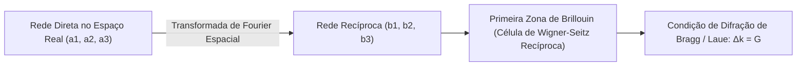

# Física do Estado Sólido, Semicondutores, Nanomateriais e Microfabricação

Esta skill estabelece a fundamentação quântica da matéria condensada cristalina, física de semicondutores, materiais 2D em nanoescala e processos de litografia/fabricação de semicondutores em sala limpa, fundamentada em **Charles Kittel**, **Donald Neamen**, **Poole & Owens** e **Marc Madou**.

---

## 💎 1. Estrutura Cristalina, Rede Recíproca e Difração

### 1.1 Vetores da Rede Recíproca e Lei de Bragg
$$\mathbf{b}_1 = 2\pi \frac{\mathbf{a}_2 \times \mathbf{a}_3}{\mathbf{a}_1 \cdot (\mathbf{a}_2 \times \mathbf{a}_3)}, \quad \mathbf{b}_2 = 2\pi \frac{\mathbf{a}_3 \times \mathbf{a}_1}{\mathbf{a}_1 \cdot (\mathbf{a}_2 \times \mathbf{a}_3)}, \quad \mathbf{b}_3 = 2\pi \frac{\mathbf{a}_1 \times \mathbf{a}_2}{\mathbf{a}_1 \cdot (\mathbf{a}_2 \times \mathbf{a}_3)}$$
- **Lei de Bragg**: $2d_{hkl} \sin\theta = n \lambda$, com distância interplanar $d_{hkl} = \frac{2\pi}{|\mathbf{G}_{hkl}|}$ para o vetor recíproco $\mathbf{G}_{hkl} = h\mathbf{b}_1 + k\mathbf{b}_2 + l\mathbf{b}_3$.

### 1.2 Vibrações de Rede e Modelo de Debye ($T^3$)
Capacidade térmica da rede cristalina em baixas temperaturas ($T \ll \Theta_D$):
$$C_v = \frac{12\pi^4}{5} N k_B \left( \frac{T}{\Theta_D} \right)^3, \quad \text{onde } \Theta_D = \frac{\hbar \omega_D}{k_B}$$

---

## ⚡ 2. Teoria de Bandas e Física de Semicondutores (Neamen)

### 2.1 Teorema de Bloch e Massa Efetiva
- **Funções de Onda de Bloch**: $\psi_{\mathbf{k}}(\mathbf{r}) = e^{i\mathbf{k}\cdot\mathbf{r}} u_{\mathbf{k}}(\mathbf{r})$.
- **Tensor de Massa Efetiva**:
  $$(m^*_{ij})^{-1} = \frac{1}{\hbar^2} \frac{\partial^2 E(\mathbf{k})}{\partial k_i \partial k_j}$$

### 2.2 Portadores em Equilíbrio e Equações de Transporte (Drift-Diffusion)
- **Lei de Ação das Massas**: $n \cdot p = n_i^2 = N_c N_v \exp\left(-\frac{E_g}{k_B T}\right)$.
- **Densidade Total de Corrente de Condução**:
  $$\begin{aligned}
  \mathbf{J}_n &= q n \mu_n \mathbf{E} + q D_n \nabla n \\
  \mathbf{J}_p &= q p \mu_p \mathbf{E} - q D_p \nabla p
  \end{aligned}$$
  Relação de Einstein para difusão térmica: $\frac{D_n}{\mu_n} = \frac{D_p}{\mu_p} = \frac{k_B T}{q}$.

---

## 🔬 3. Nanomateriais e Efeitos de Confinamento Quântico

### 3.1 Pontos Quânticos (Quantum Dots) e Modelo de Brus
Aumento do bandgap efetivo devido ao confinamento quântico 3D em um nanocristal esférico de raio $R$:
$$\Delta E_g(R) = \frac{\hbar^2 \pi^2}{2 R^2} \left( \frac{1}{m_e^*} + \frac{1}{m_h^*} \right) - \frac{1.786 e^2}{4\pi \epsilon_r \epsilon_0 R}$$

### 3.2 Materiais 2D e Nanotubos de Carbono
- **Grafeno**: Relação de dispersão linear cônica sem massa efetiva ao redor dos pontos de Dirac $K$ e $K'$: $E(\mathbf{k}) = \pm \hbar v_F |\mathbf{k}|$ com velocidade de Fermi $v_F \approx 10^6\text{ m/s}$.
- **Nanotubos de Carbono (CNTs)**: Vetor quiral $\mathbf{C}_h = n\mathbf{a}_1 + m\mathbf{a}_2$. O nanotubo é metálico se $(n - m) \equiv 0 \pmod 3$, e semicondutor caso contrário.

---

## 🏭 4. Processos de Microfabricação em Sala Limpa (Madou)

1. **Fotolitografia Avançada (DUV $\lambda = 193\text{ nm}$ e EUV $\lambda = 13.5\text{ nm}$)**:
   - Resolução de Rayleigh: $CD = k_1 \frac{\lambda}{NA}$.
   - Profundidade de Foco: $DOF = k_2 \frac{\lambda}{NA^2}$.
2. **Deposição de Filmes Finos**:
   - **CVD (Chemical Vapor Deposition)**: Deposição química em fase de vapor para óxidos e polissilício.
   - **ALD (Atomic Layer Deposition)**: Crescimento monocamada autocatalítico saturado para dielétricos High-$k$ ($\text{HfO}_2$).
3. **Corrosão por Plasma (Reactive Ion Etching - RIE)**:
   - Anisotropia com feixes de íons e gases halogenados ($\text{CF}_4, \text{SF}_6, \text{Cl}_2$) para criação de valas de isolamento STI e gates FinFET/GAA.
4. **Metrologia e Caracterização**:
   - **DRX**: Difração de Raios-X para parâmetros de rede cristalina.
   - **MEV / MET (SEM / TEM)**: Microscopia Eletrônica de Varredura e Transmissão para inspeção em escala atômica.
   - **AFM (Atomic Force Microscopy)**: Microscopia de Força Atômica para perfilometria nanométrica 3D de superfícies.
