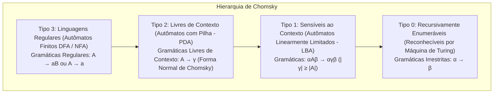

# Teoria da Computação, Autômatos e Complexidade (Michael Sipser)

Esta skill formaliza as fronteiras matemáticas da computabilidade e complexidade computacional, definindo modelos abstratos de processamento, linguagens formais, limites intrínsecos de decidibilidade e classificação de problemas em classes assintóticas de recursos (tempo e espaço).

---

## 🏛️ 1. A Hierarquia de Chomsky e Classes de Linguagens



---

## ⚙️ 2. Autômatos Finitos e Linguagens Regulares

### 2.1 Definição Formal de DFA e NFA
- **Autômato Finito Determinístico (DFA)**: 5-tupla $(Q, \Sigma, \delta, q_0, F)$:
  - $Q$: Conjunto finito de estados.
  - $\Sigma$: Alfabeto finito de entrada.
  - $\delta: Q \times \Sigma \to Q$: Função determinística de transição.
  - $q_0 \in Q$: Estado inicial.
  - $F \subseteq Q$: Conjunto de estados de aceitação (finais).
- **Autômato Finito Não-Determinístico (NFA)**: $\delta: Q \times (\Sigma \cup \{\varepsilon\}) \to \mathcal{P}(Q)$.
- **Equivalência**: Todo NFA tem um DFA equivalente gerado por *Subset Construction* ($|Q_{DFA}| \le 2^{|Q_{NFA}|}$).

### 2.2 Lema do Bombeamento para Linguagens Regulares (*Pumping Lemma*)
Se $L$ é uma linguagem regular, existe um comprimento de bombeamento $p \ge 1$ tal que para qualquer cadeia $s \in L$ com $|s| \ge p$, $s$ pode ser dividida em $s = xyz$ satisfazendo:
1. Para cada $i \ge 0$, $x y^i z \in L$.
2. $|y| > 0$.
3. $|xy| \le p$.

*(Usado para provar por contradição que linguagens como $L = \{a^n b^n \mid n \ge 0\}$ não são regulares).*

---

## 🥞 3. Linguagens Livres de Contexto e Autômatos com Pilha (PDA)

### 3.1 Gramáticas Livres de Contexto (CFG) e Forma Normal de Chomsky (CNF)
Uma CFG está na **Forma Normal de Chomsky** se todas as regras de produção têm a forma:
$$A \to BC \quad \text{ou} \quad A \to a \quad (\text{ou } S \to \varepsilon \text{ se } \varepsilon \in L)$$
- Permite decidir pertinência em tempo polinomial $\mathcal{O}(n^3)$ via **Algoritmo CYK (Cocke-Younger-Kasami)** com programação dinâmica.

### 3.2 Lema do Bombeamento para Linguagens Livres de Contexto
Se $L$ é livre de contexto, existe $p \ge 1$ tal que para todo $s \in L$ com $|s| \ge p$, $s = uvxyz$ onde:
1. $u v^i x y^i z \in L$ para todo $i \ge 0$.
2. $|vy| > 0$.
3. $|vxy| \le p$.

---

## 💻 4. Máquinas de Turing e Decidibilidade

### 4.1 Definição Formal de Máquina de Turing
7-tupla $M = (Q, \Sigma, \Gamma, \delta, q_0, q_{accept}, q_{reject})$:
- $\Gamma$: Alfabeto da fita ($\Sigma \subset \Gamma$, caractere branco $\sqcup \in \Gamma \setminus \Sigma$).
- $\delta: Q \times \Gamma \to Q \times \Gamma \times \{L, R\}$: Função de transição com movimento da cabeça.

### 4.2 O Problema da Parada ($A_{TM}$ e $HALT_{TM}$)
- **Linguagem $A_{TM} = \{ \langle M, w \rangle \mid M \text{ é uma MT que aceita a cadeia } w \}$**:
  - Provado indecidível pelo método de **Diagonalização de Cantor**: Se existisse um decodificador $H(\langle M, w \rangle)$, constrói-se $D(\langle M \rangle)$ que executa $H(\langle M, \langle M \rangle \rangle)$ e inverte o resultado, levando à contradição $D(\langle D \rangle) \text{ aceita} \iff D(\langle D \rangle) \text{ rejeita}$.
- **Teorema de Rice**: Qualquer propriedade semântica não-trivial da linguagem reconhecida por uma Máquina de Turing é **indecidível**.

---

## ⏱️ 5. Teoria da Complexidade Computacional

```
Hierarquia das Principais Classes de Complexidade:
  L ⊆ NL ⊆ P ⊆ NP ⊆ PSPACE = NPSPACE ⊆ EXPTIME ⊆ NEXPTIME
```

| Classe de Complexidade | Definição Formal | Problemas Representativos |
| :--- | :--- | :--- |
| **P** | Problemas decidíveis em tempo polinomial determinístico $\mathcal{O}(n^k)$ por MT determinística. | Caminho Mínimo (Dijkstra), 2-SAT, Matching Bipartido Máximo, Álgebra Linear. |
| **NP** | Problemas verificáveis em tempo polinomial determinístico por um certificado de tamanho polinomial (ou decidíveis em tempo polinomial por MT não-determinística). | SAT, 3-SAT, Clique Máximo, Vertex Cover, Caixeiro-Viajante (TSP), Mochila 0/1. |
| **co-NP** | Problemas cujo complemento $\overline{L}$ está em NP. | TAUTOLOGY (Verificação de Fórmulas Válidas). |
| **NP-Completo** | Problema $B \in \text{NP}$ e para todo $A \in \text{NP}$, $A \le_p B$ (Redutível em tempo polinomial). | 3-SAT, Hamiltonian Path, Subset Sum, Graph 3-Coloring. |
| **PSPACE** | Problemas decidíveis em espaço polinomial $\mathcal{O}(n^k)$. Pelo **Teorema de Savitch**, $\text{PSPACE} = \text{NPSPACE}$. | QBF (Quantified Boolean Formulas), Jogos Generalizados (Xadrez/Go em $N \times N$). |

### 5.1 Teorema de Cook-Levin
O problema **SAT (Satisfatibilidade Booleana)** é **NP-Completo**:
- Prova através da codificação da matriz de configuração (tableau de tamanho polinomial $n^k \times n^k$) de uma Máquina de Turing Não-Determinística em uma fórmula booleana CNF válida.
- Consequência: $\text{P} = \text{NP} \iff \text{SAT} \in \text{P}$.
