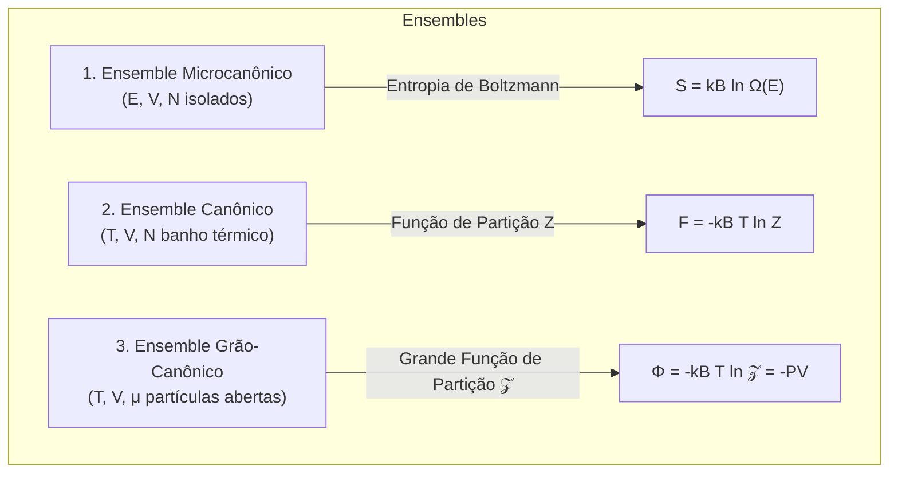

# Termodinâmica e Mecânica Estatística (Pathria & Callen)

Esta skill estabelece a ponte microscópica e macroscópica rigorosa entre as leis fenomenológicas da termodinâmica, a mecânica estatística de ensembles e os gases quânticos degenerados de férmions e bósons.

---

## 🔥 1. Leis da Termodinâmica e Potenciais Termodinâmicos

### 1.1 Leis Fundamentais
- **Primeira Lei**: $dU = \delta Q - \delta W + \mu dN$.
- **Segunda Lei**: $dS \ge \frac{\delta Q}{T}$ (para processos reversíveis, $dS = \frac{\delta Q_{rev}}{T}$).
  - Eficiência do Ciclo de Carnot: $\eta = 1 - \frac{T_C}{T_H}$.
- **Terceira Lei (Teorema de Nernst)**: $S \to 0$ quando $T \to 0\text{ K}$ para sistemas cristalinos puros.

### 1.2 Potenciais Termodinâmicos e Relações de Maxwell
| Potencial | Transformada de Legendre | Diferencial Fundamental | Relação de Maxwell Associada |
| :--- | :--- | :--- | :--- |
| **Energia Interna ($U$)** | $U(S, V, N)$ | $dU = T dS - P dV + \mu dN$ | $\left(\frac{\partial T}{\partial V}\right)_S = -\left(\frac{\partial P}{\partial S}\right)_V$ |
| **Entalpia ($H$)** | $H = U + PV$ | $dH = T dS + V dP + \mu dN$ | $\left(\frac{\partial T}{\partial P}\right)_S = \left(\frac{\partial V}{\partial S}\right)_P$ |
| **Energia Livre de Helmholtz ($F$)** | $F = U - TS$ | $dF = -S dT - P dV + \mu dN$ | $\left(\frac{\partial S}{\partial V}\right)_T = \left(\frac{\partial P}{\partial T}\right)_V$ |
| **Energia Livre de Gibbs ($G$)** | $G = H - TS$ | $dG = -S dT + V dP + \mu dN$ | $\left(\frac{\partial S}{\partial P}\right)_T = -\left(\frac{\partial V}{\partial T}\right)_P$ |

---

## 📊 2. Ensembles da Mecânica Estatística (Pathria)

### 2.1 Ensemble Canônico
- **Função de Partição Canônica**: $Z = \sum_{i} e^{-\beta E_i}$ onde $\beta = \frac{1}{k_B T}$.
- **Energia Média Interna**: $U = \langle E \rangle = -\frac{\partial \ln Z}{\partial \beta} = k_B T^2 \frac{\partial \ln Z}{\partial T}$.
- **Flutuações de Energia e Capacidade Térmica**: $\sigma_E^2 = \langle E^2 \rangle - \langle E \rangle^2 = k_B T^2 C_v$.

---

## ⚛️ 3. Estatísticas Quânticas e Gases Degenerados

O número médio de ocupação de um estado quântico de energia monomarticular $\epsilon_i$:

$$\langle n_i \rangle = \frac{1}{e^{\beta(\epsilon_i - \mu)} + a}$$
- $a = 0$: **Estatística Clássica de Maxwell-Boltzmann** (limite diluído $n \lambda_{th}^3 \ll 1$).
- $a = +1$: **Estatística Quântica de Fermi-Dirac** (Férmions de spin semi-inteiro com Princípio de Exclusão de Pauli).
- $a = -1$: **Estatística Quântica de Bose-Einstein** (Bósons de spin inteiro com condensação).

### 3.1 Gás de Elétrons Degenerado (Fermi-Dirac)
- **Energia de Fermi ($T = 0\text{ K}$)**:
  $$E_F = \frac{\hbar^2}{2m} (3\pi^2 n)^{2/3}, \quad k_F = (3\pi^2 n)^{1/3}$$
- **Capacidade Térmica Eletrônica de Sommerfeld**: $C_{v,el} = \frac{\pi^2}{2} N k_B \left( \frac{T}{T_F} \right) = \gamma T$ (dependência linear com a temperatura).

### 3.2 Condensação de Bose-Einstein (BEC) e Radiação de Corpo Negro
- **Temperatura Crítica de Condensação ($T_c$)**: Abaixo de $T_c$, uma fração macroscópica de bósons ocupa o estado fundamental de energia zero:
  $$T_c = \frac{2\pi \hbar^2}{m k_B} \left( \frac{n}{\zeta(3/2)} \right)^{2/3} \approx 3.31 \frac{\hbar^2 n^{2/3}}{m k_B}$$
- **Lei de Planck para Radiação de Fótons ($\mu = 0$)**:
  $$u(\nu, T) = \frac{8\pi h \nu^3}{c^3} \frac{1}{e^{h\nu/k_B T} - 1}$$
