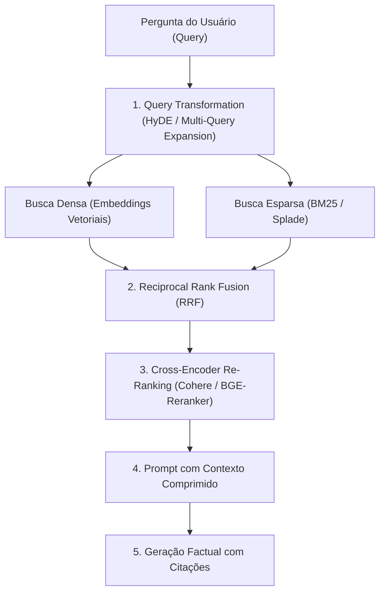

# Engenharia de Aplicações LLM e RAG Avançado (Alammar)

Esta skill estabelece a arquitetura de engenharia de software para construir sistemas robustos e de baixa latência baseados em **Modelos de Linguagem de Grande Escala (LLMs)**, **Geração Aumentada por Recuperação (RAG)** híbrida, fine-tuning parametrizado e orquestração de agentes.

---

## 🧠 1. Arquitetura de Transformer e Mecanismo de Atenção

### 1.1 Scaled Dot-Product Attention e Multi-Head Attention (MHA)
Para matrizes de consulta ($\mathbf{Q}$), chave ($\mathbf{K}$) e valor ($\mathbf{V}$) de dimensão $d_k$:

$$\text{Attention}(\mathbf{Q}, \mathbf{K}, \mathbf{V}) = \text{softmax}\left( \frac{\mathbf{Q} \mathbf{K}^T}{\sqrt{d_k}} + \mathbf{M} \right) \mathbf{V}$$
onde $\mathbf{M}$ é a máscara causal para modelos autoregressivos.

- **Rotary Position Embedding (RoPE)**: Codifica a posição relativa injetando matrizes ortogonais de rotação diretamente nos vetores de consulta e chave $\mathbf{q}_m = \mathbf{R}_{\Theta, m}^d \mathbf{W}_q \mathbf{x}_m$.
- **KV-Cache Optimization**: Armazena em memória VRAM as projeções $\mathbf{K}$ e $\mathbf{V}$ dos tokens anteriores para reduzir o tempo de inferência autorregressiva de $\mathcal{O}(N^2)$ para $\mathcal{O}(N)$.

---

## 🔍 2. Pipeline RAG Avançado e Recuperação Híbrida



### 2.1 Fusão de Ranqueamento Recíproco (RRF)
Combina os resultados de busca vetorial densa ($R_{dense}$) e busca por palavras-chave esparsa ($R_{BM25}$):

$$RRF(d) = \sum_{m \in \{dense, BM25\}} \frac{1}{k + r_m(d)}$$
onde $k \approx 60$ é uma constante de suavização e $r_m(d)$ é a posição do documento no ranqueamento $m$.

### 2.2 Estratégias Avançadas de RAG
- **HyDE (Hypothetical Document Embeddings)**: Gera primeiro uma resposta hipotética com o LLM e utiliza o embedding dessa resposta para recuperar documentos reais do vector database.
- **Parent-Child Chunking**: Divide documentos em chunks menores para busca vetorial precisa, mas entrega o parágrafo/seção pai maior como contexto para o LLM.
- **GraphRAG**: Combina bancos vetoriais com grafos de conhecimento estruturados para responder perguntas que exigem síntese global sobre todo o corpus.

---

## ⚡ 3. Fine-Tuning Eficiente (PEFT, LoRA e QLoRA)

Para adaptar um LLM de $d$ dimensões com matriz de pesos congelada $\mathbf{W}_0 \in \mathbb{R}^{d \times k}$:

$$\mathbf{W} = \mathbf{W}_0 + \Delta \mathbf{W} = \mathbf{W}_0 + \frac{\alpha}{r} \mathbf{B} \mathbf{A}$$
onde $\mathbf{B} \in \mathbb{R}^{d \times r}$ e $\mathbf{A} \in \mathbb{R}^{r \times k}$ com rank $r \ll \min(d, k)$ (ex.: $r \in [8, 64]$) e $\alpha$ é o hiperparâmetro de escala.

- **QLoRA (Quantized Low-Rank Adaptation)**: Quantiza $\mathbf{W}_0$ em formato 4-bit NormalFloat (NF4) com Double Quantization (DQ) e Paged Optimizers, permitindo fazer fine-tuning de modelos de 70B parâmetros em uma única GPU de consumo (24GB VRAM).

---

## 🤖 4. Padrões de Agentes e Orquestração

- **Padrão ReAct (Reasoning + Acting)**:
  ```
  Loop de Execução:
  Thought: Raciocínio sobre o próximo passo necessário.
  Action: Nome da ferramenta externa a invocar (Tool / API / SQL / Python).
  Action Input: Argumentos serializados em JSON.
  Observation: Saída retornada pela execução da ferramenta.
  ... (repete até conclusão)
  Final Answer: Resposta sintetizada com base nas observações.
  ```
- **Alinhamento Direto por Preferência (DPO - Direct Preference Optimization)**:
  Otimiza diretamente a política $\pi_\theta$ sem necessidade de treinar um modelo de recompensa separado:
  $$\mathcal{L}_{DPO}(\pi_\theta; \pi_{ref}) = -\mathbb{E}_{(x, y_w, y_l)} \left[ \ln \sigma \left( \beta \ln \frac{\pi_\theta(y_w|x)}{\pi_{ref}(y_w|x)} - \beta \ln \frac{\pi_\theta(y_l|x)}{\pi_{ref}(y_l|x)} \right) \right]$$

---

## 📊 5. Métricas de Avaliação Automatizada (Framework RAGAS)

1. **Faithfulness (Fidelidade)**: Proporção de alegações na resposta do LLM que podem ser diretamente inferidas a partir do contexto fornecido (prevenção de alucinação).
2. **Answer Relevance**: Quão pertinente a resposta é à pergunta original do usuário, penalizando respostas incompletas ou redundantes.
3. **Context Precision**: Avalia se os chunks recuperados mais relevantes aparecem nas primeiras posições do ranking.
4. **Context Recall**: Proporção de sentenças da resposta de referência (ground truth) que foram capturadas pelos chunks recuperados.
