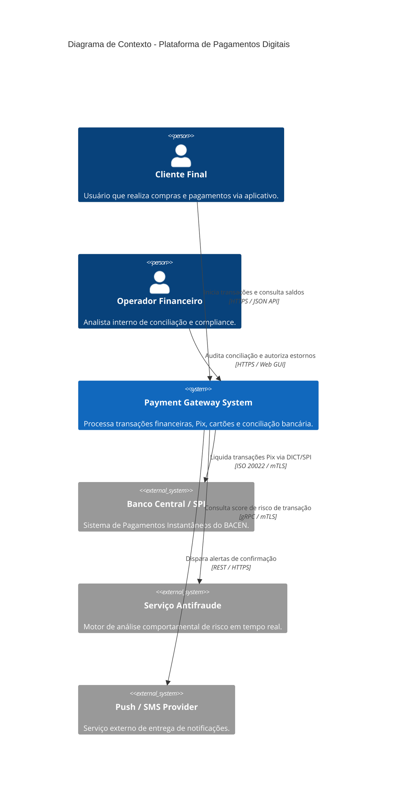
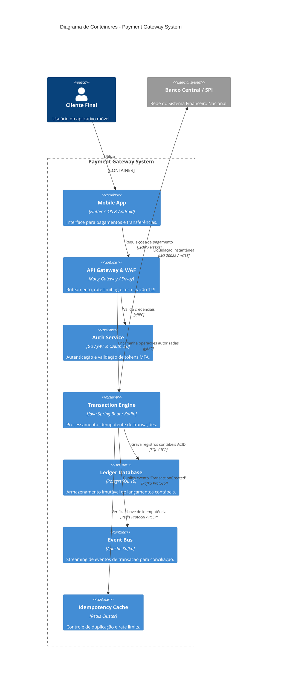

# C4 Model para Visualização de Arquitetura de Software

Esta skill estabelece os padrões formais para modelagem, abstração hierárquica e representação visual de arquiteturas de software baseadas no **C4 Model** de Simon Brown (*The C4 model for visualising software architecture*).

---

## 📌 Os 4 Níveis de Abstração do C4 Model

O C4 Model organiza a visualização de sistemas de software em quatro níveis hierárquicos de zoom progressivo:

```
┌─────────────────────────────────────────────────────────────┐
│  Nível 1: Diagrama de Contexto de Sistema (System Context)  │
│  (Pessoas e Sistemas de Software ao redor do ecossistema)   │
└──────────────────────────────┬──────────────────────────────┘
                               │ Zoom In
┌──────────────────────────────▼──────────────────────────────┐
│  Nível 2: Diagrama de Contêineres (Containers)              │
│  (Aplicações, Bancos de Dados, Microserviços, Gateways)     │
└──────────────────────────────┬──────────────────────────────┘
                               │ Zoom In
┌──────────────────────────────▼──────────────────────────────┐
│  Nível 3: Diagrama de Componentes (Components)              │
│  (Controladores, Serviços, Repositórios, Módulos internos)  │
└──────────────────────────────┬──────────────────────────────┘
                               │ Zoom In (Opcional)
┌──────────────────────────────▼──────────────────────────────┐
│  Nível 4: Diagrama de Código (Code / Classes)               │
│  (Diagramas de Classes UML, AST, Padrões de Projeto GoF)    │
└─────────────────────────────────────────────────────────────┘
```

---

## 📐 Diretrizes Detalhadas por Nível

### 1. Nível 1: System Context (Contexto do Sistema)
- **Objetivo**: Fornecer uma visão panorâmica (30.000 pés) do escopo do sistema de software.
- **Público-Alvo**: Stakeholders de negócios, gerentes de produto, novos desenvolvedores e equipe de arquitetura.
- **Elementos Representados**:
  - **Pessoas (Users/Personas)**: Atores humanos que interagem diretamente com o sistema.
  - **Sistema de Software (Foco)**: O sistema sendo projetado ou documentado.
  - **Sistemas Externos de Software**: Provedores de pagamento, autenticação corporativa (SSO), serviços SaaS, APIs governamentais.
  - **Relacionamentos**: Direcionais com descrição clara do propósito e protocolo de alto nível (ex: `Envia requisições de pagamento via HTTPS/JSON`).

### 2. Nível 2: Containers (Contêineres de Execução)
- **Definição de Contêiner**: Qualquer unidade executável ou implantável separadamente que armazena dados ou executa código (ex: SPA React, API Backend Spring/Node, Worker Go, Banco PostgreSQL, Fila RabbitMQ/Kafka, Bucket S3).
- **Objetivo**: Mostrar a forma de alto nível da arquitetura de software e como as responsabilidades são distribuídas.
- **Elementos Representados**:
  - Aplicações Frontend (Web, Mobile).
  - Gateways de API e Proxies Reversos.
  - Microsserviços e Monólitos Modulares.
  - Bancos de Dados (SQL, NoSQL, Cache em memória).
  - Tecnologias e Protocolos explícitos (ex: `Go, REST/gRPC`, `PostgreSQL 16, TCP 5432`).

### 3. Nível 3: Components (Componentes Internos)
- **Definição de Componente**: Um agrupamento de código relacionado encapsulado por uma interface limpa (ex: Controller, Service Layer, Repository, Event Producer).
- **Objetivo**: Decompor um contêiner individual para detalhar como seus componentes internos colaboram.
- **Diretriz**: Crie diagramas de componentes apenas para contêineres críticos ou complexos que justifiquem o detalhamento.

### 4. Nível 4: Code (Código / Classes)
- **Objetivo**: Mostrar detalhes de implementação em nível de código (diagramas de classes UML, interfaces, herança).
- **Diretriz**: Na maioria dos projetos, esse nível é gerado dinamicamente por ferramentas de engenharia reversa e AST via [`skills/mapping/code-architecture-mapping/SKILL.md`](../../mapping/code-architecture-mapping/SKILL.md) ou [`skills/mapping/uml-diagram-generation/SKILL.md`](../../mapping/uml-diagram-generation/SKILL.md).

---

## 🛠️ Padrões de Sintaxe: Mermaid.js & C4-PlantUML

### Exemplo: Diagrama de Contexto (Nível 1) em Mermaid.js C4


### Exemplo: Diagrama de Contêineres (Nível 2) em Mermaid.js C4


---

## 📋 Checklist de Qualidade para Diagramas C4

1. **Elementos Claramente Identificados**:
   - Todo elemento possui: `Nome`, `Tipo/Papel`, `Tecnologia Principal` (para Níveis 2 e 3) e `Descrição Clara do Propósito`.
2. **Relacionamentos Explícitos**:
   - Toda linha de conexão deve conter um verbo no presente (ex: `Consulta`, `Grava`, `Publica evento`) e o protocolo de transporte (`HTTPS`, `gRPC`, `AMQP`, `SQL/TCP`).
3. **Foco e Limites do Sistema**:
   - Utilizar delimitadores de fronteira (`System_Boundary`, `Container_Boundary`) para separar claramente o que pertence ao escopo do sistema do que é externo.
4. **Alinhamento com Documentação**:
   - Integrar diagramas C4 em Documentos de Arquitetura de Software (SAD) e Architecture Decision Records (ADRs).
