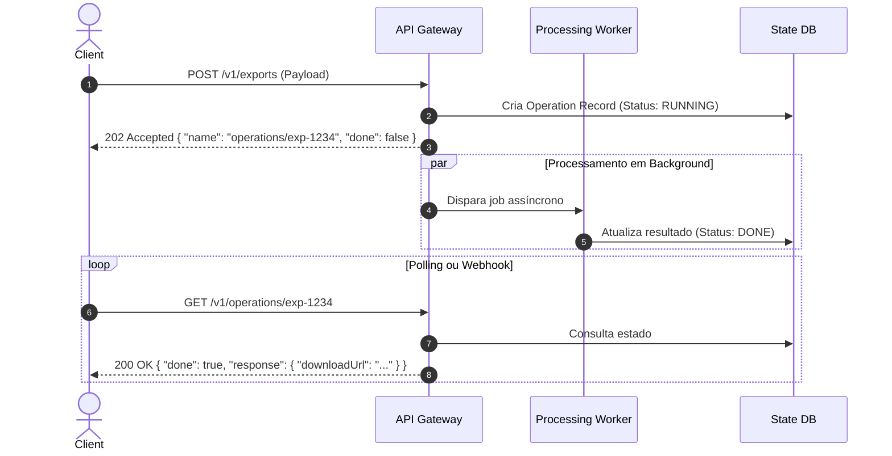

# Padrões Avançados de Design de APIs (API Design Patterns)

Esta skill estabelece diretrizes rigorosas e padrões reutilizáveis para design, modelagem de contratos e evolução contínua de APIs corporativas, fundamentada no livro **API Design Patterns** de JJ Geewax e nas melhores práticas de **Continuous API Management**.

---

## 🎯 1. Princípios Fundamentais de Orientação a Recursos

### Estrutura Hierárquica de Recursos
- **Coleção**: `/v1/users`, `/v1/orders`
- **Recurso Individual**: `/v1/users/{userId}`, `/v1/orders/{orderId}`
- **Sub-Recurso**: `/v1/users/{userId}/addresses/{addressId}`
- **Ações Customizadas (Custom Methods)**: Quando uma operação não se encaixa nos verbos CRUD padrão, utilize o sufixo com dois-pontos `:`:
  - `POST /v1/orders/{orderId}:cancel`
  - `POST /v1/documents/{documentId}:publish`
  - `POST /v1/payments:batchCharge`

---

## 🔁 2. Padrões de Operações e Mutações

### A. Operações de Longa Duração (Long-Running Operations - LRO)
Para tarefas assíncronas que levam mais de 500ms para completar (processamento de vídeo, relatórios, migrações):



### B. Mutações em Lote (Batch & Bulk Mutations)
- **Operações Atômicas**:
  - `POST /v1/books:batchCreate` com payload `{ "requests": [...] }`.
  - Retorna `200 OK` com `{ "books": [...] }` ou rejeição total (`Rollback`).
- **Operações Parciais (Bulk Processing com RFC 7807)**:
  - Retorna lista de sucessos e lista detalhada de erros com índices específicos para reprocessamento seletivo.

### C. Paginação Determinística por Cursor
Evite paginação baseada em `offset`/`limit` em bases com alta taxa de inserção (problema do *page drift*). Utilize tokens de página codificados (Cursor-Based Pagination):
- **Requisição**: `GET /v1/orders?pageSize=50&pageToken=eyJjcmVhdGVkQXQiOiIyMDI2LTA4LTI4VDE3OjAwOjAwWiIsImlkIjoiOTk5In0=`
- **Resposta**:
  ```json
  {
    "orders": [ ... ],
    "nextPageToken": "eyJjcmVhdGVkQXQiOiIyMDI2LTA4LTI4VDE3OjAwOjAwWiIsImlkIjoiOTUwIn0="
  }
  ```

---

## 🔒 3. Idempotência e Tratamento de Falhas

### Padrão de Chave de Idempotência (`Idempotency-Key`)
1. **Recepção**: O cliente envia `Idempotency-Key: <UUIDv4>` no cabeçalho em requisições `POST` / `PATCH`.
2. **Locking**: A API verifica se a chave existe no cache distribuído (Redis com TTL de 24h).
   - Se em processamento: Retorna `409 Conflict` ou `425 Too Early`.
   - Se já concluída: Retorna imediatamente a resposta cacheada (status, cabeçalhos e body originais) sem re-executar lógica de negócio ou debitar pagamentos.
   - Se nova: Processa, grava resposta no cache atômico e retorna.

---

## 📐 4. Padrões de Filtragem, Ordenação e Projeção de Campos

| Recurso | Parâmetro | Exemplo de Sintaxe |
| :--- | :--- | :--- |
| **Filtragem Declarativa** | `filter` | `GET /v1/users?filter=status="ACTIVE" AND age>=18` |
| **Ordenação Multicampo** | `orderBy` | `GET /v1/orders?orderBy=createdAt desc, totalAmount asc` |
| **Field Mask / Projeção** | `fields` ou `readMask` | `GET /v1/users/123?fields=id,name,email` (reduz payload de rede) |

---

## 📋 Checklist de Revisão de Contratos de API

- [ ] **1. Semântica de Verbos**: GET idempotente e seguro, POST para criação/ações, PUT para substituição total, PATCH para mutação parcial.
- [ ] **2. Padronização de Erros**: Respostas de erro formatadas estritamente sob a RFC 7807 (`type`, `title`, `status`, `detail`, `instance`, `invalidParams`).
- [ ] **3. Compatibilidade Retroativa (Backward Compatibility)**:
  - Não renomear campos existentes.
  - Não alterar tipos primitivos de dados.
  - Novos campos em requisições devem ser sempre opcionais.
- [ ] **4. Rate Limiting e Quotas**: Cabeçalhos padronizados `RateLimit-Limit`, `RateLimit-Remaining`, `RateLimit-Reset` e `Retry-After`.
