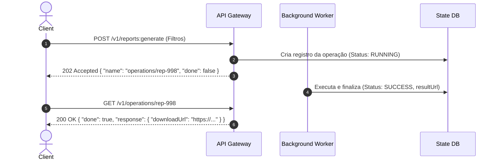

# Design de APIs RESTful, Protocolo HTTP e Padrões de Contrato

Esta skill fornece as diretrizes canônicas para arquitetura do **Protocolo HTTP (HTTP/1.1, HTTP/2, HTTP/3 sobre QUIC)**, modelagem de **APIs RESTful** sob **OpenAPI 3.1** e aplicação dos **Padrões de Design de APIs** (baseado em JJ Geewax e *Continuous API Management*).

---

## 🌐 1. Semântica dos Verbos e Métodos HTTP (RFC 9110 & RFC 10008)

| Método | Corpo Requisição | Corpo Resposta | Seguro (Safe)? | Idempotente? | Cacheável? | Padrão IETF |
| :--- | :---: | :---: | :---: | :---: | :---: | :--- |
| **GET** | Não | Sim | Sim | Sim | Sim | RFC 9110 |
| **QUERY** | **Sim** | **Sim** | **Sim** | **Sim** | **Sim** | **RFC 10008** |
| **POST** | Sim | Sim | Não | Não | Condicional | RFC 9110 |
| **PUT** | Sim | Sim | Não | Sim | Não | RFC 9110 |
| **PATCH** | Sim | Sim | Não | Não | Condicional | RFC 5789 / 9110 |
| **DELETE** | Opcional | Sim | Não | Sim | Não | RFC 9110 |
| **HEAD** | Não | Não | Sim | Sim | Sim | RFC 9110 |
| **OPTIONS** | Opcional | Sim | Sim | Sim | Não | RFC 9110 |

> **Método `QUERY` (RFC 10008)**: Permite consultas e buscas seguras/idempotentes com payload JSON complexo sem violar a semântica do `GET` e sem efeitos colaterais de `POST`. A chave de cache deve incluir URI + hash do corpo da requisição.

---

## 🎯 2. Modelagem Hierárquica e Métodos Customizados

### 2.1 Estrutura de URIs
- **Coleção**: `/v1/orders`
- **Recurso**: `/v1/orders/{orderId}`
- **Sub-Recurso**: `/v1/orders/{orderId}/items/{itemId}`
- **Métodos Customizados (Custom Actions)**: Use o sufixo `:` para ações não-CRUD:
  - `POST /v1/orders/{orderId}:cancel`
  - `POST /v1/documents/{documentId}:publish`
  - `POST /v1/payments:batchCharge`

---

## 🔁 3. Padrões Avançados de Operações

### 3.1 Operações de Longa Duração (Long-Running Operations - LRO)
Para processos assíncronos (> 500ms):


### 3.2 Idempotência em Mutações (`Idempotency-Key`)
- O cliente envia cabeçalho `Idempotency-Key: <UUIDv4>`.
- O servidor armazena chave no Redis/DB com TTL (ex: 24h). Se repetida, retorna a resposta original em cache sem reprocessar.

---

## 🛠️ 4. Tratamento de Erros Padronizado (RFC 7807 - Problem Details)

Utilize `Content-Type: application/problem+json`:
```json
{
  "type": "https://api.dominio.com/errors/insufficient-funds",
  "title": "Saldo insuficiente para transferência",
  "status": 422,
  "detail": "A conta 1029 possui R$ 50,00 disponíveis, mas a operação exigiu R$ 120,00.",
  "instance": "/v1/accounts/1029/transfers/tx-4432",
  "invalid_params": [
    {
      "name": "amount",
      "reason": "O montante excede o limite disponível"
    }
  ]
}
```

---

## 🔍 5. Paginação Determinística por Cursor e Rate Limiting

### 5.1 Paginação por Cursor
```http
GET /v1/events?limit=50&starting_after=evt_98374 HTTP/1.1
```
```json
{
  "data": [...],
  "has_more": true,
  "next_cursor": "evt_98424"
}
```

### 5.2 Cabeçalhos de Rate Limiting (IETF Draft)
- `RateLimit-Limit: 1000, 1000;window=60`
- `RateLimit-Remaining: 980`
- `RateLimit-Reset: 15`
- Resposta para estouro de cota: `429 Too Many Requests` com cabeçalho `Retry-After: 15`.

---

## 🛡️ 6. Caching HTTP e Cabeçalhos de Segurança

- **Validação Condicional**: `ETag: "hash321"`, `If-None-Match: "hash321"` $\rightarrow$ `304 Not Modified`.
- **Cache-Control**: `public, max-age=3600, stale-while-revalidate=60`.
- **Headers de Segurança Obrigatórios**:
  - `Strict-Transport-Security: max-age=63072000; includeSubDomains; preload`
  - `Content-Security-Policy: default-src 'self'`
  - `X-Content-Type-Options: nosniff`
  - `X-Frame-Options: DENY`
