# Habilidade Auxiliar: Designer de Documentação e Diagramas (Mermaid)

Esta skill guia a inteligência artificial a elaborar documentações de software visualmente ricas, estruturadas e a desenhar diagramas e fluxogramas usando a sintaxe correta do **Mermaid.js**, abrangendo desde estruturas tradicionais até diagramas de dados, estratégicos e de infraestrutura.

---

## 🚫 Prevenção de Erros de Sintaxe (Crítico)

Para evitar que o renderizador de Markdown ou a IDE quebrem ao processar o Mermaid, siga rigidamente estas regras:

1. **Palavras Reservadas**:
   - A palavra **`end`** (toda minúscula) é um delimitador de bloco em subgrafos. Se precisar escrever "end" em um nó ou texto, capitalize-a (`End`, `END`) ou cerque-a de aspas duplas: `id["Finalizar e fechar (end)"]`.
2. **Caracteres Especiais**:
   - Evite usar parênteses `()`, colchetes `[]`, chaves `{}`, barras `/` ou aspas soltas diretamente no rótulo do nó.
   - **Solução**: Sempre cerque rótulos contendo caracteres especiais ou espaços com aspas duplas, utilizando o formato: `id["Meu Rótulo (Contendo Parênteses)"]`.
3. **Conexões Ambíguas**:
   - Não inicie rótulos de nós conectados com as letras `o` ou `x` coladas nos hifens (ex: `A---oB` ou `A---xB` são interpretados como setas circulares ou cruzadas). Use espaços: `A --- oB`.
4. **Diagramas Experimentais/Beta**:
   - Diagramas marcados com sufixo `-beta` devem iniciar exatamente com a palavra-chave correspondente (ex: `sankey-beta`, `treeView-beta`).

---

## 📐 1. Diagramas Clássicos e Estruturais

### 🔹 Fluxogramas (`flowchart`)
Utilize a declaração `flowchart` (em vez de `graph`) para obter renderizações modernas.
- **Orientação**: `TB` ou `TD` (cima-baixo), `LR` (esquerda-direita), `BT` (baixo-cima), `RL` (direita-esquerda).
- **Formas de Nós**:
    - Retângulo Padrão: `id1[Texto]`
    - Arredondado (Início/Fim): `id2(Texto)`
    - Estádio (Stadium): `id3([Texto])`
    - Sub-rotina: `id4[[Texto]]`
    - Banco de Dados (Cilindro): `id5[(Texto)]`
    - Círculo: `id6((Texto))`
    - Losango (Decisão): `id7{Texto}`
    - Hexágono (Preparação): `id8{{Texto}}`
    - Paralelogramo: `id9[/Texto/]` ou `id10[\Texto\]`
    - Duplo Círculo: `id11(((Texto)))`
- **Conexões**:
    - Seta Simples: `A --> B`
    - Linha sem Seta: `A --- B`
    - Linha com Texto: `A -->|Texto| B` ou `A -- Texto --> B`
    - Linha Pontilhada: `A -.-> B`
    - Linha Grossa (Thick): `A ==> B`
    - Comprimento Customizado: `--->` ou `====>` ou `-.-.->` (adicione caracteres para esticar)
    - Setas Circulares/Cruzadas: `A --o B` ou `A --x B`
- **Subgrafos**:
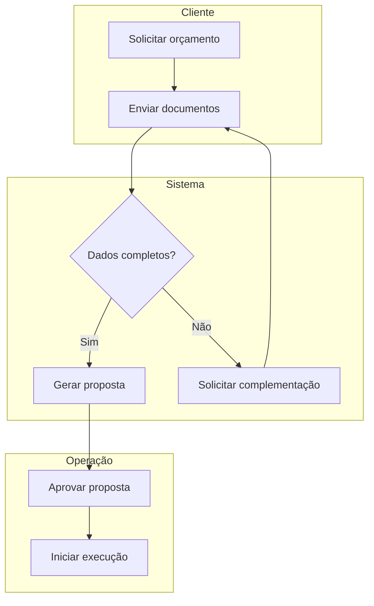
```mermaid
flowchart TB
    subgraph Lane_Cliente["Cliente"]
        direction LR
        A[Solicitar orçamento] --> B[Enviar documentos]
    end
    subgraph Lane_Sistema["Sistema"]
        direction LR
        C{Dados completos?}
        D[Gerar proposta]
        E[Solicitar complementação]
    end
    subgraph Lane_Operacao["Operação"]
        direction LR
        F[Aprovar proposta]
        G[Iniciar execução]
    end
    B --> C
    C -->|Sim| D --> F --> G
    C -->|Não| E --> B
```

### 🔹 Raias de Processos (Swimlanes Diagram)
Como o Mermaid não possui um tipo dedicado para Swimlanes, utilize `flowchart` combinando `subgraph` estruturados para representar raias funcionais.
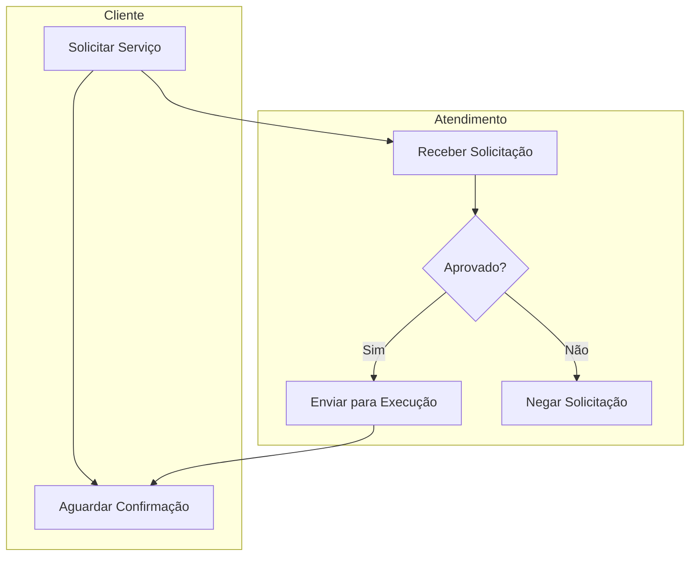
```mermaid
flowchart TB
    subgraph Lane_Cliente ["Cliente"]
        direction LR
        A[Solicitar Serviço] --> B[Aguardar Confirmação]
    end
    subgraph Lane_Atendimento ["Atendimento"]
        direction LR
        C[Receber Solicitação] --> D{Aprovado?}
        D -->|Sim| E[Enviar para Execução]
        D -->|Não| F[Negar Solicitação]
    end
    A --> C
    E --> B
```

### 🔹 Diagramas de Sequência (`sequenceDiagram`)
Útil para detalhar fluxos transacionais e chamadas de APIs.
- **Destaques**: Suporta numeração automática (`autonumber`), ativação de participantes (`activate`/`deactivate` ou atalhos `+`/`-`), agrupamentos e condições (`alt`/`else`, `loop`, `opt`).
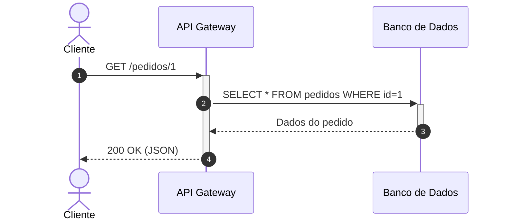
```mermaid
sequenceDiagram
    autonumber
    actor Cliente
    participant API as API Gateway
    participant DB as Banco de Dados
    Cliente->>+API: GET /pedidos/1
    API->>+DB: SELECT * FROM pedidos WHERE id=1
    DB-->>-API: Dados do pedido
    API-->>-Cliente: 200 OK (JSON)
```

### 🔹 Diagramas de Classe (`classDiagram`)
Útil para detalhar a modelagem tática do DDD ou a estrutura interna de Design Patterns.
- **Relações**: Herança (`<|--`), Composição (`*--`), Agregação (`o--`), Associação (`-->`), Dependência (`..>`).
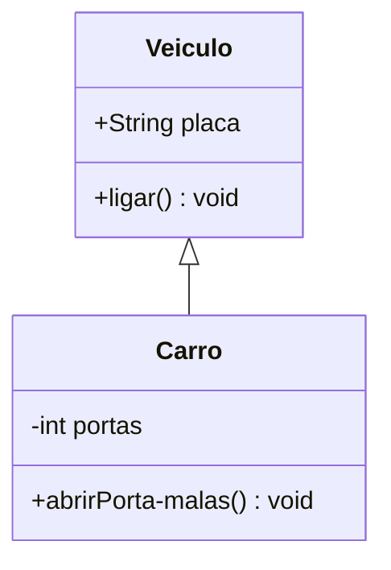
```mermaid
classDiagram
    class Veiculo {
        +String placa
        +ligar() void
    }
    class Carro {
        -int portas
        +abrirPorta-malas() void
    }
    Veiculo <|-- Carro
```

### 🔹 Diagramas de Estado (`stateDiagram-v2`)
Mapeia o ciclo de vida de entidades e objetos de negócio complexos.
- **Recursos**: Estados compostos, transições, bifurcações (`fork`/`join`) e notas explicativas.
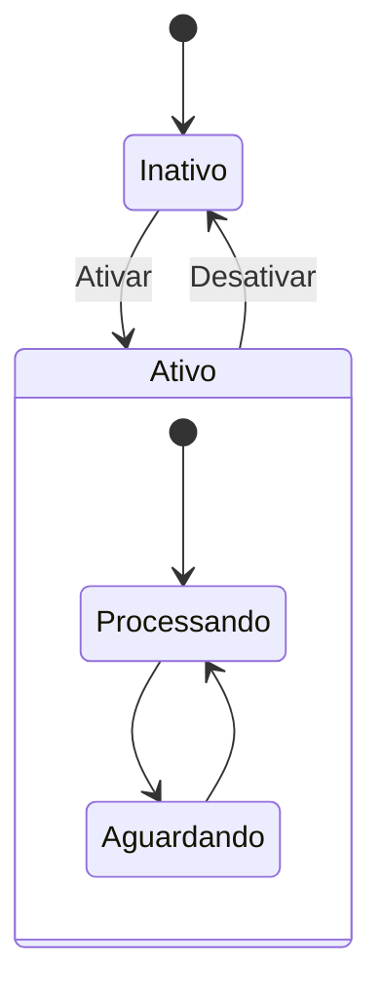
```mermaid
stateDiagram-v2
    [*] --> Inativo
    Inativo --> Ativo : Ativar
    state Ativo {
        [*] --> Processando
        Processando --> Aguardando
        Aguardando --> Processando
    }
    Ativo --> Inativo : Desativar
```

### 🔹 Diagramas de Entidade e Relacionamento (`erDiagram`)
Modelagem lógica e física de banco de dados relacionais.
- **Relações de Cardinalidade**:
    - `||--||` (Um para um)
    - `||--o{` (Zero ou muitos)
    - `||--|{` (Um ou muitos)
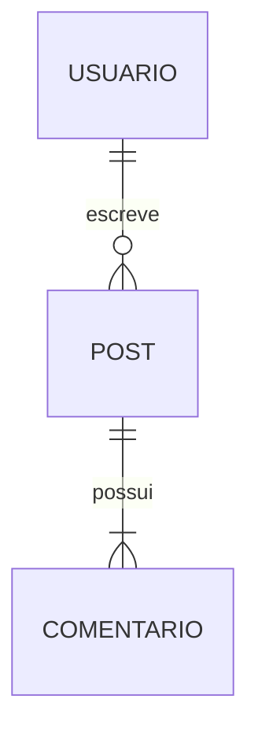
```mermaid
erDiagram
    USUARIO ||--o{ POST : escreve
    POST ||--|{ COMENTARIO : possui
```

### 🔹 Diagramas de Requisitos (`requirementDiagram`)
Usado em engenharia de sistemas (padrão SysML) para mapear requisitos funcionais/não-funcionais e os elementos de design que os atendem.
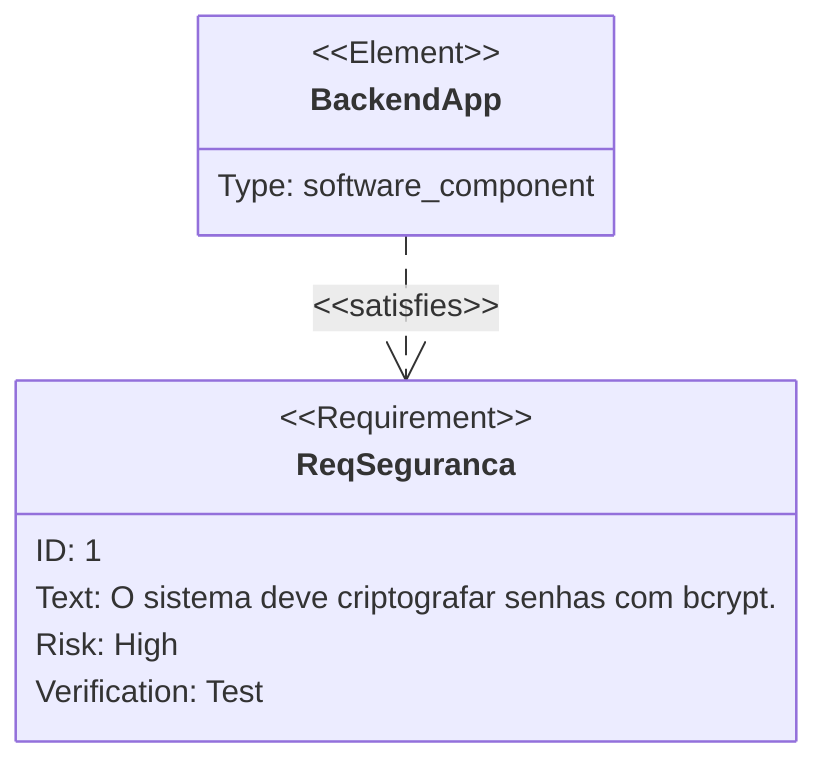
```mermaid
requirementDiagram

requirement ReqSeguranca {
    id: 1
    text: O sistema deve criptografar senhas com bcrypt.
    risk: high
    verifymethod: test
}

element BackendApp {
    type: software_component
}

BackendApp - satisfies -> ReqSeguranca
```

### 🔹 Diagrama C4 (C4Context, C4Container, C4Component) 🦺⚠️
Para mapear a arquitetura em diferentes níveis de abstração conceitual.
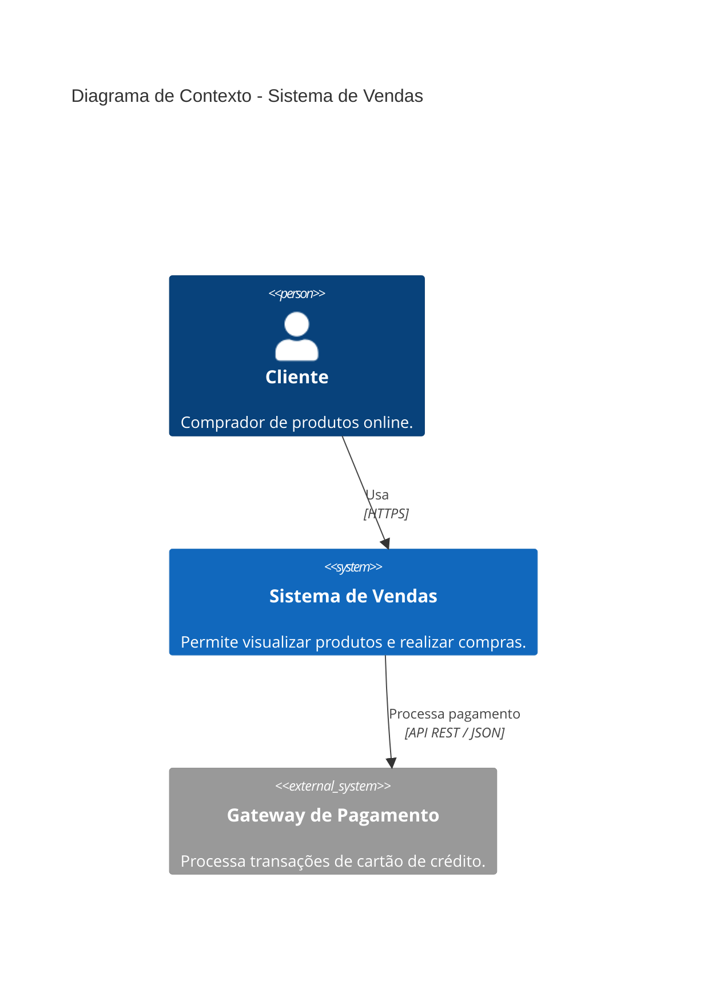
```mermaid
C4Context
    title Diagrama de Contexto - Sistema de Vendas
    Person(cliente, "Cliente", "Comprador de produtos online.")
    System(vendas, "Sistema de Vendas", "Permite visualizar produtos e realizar compras.")
    System_Ext(gateway, "Gateway de Pagamento", "Processa transações de cartão de crédito.")
    
    Rel(cliente, vendas, "Usa", "HTTPS")
    Rel(vendas, gateway, "Processa pagamento", "API REST / JSON")
```

---

## 📊 2. Diagramas de Dados, Planejamento e Métricas

### 🔹 Gráficos de Gantt (`gantt`)
Perfeito para cronogramas, calendários e marcos de entrega.
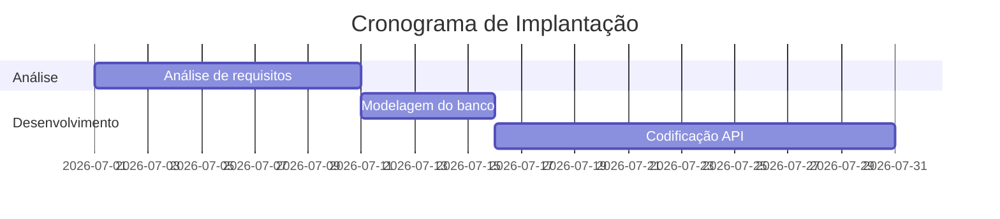
```mermaid
gantt
    title Cronograma de Implantação
    dateFormat  YYYY-MM-DD
    section Análise
    Análise de requisitos :a1, 2026-07-01, 10d
    section Desenvolvimento
    Modelagem do banco   :a2, after a1, 5d
    Codificação API      :a3, after a2, 15d
```

### 🔹 Gráfico de Pizza (`pie`)
Visualiza fatias e proporções de dados simples.
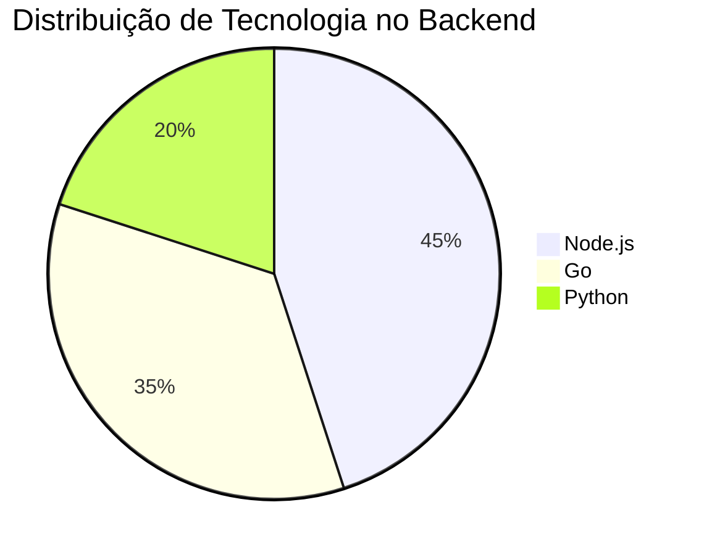
```mermaid
pie title Distribuição de Tecnologia no Backend
    "Node.js" : 45
    "Go" : 35
    "Python" : 20
```

### 🔹 Gráfico de Quadrante (`quadrantChart`)
Para matrizes de decisão, classificação de prioridades e análises SWOT.
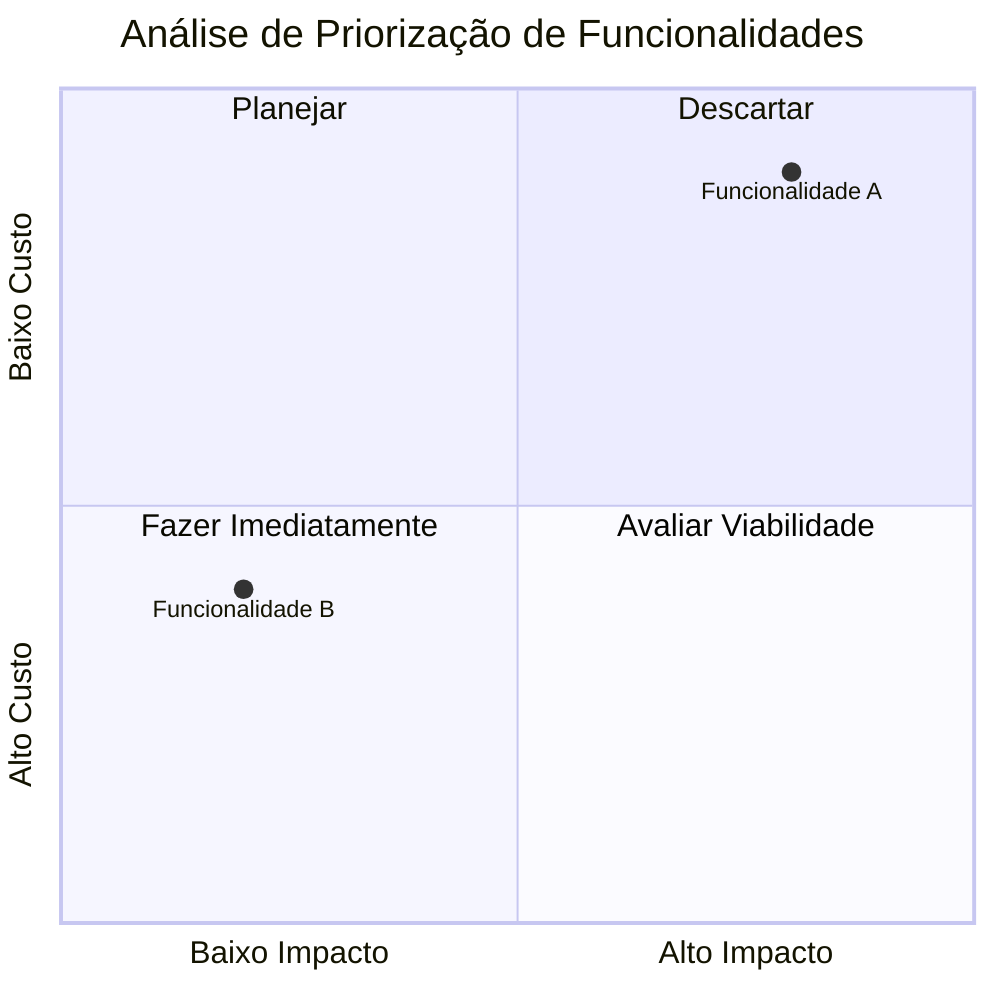
```mermaid
quadrantChart
    title Análise de Priorização de Funcionalidades
    x-axis Baixo Impacto --> Alto Impacto
    y-axis Alto Custo --> Baixo Custo
    quadrant-1 Descartar
    quadrant-2 Planejar
    quadrant-3 Fazer Imediatamente
    quadrant-4 Avaliar Viabilidade
    "Funcionalidade A": [0.8, 0.9]
    "Funcionalidade B": [0.2, 0.4]
```

### 🔹 Gráfico XY (`xychart-beta`) 🔥
Renderização nativa de gráficos de barra e de linha cartesianos para dados numéricos temporais ou categóricos.
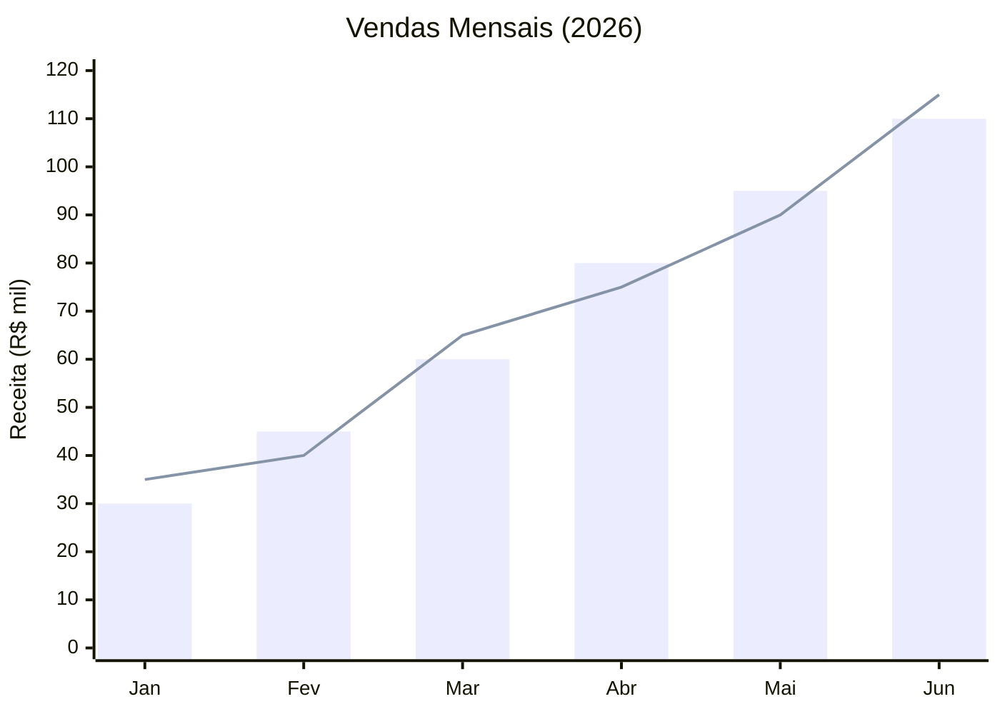
```mermaid
xychart-beta
    title "Vendas Mensais (2026)"
    x-axis [Jan, Fev, Mar, Abr, Mai, Jun]
    y-axis "Receita (R$ mil)" 0 --> 120
    bar [30, 45, 60, 80, 95, 110]
    line [35, 40, 65, 75, 90, 115]
```

### 🔹 Treemap (`treemap`) 🔥
Representação de estruturas de dados hierárquicas e seus pesos usando retângulos proporcionais aninhados.
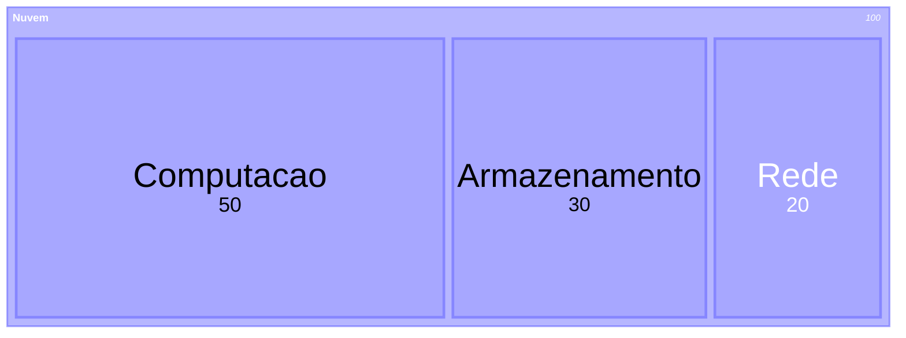
```mermaid
treemap-beta
"Nuvem"
    "Computacao": 50
    "Armazenamento": 30
    "Rede": 20
```

### 🔹 Gráfico de Radar (`radar-beta`) 🔥
Usado para comparar múltiplos perfis ou alternativas sob múltiplos eixos de análise quantitativa.
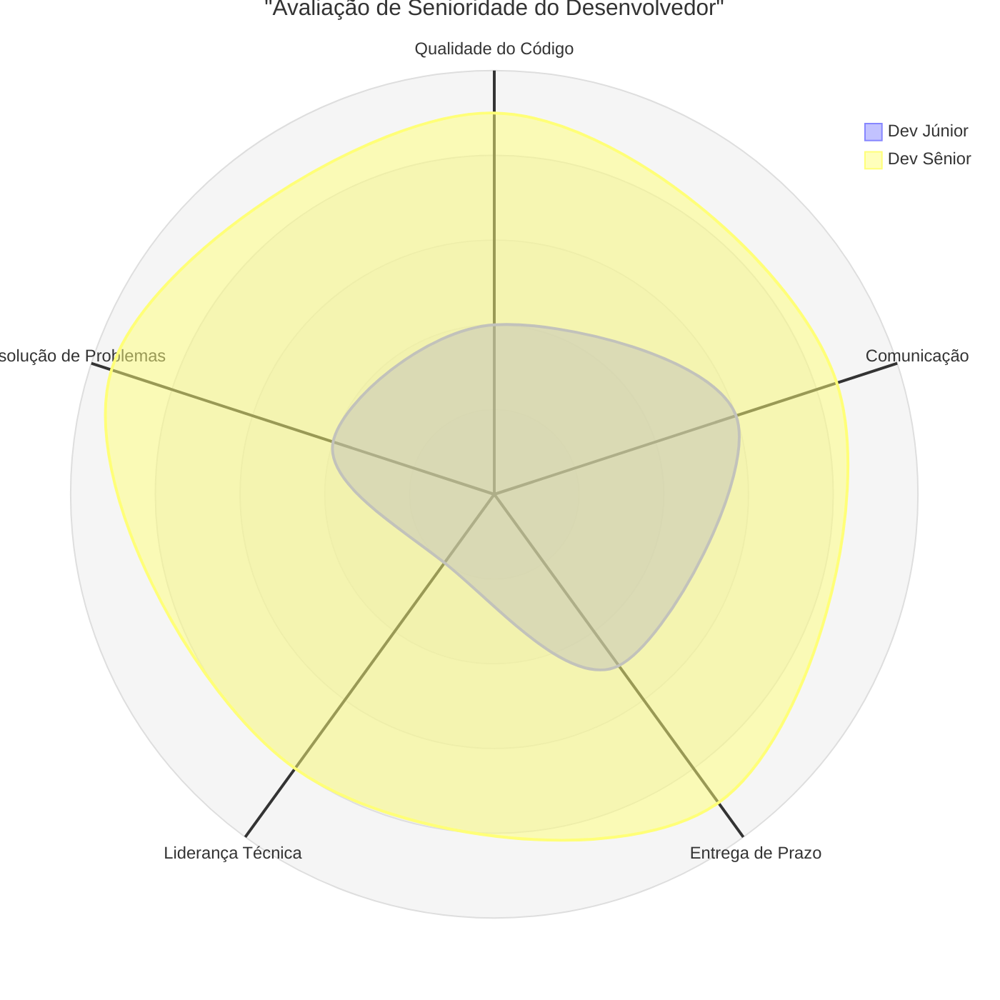
```mermaid
radar-beta
title "Avaliação de Senioridade do Desenvolvedor"
axis qualidade["Qualidade do Código"], comunicacao["Comunicação"], prazo["Entrega de Prazo"], lideranca["Liderança Técnica"], problemas["Resolução de Problemas"]
curve junior["Dev Júnior"]{qualidade: 40, comunicacao: 60, prazo: 50, lideranca: 20, problemas: 40}
curve senior["Dev Sênior"]{qualidade: 90, comunicacao: 85, prazo: 90, lideranca: 80, problemas: 95}
max 100
```

### 🔹 Diagrama de Sankey (`sankey-beta`) 🔥
Mapeia fluxos e transferência de volumes de energia, dinheiro ou recursos entre categorias.
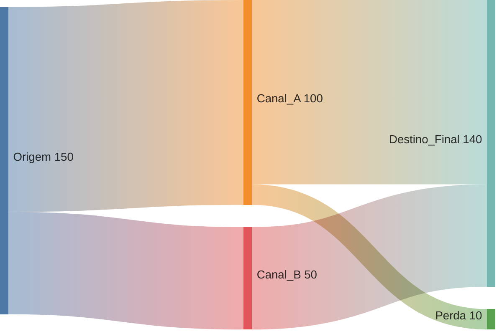
```mermaid
sankey-beta
    Origem, Canal_A, 100
    Origem, Canal_B, 50
    Canal_A, Destino_Final, 90
    Canal_A, Perda, 10
    Canal_B, Destino_Final, 50
```

### 🔹 Diagrama de Venn (`venn-beta`) 🔥
Visualiza a intersecção de conjuntos lógicos de dados.
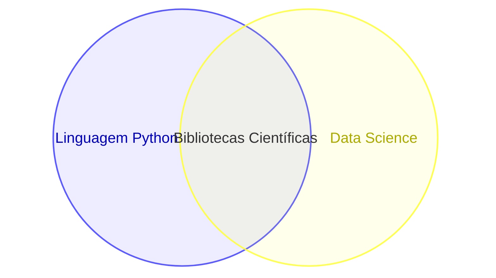
```mermaid
venn-beta
set A["Linguagem Python"]:10
set B["Data Science"]:10
union A,B["Bibliotecas Científicas"]:4
```

---

## 🗺️ 3. Diagramas Estratégicos, Conceituais e Mapas Mentais

### 🔹 Jornada do Usuário (`journey`)
Esboço descritivo e sequencial das interações do usuário com o sistema, mapeando níveis de frustração e atores.
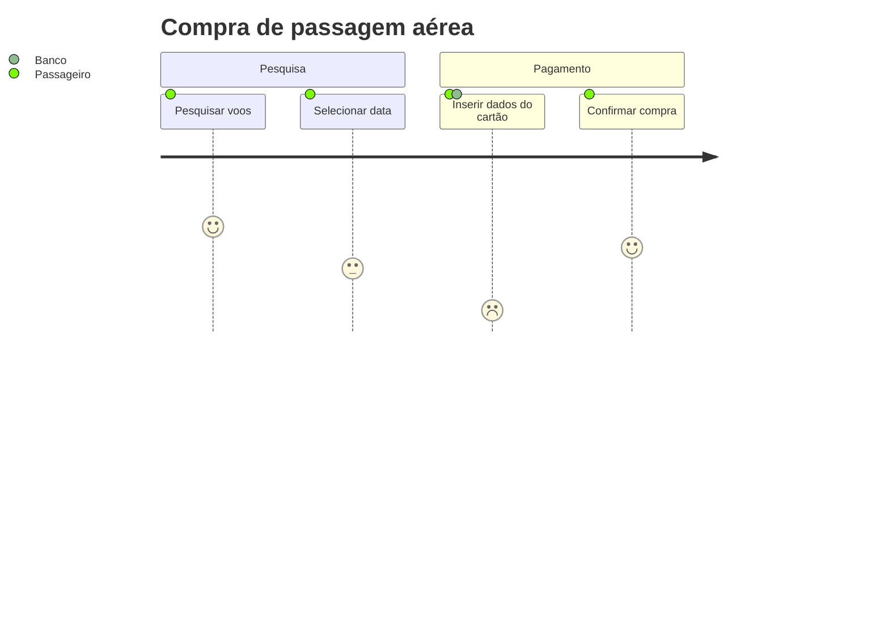
```mermaid
journey
    title Compra de passagem aérea
    section Pesquisa
        Pesquisar voos: 5: Passageiro
        Selecionar data: 3: Passageiro
    section Pagamento
    Inserir dados do cartão: 1: Passageiro, Banco
        Confirmar compra: 4: Passageiro
```

### 🔹 Mapas Mentais (`mindmap`)
Excelente para brainstorming estruturado de ideias, mapeamento mental de requisitos e conceitos.
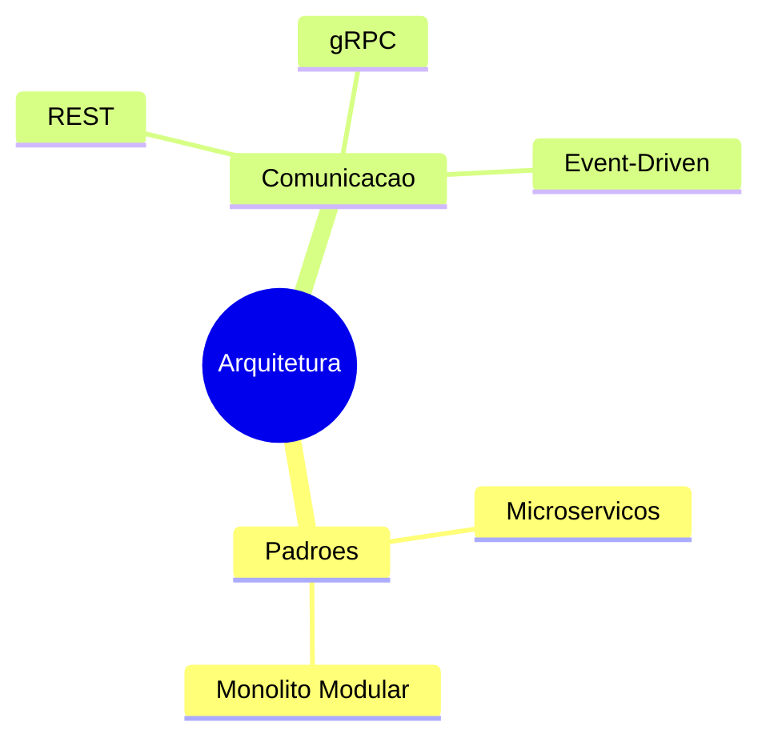
```mermaid
mindmap
    root((Arquitetura))
        Padroes
            Microservicos
            Monolito Modular
        Comunicacao
            REST
            gRPC
            Event-Driven
```

### 🔹 Linha do Tempo (`timeline`)
Apresenta cronologias de marcos, históricos de sistemas ou fases de lançamento.
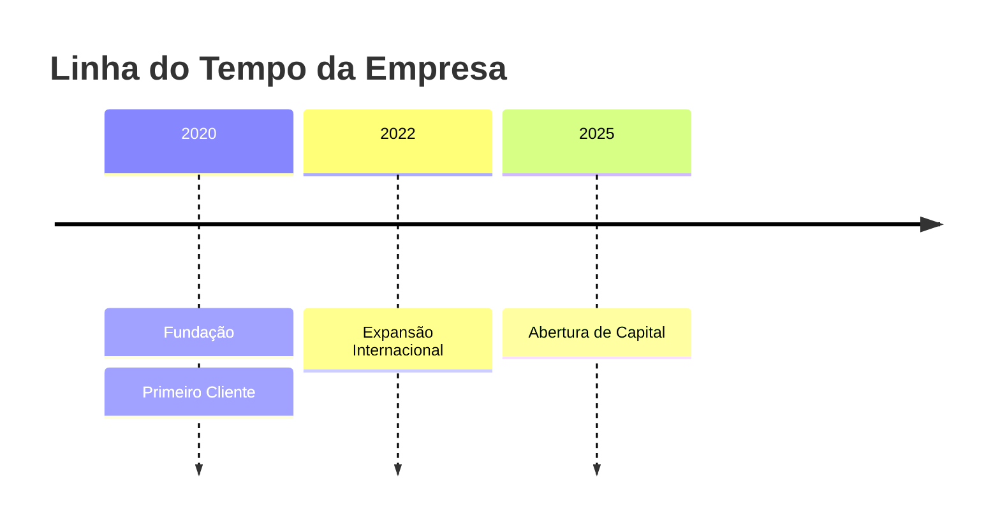
```mermaid
timeline
    title Linha do Tempo da Empresa
    2020 : Fundação : Primeiro Cliente
    2022 : Expansão Internacional
    2025 : Abertura de Capital
```

### 🔹 Gráfico de Git (`gitGraph`)
Representa de forma precisa fluxos de versionamento, commits, merge e branches do Git.
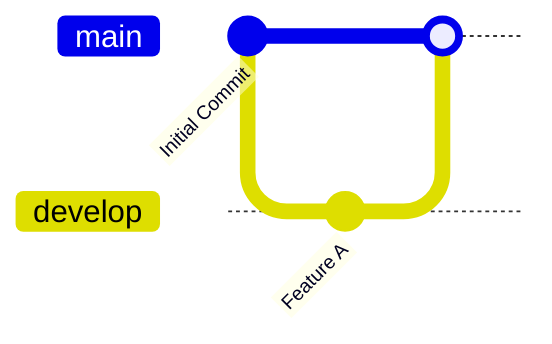
```mermaid
gitGraph
    commit id: "Initial Commit"
    branch develop
    checkout develop
    commit id: "Feature A"
    checkout main
    merge develop
```

### 🔹 Modelagem de Eventos (`eventmodeling`) 🔥
Esboço dinâmico para arquiteturas Event-Driven (CQRS/Event Sourcing), sequenciando UIs, comandos e eventos.
```mermaid
flowchart LR
    TelaRegistro[UI: Tela de Registro] --> RegistrarUsuario[Command: Registrar Usuario]
    RegistrarUsuario --> UsuarioRegistrado[Event: Usuario Registrado]
```

### 🔹 Wardley Maps (`wardley-beta`) 🔥
Mapeia estrategicamente o valor dos componentes do negócio em relação à sua evolução e maturidade.
- **Eixos**: O eixo Y representa a visibilidade ao cliente, o eixo X a maturidade/evolução técnica (Gênese a Commodity).
```mermaid
wardley-beta
    title Mapa de Evolução de IA
    anchor Cliente [0.9, 0.4]
    component Chatbot [0.7, 0.5]
    component Modelo_LLM [0.4, 0.7]
    component Servidores [0.1, 0.9]
    
    Cliente -> Chatbot
    Chatbot -> Modelo_LLM
    Modelo_LLM -> Servidores
```

### 🔹 Framework Cynefin (`cynefin`) 🔥
Framework conceitual para categorizar a complexidade de problemas, identificando os cinco domínios de tomada de decisão.
```mermaid
mindmap
    root((Cynefin))
        clear
            "Sense -> Categorise -> Respond"
        complicated
            "Sense -> Analyse -> Respond"
        complex
            "Probe -> Sense -> Respond"
        chaotic
            "Act -> Sense -> Respond"
        confusion
            "Move toward a domain"
```

---

## 💻 4. Diagramas Técnicos e de Arquitetura de Redes/Sistemas

### 🔹 ZenUML (`zenuml`)
Alternativa poderosa e estruturada em formato de código para a criação de diagramas de sequência complexos.
```mermaid
sequenceDiagram
    title Processamento de Pedido
    actor Cliente
    participant Loja
    participant Estoque
    participant Pagamento
    Cliente->>Loja: Fazer pedido
    Loja->>Estoque: Reservar itens
    Loja->>Pagamento: Cobrar pagamento
```

### 🔹 Diagrama de Blocos (`block-beta`) 🔥
Ideal para diagramas físicos e de layout, simulando grades, tabelas de arquitetura ou quadros estruturais.
```mermaid
block-beta
    columns 3
    block:WebTier:2
        columns 2
        Browser["Navegador"]
        App["App Mobile"]
    end
    DB["Banco de Dados"]
    WebTier --> DB
```

### 🔹 Diagrama de Pacote de Rede (`packet-beta`) 🔥
Representação visual e de baixo nível da distribuição de bits/bytes em cabeçalhos de protocolos de rede ou mensagens binárias.
```mermaid
packet-beta
    0-7: "Versão IP"
    8-15: "Tamanho do Cabeçalho"
    16-31: "Tamanho Total"
    32-63: "Identificação"
```

### 🔹 Diagrama de Arquitetura de Nuvem/Infra (`architecture-beta`) 🔥
Criado para esboçar arquiteturas de nuvem de forma nativa e clara (p. ex., AWS, GCP), separando serviços e agrupando-os por redes.
```mermaid
architecture-beta
group vpc(cloud)[VPC Privada]
service web(server)[Servidor Web] in vpc
service cache(redis)[Redis Cache] in vpc
service rds(database)[PostgreSQL] in vpc

web:R -- L:cache
web:B -- T:rds
```

### 🔹 Visualizador de Árvores de Diretórios (`treeView-beta`) 🔥
Gera visualizações organizadas de estruturas de arquivos e hierarquias de pastas usando indentação.
```mermaid
treeView-beta
        "meu-projeto"
                "src"
                        "components"
                                "Button.tsx"
                        "App.tsx"
                "package.json"
                "tsconfig.json"
```

### 🔹 Quadro Kanban (`kanban`) 🔥
Quadro ágil nativo para organização, controle e distribuição de tarefas de desenvolvimento.
```mermaid
kanban
    title Sprint 24
    section Backlog
        Task_A["Criar Model de Usuário"]
        Task_B["Configurar CI/CD"]
    section Fazendo
        Task_C["Desenvolver Login"]
    section Concluído
        Task_D["Setup Inicial"]
```

---

## 🤝 Integração com Outras Skills

- **Sob a Skill [software-architect](../software-architect/SKILL.md)**: Use diagramas do Mermaid para mapear a separação lógica de camadas (Layers), fluxo de integração de APIs e topologias de rede.
- **Sob as Skills de Design Patterns [dp-*](../../patterns/dp-factory-method/SKILL.md)**: Use diagramas de classe (`classDiagram`) do Mermaid para esboçar a relação conceitual de herança, composição e interfaces dos padrões estruturados ou compartilhamentais envolvidos.
