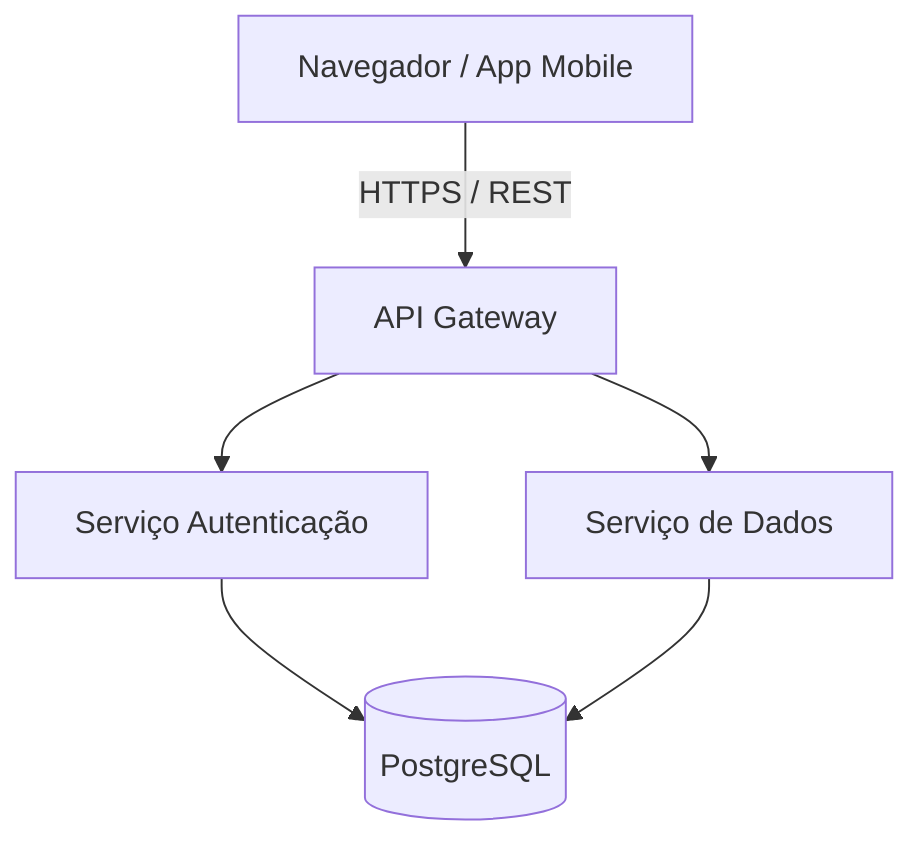

# Nome do Projeto

[](#)
[](#)
[](#)

Uma descrição sucinta, clara e objetiva do que o projeto faz, qual problema resolve e quais tecnologias principais ele utiliza.

> [!NOTE]
> Este projeto utiliza Node.js >= 18.0.0 e PostgreSQL 15.

---

## 🚀 Funcionalidades Principais

- **Funcionalidade A**: Breve descrição da funcionalidade A.
- **Funcionalidade B**: Breve descrição da funcionalidade B.
- **Integração Real-Time**: Comunicação bidirecional via WebSockets.

---

## 🛠️ Tecnologias Utilizadas

| Categoria | Tecnologia | Versão | Uso |
| :--- | :--- | :---: | :--- |
| Linguagem | TypeScript | ^5.0 | Tipagem estática |
| Runtime | Node.js | >= 18 | Servidor backend |
| Banco de Dados | PostgreSQL | 15 | Persistência de dados |

---

## 📦 Instalação e Execução

### Pré-requisitos
- Node.js versão 18 ou superior.
- Docker e Docker Compose (opcional para banco local).

### Passo a Passo

1. **Clonar o repositório**:
   ```bash
   git clone https://github.com/usuario/nome-do-projeto.git
   cd nome-do-projeto
   ```

2. **Instalar as dependências**:
   ```bash
   npm install
   ```

3. **Configurar as variáveis de ambiente**:
   ```bash
   cp .env.example .env
   ```

4. **Executar a aplicação**:
   ```bash
   npm run dev
   ```

---

## 🏗️ Arquitetura do Sistema



---

## 📄 Licença

Este projeto está sob a licença MIT. Veja o arquivo [LICENSE](LICENSE) para mais detalhes.
