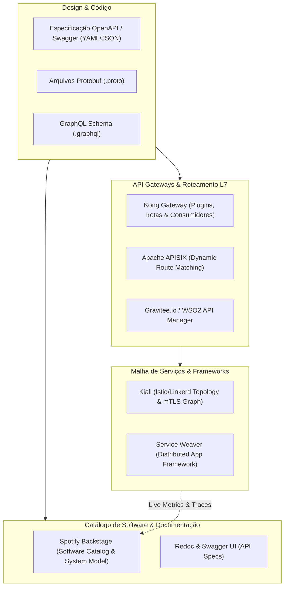

# 🔌 Descoberta, Inventário e Mapeamento de APIs & Service Mesh

Esta skill orienta a inteligência artificial a atuar como **Especialista em Mapeamento de Contratos de API, Portais de Desenvolvedor e Service Meshes**, catalogando endpoints REST, GraphQL, gRPC, políticas de gateway, dependências entre serviços e governança de APIs corporativas.

---

## 🌐 1. Arquitetura de Mapeamento de APIs e Catálogo Centralizado

A governança de APIs moderna centraliza os contratos de serviço em catálogos unificados enquanto monitora o tráfego em tempo de execução nos gateways e malhas de serviço:



---

## 🛠️ 2. Ferramentas Especialistas de Mapeamento de APIs

### 1. Spotify Backstage (O Padrão de Software Catalog e IDP)
- **Conceito**: Plataforma aberta desenvolvida pelo Spotify para construção de Portais Internos do Desenvolvedor (Internal Developer Platforms - IDP). Mapeia entidades de software através de manifestos YAML (`catalog-info.yaml`), estabelecendo relacionamentos de `System`, `Domain`, `Component`, `API`, `Resource` e `User/Group`.
- **Exemplo de Manifesto `catalog-info.yaml` para Mapeamento de API e Dependências**:
```yaml
apiVersion: backstage.io/v1alpha1
kind: Component
metadata:
  name: order-service
  description: Serviço central de processamento de pedidos
  tags:
    - java
    - spring-boot
    - e-commerce
spec:
  type: service
  lifecycle: production
  owner: group:checkout-team
  system: ecommerce-core
  providesApis:
    - order-api-v1
  consumesApis:
    - payment-api-v2
    - inventory-api-v1
  dependsOn:
    - resource:order-postgres-db
    - resource:order-events-kafka-topic
---
apiVersion: backstage.io/v1alpha1
kind: API
metadata:
  name: order-api-v1
  description: API REST de gerenciamento de pedidos
spec:
  type: openapi
  lifecycle: production
  owner: group:checkout-team
  system: ecommerce-core
  definition:
    $text: ./openapi.yaml
```

### 2. OpenAPI / Swagger & Redoc
- **OpenAPI 3.1**: Especificação padrão da indústria para descrição de contratos HTTP/REST, permitindo geração de clientes, servidores e testes de contrato.
- **Redoc**: Mecanismo de renderização de documentação estática responsiva de alta performance a partir de especificações OpenAPI.
```bash
# Gerar documentação HTML autônoma do OpenAPI
npx @redocly/cli build-docs openapi.yaml -o api-docs.html
```

### 3. API Gateways (Kong, Apache APISIX, Gravitee, WSO2)
- **Kong Gateway**: Mapeia serviços upstream, rotas, plugins de autenticação (OAuth2, Key-Auth), rate limiting e CORS via API administrativa ou declaração declarativa decK (`kong.yaml`).
- **Apache APISIX**: Gateway nativo de nuvem baseado em Nginx/Lua e etcd, com suporte a roteamento dinâmico e plugins de observabilidade OpenTelemetry e Prometheus.
- **Gravitee.io & WSO2 API Manager**: Plataformas completas de ciclo de vida de APIs cobrindo monetização, controle de acesso baseado em planos/assinaturas e análise de tráfego de desenvolvedores.

### 4. Service Weaver (Google)
- **Conceito**: Framework distribuído para Go que permite escrever aplicações como um monólito modular e fazer o deploy transparente como múltiplos microsserviços, com descoberta e comunicação IPC otimizada pelo runtime do framework.

### 5. Kiali (Istio/Linkerd API Topology)
- **Conceito**: Inspeciona a malha de serviços em tempo real, mapeando as rotas de tráfego de API entre pods, taxas de erro HTTP por versão de serviço e autenticação mTLS inter-serviços.

---

## 📊 3. Modelo de Entidades C4 / Backstage para APIs

Ao modelar ecossistemas de APIs, estruture as relações de acordo com o modelo de catálogo de serviços:

| Entidade | Definição | Relacionamentos |
| :--- | :--- | :--- |
| **Domain** | Domínio de negócio macro (ex: Vendas, Logística) | Contém múltiplos `Systems` |
| **System** | Conjunto coeso de serviços que entregam uma capacidade | Agrupa `Components` e `Resources` |
| **Component** | Unidade de software executável (Microsserviço, Frontend, Lambda) | `providesApis`, `consumesApis`, `dependsOn` |
| **API** | Contrato formal de interface (OpenAPI, Protobuf, GraphQL) | Implementada por um `Component` |
| **Resource** | Infraestrutura externa persistente ou de mensageria | Banco de dados, Tópico Kafka, Bucket S3 |

---

## 🎯 4. Boas Práticas de Governança de APIs

- [ ] **Design-First com OpenAPI**: Escreva e valide a especificação OpenAPI antes da implementação do código-fonte para alinhar consumidores e produtores.
- [ ] **Detecção de Quebra de Contrato (Contract Testing)**: Utilize testes de contrato (ex: Pact) para garantir que alterações em APIs produtoras não quebrem microsserviços consumidores.
- [ ] **Inventário Automático no CI/CD**: Valide e publique automaticamente as especificações de API no Backstage ou portal de desenvolvedor durante o pipeline de release.
