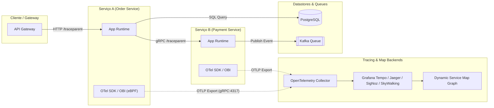

# 🛰️ Descoberta de Aplicações, Service Maps e Rastreamento Distribuído (Distributed Tracing & eBPF)

Esta skill orienta a inteligência artificial a atuar como **Especialista em Descoberta de Aplicações e Rastreamento de Dependências em Runtime**, capacitando o mapeamento automatizado de interações entre microsserviços, latências, chamadas HTTP/gRPC, mensagens assíncronas e queries de banco de dados sem ou com mínima instrumentação manual.

---

## 🏗️ 1. Arquitetura de Descoberta e Service Maps

A descoberta em runtime opera através de duas abordagens complementares:
1. **Instrumentação no Kernel via eBPF (Zero-Code Instrumentation)**: Inspeciona chamadas de sistema (`sys_enter_connect`, `sys_enter_write`, `sys_enter_read`, `tcp_v4_connect`) no nível do kernel Linux para correlacionar processos, portas, sockets e payloads L7 (HTTP, gRPC, MySQL, Postgres, Redis, Kafka) sem alterar o binário da aplicação.
2. **Instrumentação de Aplicação via OpenTelemetry / W3C Trace Context**: Injeta cabeçalhos padronizados (`traceparent`, `tracestate`, `baggage`) através de SDKs/Agentes de linguagem (Java Bytecode Agent, Go eBPF, Node.js Hooks, Python OpenTelemetry Instrumentation) para reconstruir árvores completas de Spans (DAG - Directed Acyclic Graph).



---

## 🛠️ 2. Ferramentas Especialistas de Descoberta

### 1. OpenTelemetry eBPF Instrumentation (OBI) / OpenTelemetry Operator
- **Conceito**: Instrumentação transparente no nível do SO que captura tráfego de rede e protocolos de aplicação (HTTP/1.1, HTTP/2, gRPC, bancos de dados) interceptando syscalls de socket e bibliotecas SSL (OpenSSL, Go Crypto, BoringSSL) com decodificação de tráfego HTTPS em runtime antes da criptografia.
- **Configuração do OpenTelemetry Collector (`otel-collector-config.yaml`)**:
```yaml
receivers:
  otlp:
    protocols:
      grpc:
        endpoint: 0.0.0.0:4317
      http:
        endpoint: 0.0.0.0:4318

processors:
  batch:
    timeout: 1s
    send_batch_size: 1024
  memory_limiter:
    check_interval: 1s
    limit_percentage: 75
    spike_limit_percentage: 20

exporters:
  otlp/tempo:
    endpoint: "tempo:4317"
    tls:
      insecure: true
  otlp/signoz:
    endpoint: "signoz-otel-collector:4317"
    tls:
      insecure: true
  logging:
    loglevel: debug

service:
  pipelines:
    traces:
      receivers: [otlp]
      processors: [memory_limiter, batch]
      exporters: [otlp/tempo, otlp/signoz, logging]
```

### 2. Caretta (eBPF Service Network Map)
- **Conceito**: Utilitário leve baseado em eBPF que monitora conexões de rede em tempo real no cluster Kubernetes, resolvendo IPs para Pods, Services e Namespaces, e gerando grafos de topologia e taxa de throughput/latência diretamente no Grafana.
- **Instalação via Helm**:
```bash
helm repo add groundcover https://helm.groundcover.com
helm repo update
helm install caretta groundcover/caretta --namespace caretta --create-namespace
```

### 3. Jaeger (CNCF Distributed Tracing)
- **Conceito**: Sistema de rastreamento distribuído ponta a ponta que permite análise de caminho crítico (*Critical Path Analysis*), correlação de latência p95/p99 e visualização de grafos de dependência direta entre serviços.
- **Geração do Grafo de Dependências do Jaeger**:
```bash
# Processar dependências históricas a partir do armazenamento (Elasticsearch/OpenSearch/Cassandra)
java -jar jaeger-spark-dependencies.jar
```

### 4. Zipkin
- **Conceito**: Sistema de tracing distribuído baseado na especificação Dapper do Google, oferecendo agregação de traces via API REST e visualização de dependências através do Zipkin Dependencies Engine (Spark/Flink).

### 5. Apache SkyWalking
- **Conceito**: Plataforma de gerenciamento de desempenho de aplicações (APM) e observabilidade de malha de serviços (Service Mesh), capaz de gerar mapas topológicos interativos (*Topology Engine*) correlacionando métricas de ouro (Throughput, Latency, Errors) diretamente nos vértices do grafo.

### 6. SigNoz
- **Conceito**: Plataforma unificada de observabilidade baseada em ClickHouse que consome traces, métricas e logs via OpenTelemetry nativo, fornecendo Service Map automático e detecção de anomalias em chamadas externas e downstream.

### 7. Grafana Tempo & TraceQL
- **Conceito**: Backend de traces massivamente escalável e de baixo custo de armazenamento (Object Storage S3/GCS) integrado ao Grafana Service Map e permitindo queries avançadas via **TraceQL**.
- **Exemplo de Consulta TraceQL para detecção de dependência degradada**:
```traceql
{ .http.status_code >= 500 && duration > 2s } | select(.service.name, .http.target, .error)
```

---

## 📋 3. Matriz de Propagação de Contexto W3C (Trace Context)

Ao projetar ou auditar sistemas de microsserviços, garanta a propagação consistente dos seguintes cabeçalhos HTTP:

| Cabeçalho | Formato | Finalidade |
| :--- | :--- | :--- |
| `traceparent` | `00-4bf92f3577b34da6a3ce929d0e0e4736-00f067aa0ba902b7-01` | Versão (00), TraceID (16 bytes hex), ParentSpanID (8 bytes hex), TraceFlags (01=sampled) |
| `tracestate` | `rojo=1,congo=2` | Metadados proprietários específicos de vendors de tracing |
| `baggage` | `userId=alice,env=prod,region=us-east-1` | Propagação de contexto de negócio entre todas as camadas do grafo |

---

## 🎯 4. Boas Práticas e Checklist de Validação

- [ ] **Zero-Code eBPF vs SDKs**: Utilize eBPF para descoberta instantânea de topologia sem reinicialização de pods; use SDKs OpenTelemetry quando for necessário capturar atributos de negócio ricos (ex: `user_id`, `order_id`).
- [ ] **Taxa de Amostragem (Sampling)**: Em ambientes de alto volume (high-throughput), utilize *Head-based Sampling* (1% a 5%) ou *Tail-based Sampling* no OTel Collector para reter 100% de erros e requisições lentas.
- [ ] **Padronização Semântica**: Siga rigorosamente as **OpenTelemetry Semantic Conventions** para nomes de spans (`HTTP GET /orders/{id}`, `SELECT FROM users`), atributos (`db.system`, `net.peer.name`, `rpc.service`).
