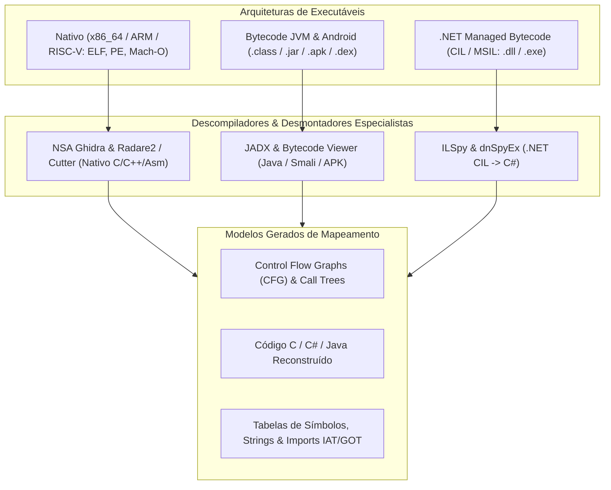

# 🔬 Engenharia Reversa de Binários, Descompilação e Análise de Baixo Nível

Esta skill orienta a inteligência artificial a atuar como **Especialista em Engenharia Reversa de Binários e Aplicações Compiladas**, reconstruindo lógica de código fechado, analisando Control Flow Graphs (CFG), identificando funções e APIs importadas em binários nativos (ELF, PE, Mach-O), bytecode JVM (.class/.apk/.jar) e assemblies .NET (.dll/.exe).

---

## ⚙️ 1. Pipeline de Engenharia Reversa por Arquitetura de Binário

A engenharia reversa adapta suas técnicas dependendo do nível de abstração do executável compilado:



---

## 🛠️ 2. Ferramentas Especialistas de Descompilação

### A. Binários Nativos (C, C++, Rust, Go, Assembly)

#### 1. NSA Ghidra (Software Reverse Engineering Suite)
- **Conceito**: Framework de engenharia reversa de código aberto desenvolvido pela National Security Agency (NSA). Possui descompilador de ponta para C/C++, suporte a processadores x86, ARM, MIPS, PowerPC, SPARC, análise de referências cruzadas (*Xrefs*), inferência automática de tipos de estruturas e scripts em Python/Java.
- **Automação Headless do Ghidra via CLI**:
```bash
# Executar análise em lote de binários sem interface gráfica
analyzeHeadless /tmp/ghidra_projects ProjetoBinario \
  -import /path/to/target_binary \
  -postScript DecompileToFile.java /tmp/output_c_code.c
```

#### 2. Radare2 (r2) & Cutter
- **Radare2**: Conjunto de ferramentas de linha de comando para desmontagem, depuração, análise forense de memória e patch de binários.
- **Cutter**: Interface gráfica moderna (GUI) oficial construída sobre o motor do Radare2 e Rizin.
- **Comandos Radare2 Essenciais para Mapeamento de Funções**:
```bash
# Abrir binário em modo de análise
r2 -A /bin/ls

# Comandos internos do r2:
# afl          -> Listar todas as funções descobertas
# pdf @ main   -> Desmontar função main (Print Disassembly Function)
# agf @ main   -> Gerar Grafo de Fluxo de Controle (ASCII/DOT)
# iz           -> Listar strings estáticas da seção de dados (.rodata)
# ii           -> Listar símbolos importados de bibliotecas dinâmicas
```

---

### B. Ecossistema Java & Android (.class, .jar, .apk, .dex)

#### 1. JADX (Dex to Java Decompiler)
- **Conceito**: O descompilador mais eficiente para aplicativos Android (arquivos APK, DEX, AAR) e arquivos JAR Java. Converte bytecode Dalvik/Smali diretamente em código-fonte Java legível com restauração do `AndroidManifest.xml` e recursos associados.
- **Uso CLI**:
```bash
# Descompilar APK com geração direta do projeto Java
jadx -d /tmp/app_decompiled app-release.apk --show-bad-code
```

---

### C. Ecossistema .NET (C#, VB.NET, F#)

#### 1. ILSpy & dnSpyEx
- **ILSpy**: Descompilador open-source padrão para assemblies .NET. Reconstrói projetos C# completos a partir de DLLs compiladas em .NET Framework, .NET Core e .NET 8+.
- **dnSpyEx**: Fork comunitário e moderno do dnSpy, oferecendo descompilação e **depuração dinâmica em tempo real** de assemblies .NET sem necessidade de código-fonte original, permitindo editar código C# diretamente no executável e salvar o binário alterado.
- **Uso CLI do ILSpy**:
```bash
ilspycmd -p -o /tmp/decompiled_csharp /path/to/MyAssembly.dll
```

---

## 📊 3. Matriz de Análise de Superfície de Binários

Ao mapear a estrutura de um executável fechado, colete os seguintes elementos:

| Elemento do Binário | Finalidade no Mapeamento | Risco / Ponto de Atenção |
| :--- | :--- | :--- |
| **Imports / IAT / GOT** | Lista de chamadas de sistema e bibliotecas externas | Identificação de sockets, escrita de arquivos, criptografia |
| **Strings Estáticas** | URLs de API, endpoints, chaves, senhas hardcoded | Exposição de credenciais e comunicação C2 |
| **Control Flow Graphs (CFG)** | Fluxo de ramificação e complexidade ciclomática | Funções ofuscadas (*Control Flow Flattening*) |
| **Seções do Executável** | Entropia de `.text`, `.data`, `.rsrc` | Detecção de empacotadores (*Packers* como UPX, Themida) |

---

## 🎯 4. Boas Práticas

- [ ] **Ambiente Isolado (Sandbox)**: Sempre execute binários desconhecidos dentro de máquinas virtuais ou containers isolados sem conectividade de rede não autorizada.
- [ ] **Verificação de Assinaturas e Hashes**: Calcule e registre hashes SHA256 e SSDEEP (Fuzzy Hashing) antes de iniciar a descompilação para garantir integridade e rastreabilidade.
