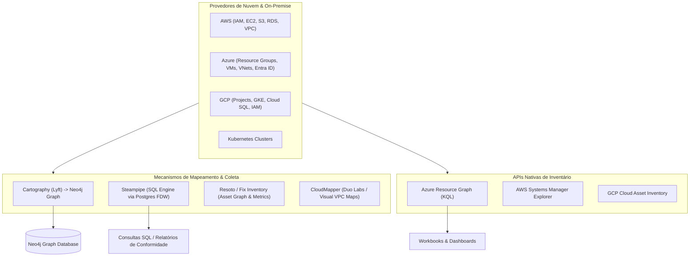

# ☁️ Mapeamento de Topologia Cloud, Ambientes Híbridos e Grafos de Ativos Multi-Cloud

Esta skill orienta a inteligência artificial a atuar como **Especialista em Mapeamento de Topologia e Governança de Recursos em Nuvem**, integrando dados de inventário de ativos da AWS, Microsoft Azure, Google Cloud Platform (GCP) e ambientes on-premise em bancos de dados relacionais e grafos para análise de segurança, custos e dependências de infraestrutura.

---

## 🛰️ 1. Arquitetura de Mapeamento de Recursos Cloud

O mapeamento de nuvem moderno consolida APIs de múltiplos provedores em interfaces de consulta unificadas (SQL ou Grafos Cypher):



---

## 🛠️ 2. Ferramentas Especialistas de Mapeamento de Nuvem

### 1. Cartography (Lyft)
- **Conceito**: Ferramenta de auditoria e consolidação de recursos baseada em Python que varre APIs de nuvem (AWS, Azure, GCP, GitHub, Okta, Kubernetes) e constrói um grafo de relacionamento detalhado no **Neo4j**.
- **Execução CLI de Sincronização**:
```bash
cartography --neo4j-uri bolt://localhost:7687 --neo4j-user neo4j --neo4j-password-env-var NEO4J_PASSWORD
```
- **Exemplo de Consulta Cypher para identificar instâncias EC2 expostas diretamente à Internet com permissões de administração IAM**:
```cypher
MATCH (i:EC2Instance)-[:MEMBER_OF_EC2_SECURITY_GROUP]->(sg:EC2SecurityGroup)<-[:ALLOWS]-(rule:IpRule)
WHERE rule.fromport <= 22 AND rule.toport >= 22 AND rule.cidr = '0.0.0.0/0'
MATCH (i)-[:ATTACHED_IAM_ROLE]->(role:AWSPrincipal)-[:POLICY]->(p:AWSPolicy)
WHERE p.name = 'AdministratorAccess'
RETURN i.id, i.publicdnsname, sg.id, role.name
```

### 2. Steampipe (Zero-ETL SQL Engine for Cloud Assets)
- **Conceito**: Utilitário CLI e servidor SQL que expõe APIs de nuvem e ferramentas de software como tabelas relacionais PostgreSQL através de Foreign Data Wrappers (FDW). Permite executar consultas SQL diretas, joins entre diferentes provedores e verificações de conformidade CIS.
- **Consultas SQL Multi-Cloud**:
```bash
# Iniciar console interativo
steampipe query
```
```sql
-- Identificar todos os buckets S3 públicos na AWS e containers Blob no Azure
SELECT
  'AWS' AS provider,
  name AS asset_name,
  region AS location,
  block_public_acls,
  block_public_policy
FROM
  aws_s3_bucket
WHERE
  block_public_acls = false OR block_public_policy = false

UNION ALL

SELECT
  'Azure' AS provider,
  name AS asset_name,
  location,
  false AS block_public_acls,
  false AS block_public_policy
FROM
  azure_storage_container
WHERE
  public_access <> 'None';
```

### 3. Resoto / Fix Inventory
- **Conceito**: Inventário de infraestrutura multi-cloud focado em grafos, permitindo limpeza de recursos órfãos, automação de tagging e monitoramento de drift de configurações em AWS, GCP, Azure, DigitalOcean e Kubernetes.

### 4. CloudMapper (Duo Security)
- **Conceito**: Utilitário focado em análise visual de topologias de rede AWS (VPCs, Subnets, Gateways, Route Tables e Security Groups). Gera relatórios HTML interativos e diagramas visuais de tráfego de rede e roteamento.
```bash
python cloudmapper.py collect --account my-aws-account
python cloudmapper.py prepare --account my-aws-account
python cloudmapper.py webserver --port 8000
```

### 5. Azure Resource Graph (ARG) & KQL
- **Conceito**: Serviço de gerenciamento do Azure que oferece exploração de recursos em grande escala em dezenas de assinaturas utilizando o **Kusto Query Language (KQL)** com tempos de resposta sub-segundo.
- **Exemplo de Consulta KQL**:
```kusto
Resources
| where type == "microsoft.compute/virtualmachines"
| project name, resourceGroup, subscriptionId, location, properties.hardwareProfile.vmSize
| join kind=leftouter (
    ResourceContainers
    | where type == "microsoft.resources/subscriptions"
    | project subscriptionId, subscriptionName = name
) on subscriptionId
| project name, resourceGroup, subscriptionName, location, vmSize
```

### 6. AWS Systems Manager (SSM) Explorer & Inventory
- **Conceito**: Dashboard centralizado e mecanismo de coleta de inventário da AWS que consolida metadados de instâncias EC2, sistemas operacionais instalados, pacotes de software, patches e status de conformidade em múltiplas contas e regiões da AWS.

### 7. GCP Cloud Asset Inventory
- **Conceito**: Serviço de inventário nativo do Google Cloud que mantém histórico de 5 semanas de metadados de recursos e políticas de IAM, permitindo buscas em tempo real e exportação contínua para BigQuery.
```bash
# Buscar todas as instâncias Compute Engine ativas em uma organização GCP
gcloud asset search-all-resources \
  --scope='organizations/123456789012' \
  --asset-types='compute.googleapis.com/Instance' \
  --format='table(name, location, state)'
```

---

## 📊 3. Matriz de Integração de Mapeamento Cloud

| Objetivo de Mapeamento | Ferramenta Recomendada | Formato de Saída / Consulta |
| :--- | :--- | :--- |
| **Grafo de Relação IAM + Rede + Ativos** | **Cartography** | Grafo Neo4j / Cypher Queries |
| **Auditoria e Joins Multi-Cloud via SQL** | **Steampipe** | PostgreSQL SQL / JSON / CSV |
| **Visualização de Topologias VPC AWS** | **CloudMapper** | Diagrama Web Interativo / SVG |
| **Inventário Rápido em Escala Azure** | **Azure Resource Graph** | KQL (Kusto) / Portal Azure |
| **Auditoria Contínua & Histórico GCP** | **GCP Cloud Asset Inventory** | BigQuery Tables / PubSub Feeds |
| **Detecção de Recursos Órfãos/Custos** | **Resoto (Fix Inventory)** | Resoto Shell / Python SDK |

---

## 🎯 4. Boas Práticas

- [ ] **Acesso Somente-Leitura (Least Privilege Read-Only)**: Crie Service Principals, IAM Roles e Contas de Serviço com permissões exclusivas de leitura (`SecurityAudit`, `Viewer`, `Reader`) para as ferramentas de mapeamento.
- [ ] **Agendamento Periódico de Snapshots**: Execute sincronizações de inventário (via Cartography ou Steampipe) em horários agendados para capturar o histórico e tendências de crescimento da infraestrutura.
- [ ] **Alinhamento com Tags Estruturadas**: Garanta que todos os recursos mapeados contenham tags obrigatórias (`Environment`, `Owner`, `CostCenter`, `Service`) para permitir filtragem precisa no grafo.
