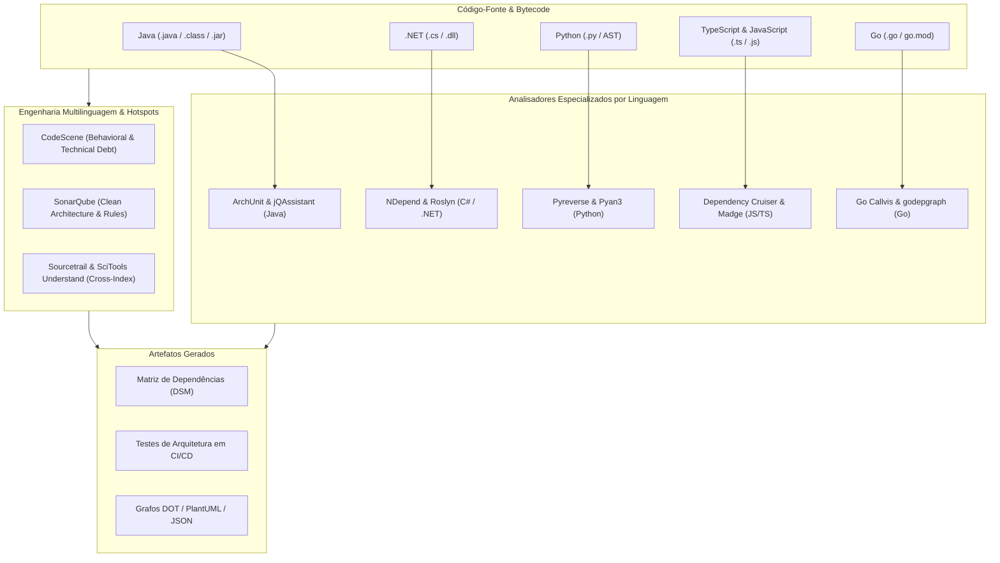

# 🧬 Mapeamento de Código-Fonte, Arquitetura, AST e Dependências entre Classes

Esta skill orienta a inteligência artificial a atuar como **Especialista em Mapeamento Estático e Arquitetural de Código-Fonte**, utilizando analisadores de AST (Árvore Sintática Abstrata), testes de governança arquitetural automatizados, matrizes de acoplamento (*Dependency Structure Matrix - DSM*) e métricas de complexidade e coesão em múltiplas linguagens.

---

## 🏛️ 1. Visão Geral do Mapeamento Estático por Linguagem

O mapeamento de código extrai o modelo relacional de tipos, funções, pacotes e módulos diretamente do código-fonte ou bytecode compilado:



---

## 🛠️ 2. Ferramentas por Ecossistema de Linguagem

### A. Java & JVM
1. **ArchUnit**: Framework de testes unitários para asserção de regras arquiteturais (Onion, Hexagonal, Clean Architecture, injeção de dependências e camadas).
   - **Exemplo de Teste de Arquitetura Java**:
```java
@AnalyzeClasses(packages = "com.empresa.app")
public class ArchitectureTest {

    @ArchTest
    public static final ArchRule controllers_should_only_call_services =
        classes().that().resideInAPackage("..controller..")
            .should().onlyAccessClassesThat()
            .resideInAnyPackage("..service..", "..dto..", "java..");

    @ArchTest
    public static final ArchRule domain_should_not_depend_on_infrastructure =
        noClasses().that().resideInAPackage("..domain..")
            .should().dependOnClassesThat()
            .resideInAPackage("..infrastructure..");

    @ArchTest
    public static final ArchRule no_cycles_in_packages =
        slices().matching("com.empresa.app.(*)..").should().beFreeOfCycles();
}
```

2. **jQAssistant**: Transforma a estrutura do código Java (classes, métodos, anotações, JPA, dependências Maven) em um grafo **Neo4j**, permitindo validar regras de conformidade via queries Cypher no build do Maven/Gradle.
3. **Structure101 & Sonargraph**: Analisadores avançados com Matriz de Estrutura de Dependência (DSM), visualização de slices e detecção de dependências cíclicas em nível de pacote e classe.
4. **JDepend & Classycle**: Utilitários para medição de métricas de Robert C. Martin:
   - **Afferent Coupling ($C_a$)**: Quantidade de classes externas que dependem deste pacote.
   - **Efferent Coupling ($C_e$)**: Quantidade de classes externas das quais este pacote depende.
   - **Instability ($I$)**: $I = \frac{C_e}{C_a + C_e}$ (0 = Totalmente estável, 1 = Totalmente instável).
   - **Abstractness ($A$)**: Razão de classes abstratas e interfaces pelo total de classes.
   - **Distance from Main Sequence ($D$)**: $D = |A + I - 1|$.

---

### B. C# & .NET
1. **NDepend**: Ferramenta de análise estática profunda para ecossistema .NET com suporte a linguagem de consulta **CQLinq** (Code Query LINQ).
   - **Exemplo de Regra CQLinq**:
```csharp
// Identificar métodos com alto acoplamento e complexidade ciclomática elevada
warnif count > 0 
from m in JustMyCode.Methods 
where m.CyclomaticComplexity > 15 && m.CouplingMethods > 20
select new { m, m.CyclomaticComplexity, m.CouplingMethods }
```
2. **Roslyn Analyzers**: Analisadores integrados ao compilador C# que validam padrões de design durante o tempo de edição/compilação.
3. **ArchUnitNET**: Porte do ArchUnit para C#, permitindo asserções de arquitetura fluentes em xUnit/NUnit.

---

### C. Python
1. **Pyreverse**: Módulo integrado ao `pylint` que faz parsing da AST de projetos Python e produz diagramas de classes e pacotes nos formatos PlantUML e Graphviz DOT.
```bash
# Gerar diagrama de classes e pacotes do projeto
pyreverse -o png -p MeuProjeto ./src/meu_modulo
```
2. **Pyan3**: Utilitário em Python 3 para análise de AST e geração de Call Graphs estáticos de métodos e funções.
```bash
pyan3 src/**/*.py --uses --defines --colored --grouped --annotated --dot > callgraph.dot
dot -Tsvg callgraph.dot -o callgraph.svg
```
3. **Snakefood & Code2Flow**: Geradores rápidos de grafos de importação e fluxogramas de chamada de funções em Python e JavaScript.

---

### D. JavaScript & TypeScript
1. **Dependency Cruiser**: O padrão da indústria para validação de dependências em monorepos e projetos Node.js/TypeScript.
```bash
# Validar regras arquiteturais definidas no arquivo .dependency-cruiser.js
npx depcruise --config .dependency-cruiser.js src

# Gerar diagrama visual SVG de dependências entre módulos
npx depcruise src --include-only "^src" --output-type dot | dot -Tsvg > dependency-graph.svg
```
2. **Madge**: Cria grafos visuais de dependências de módulos CommonJS, AMD e ES6, listando arquivos com dependências circulares.
```bash
# Encontrar ciclos de dependência
npx madge --circular ./src
```
3. **Nx Graph**: Visualizador nativo de topologia de projetos e bibliotecas em monorepos NX.
4. **TypeScript Compiler API**: Permite inspecionar nós de AST (`ts.createSourceFile`, `ts.forEachChild`) para construir linters arquiteturais sob medida.

---

### E. Go (Golang)
1. **Go Callvis**: Utilitário interativo que analisa a árvore de tipos e ponteiros de projetos Go (usando `golang.org/x/tools/go/pointer`) para renderizar o grafo de chamadas de funções agrupadas por pacote.
```bash
go-callvis -group pkg,type -focus main ./...
```
2. **godepgraph & GoGraph**: Geradores de diagramas de importação de pacotes Go em formato Graphviz DOT.
```bash
godepgraph -s github.com/empresa/meu-repo | dot -Tpng -o godeps.png
```

---

### F. Multilinguagem e Análise Comportamental
1. **CodeScene**: Plataforma de análise comportamental de código que combina dados de controle de versão (Git) com métricas de código para identificar **Hotspots** (código com alta complexidade + alta rotatividade de commits), acoplamento temporal (*Temporal Coupling*) e gargalos de equipe (*Knowledge Loss*).
2. **SonarQube**: Plataforma de inspeção contínua de código, cobrindo vulnerabilidades de segurança (Security Hotspots), duplicações e débitos técnicos.
3. **Sourcetrail**: Excelente para navegação visual. Indexa o código-fonte e cria mapas interativos de classes, funções e chamadas. É focado em C, C++, Java e Python. O projeto foi descontinuado comercialmente, mas o código permanece aberto no GitHub e plenamente funcional para uso offline em bases de código legadas.
4. **SciTools Understand**: Ferramenta de análise estática e indexação profunda multilinguagem, gerando Butterfly Graphs, matrizes de dependência e métricas de complexidade ciclomática em escala de milhões de linhas.

---

## 📊 3. Matriz de Detecção de Más Práticas Arquiteturais

| Anti-Padrão Arquitetural | Sintoma no Mapeamento | Ferramenta de Detecção |
| :--- | :--- | :--- |
| **Dependências Circulares** | Ciclos em grafos ($A \to B \to C \to A$) | `ArchUnit`, `depcruise --circular`, `madge` |
| **God Class / God Package** | Centenas de conexões de entrada/saída | `NDepend`, `Sonargraph`, `Pyreverse` |
| **Vazamento de Camada (Layer Leak)** | Camada de Domínio importando Framework/DB | `ArchUnit`, `jQAssistant`, `.dependency-cruiser.js` |
| **Acoplamento Temporal** | Arquivos sempre modificados juntos sem importação | `CodeScene` |
| **Dívida Técnica Oculta** | Alta complexidade ciclomática em arquivos voláteis | `CodeScene`, `SonarQube` |

---

## 🎯 4. Boas Práticas

- [ ] **Trava de Arquitetura no CI/CD**: Falhe o build caso novos ciclos de dependência ou violações de camadas sejam introduzidos em Pull Requests.
- [ ] **Métricas de Martin**: Mantenha a distância da sequência principal ($D$) abaixo de `0.2` para pacotes centrais de negócio.
- [ ] **Isolamento de Monorepos**: Configure limites de fronteira explícitos (Tags de isolamento no Nx ou regras de pacote no Dependency Cruiser) impedindo que bibliotecas internas importem módulos privados de outros domínios.
