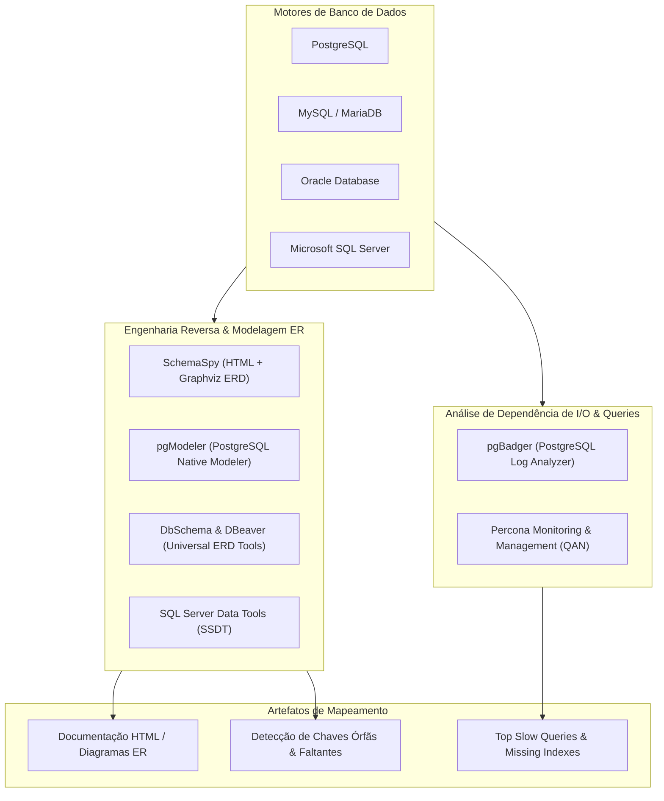

# 🗄️ Mapeamento de Bancos de Dados, Engenharia Reversa de Esquemas e Dependências de I/O

Esta skill orienta a inteligência artificial a atuar como **Especialista em Engenharia Reversa de Bancos de Dados e Mapeamento de Esquemas**, gerando diagramas de entidade-relacionamento (ERD), inspecionando dependências entre tabelas, visualizando relacionamentos implícitos/explícitos e diagnosticando gargalos de I/O através de análise de logs de consulta.

---

## 🏛️ 1. Ciclo de Mapeamento e Engenharia Reversa de Dados

O mapeamento de banco de dados extrai a estrutura relacional do catálogo do SGBD e correlaciona o uso real das tabelas pelas consultas em produção:



---

## 🛠️ 2. Ferramentas Especialistas de Mapeamento de Banco de Dados

### 1. SchemaSpy
- **Conceito**: Utilitário em Java baseado em metadados JDBC que analisa esquemas de bancos de dados relacionais e gera documentação HTML interativa com diagramas ER via Graphviz, exibindo chaves primárias, chaves estrangeiras, relacionamentos inferidos por convenção de nomes e tabelas com anomalias (*orphaned tables*).
- **Execução CLI do SchemaSpy**:
```bash
java -jar schemaspy-6.2.4.jar \
  -t pgsql \
  -dp /opt/drivers/postgresql-42.7.2.jar \
  -db meubanco \
  -host localhost \
  -port 5432 \
  -s public \
  -u postgres \
  -p secret123 \
  -o /var/www/html/db-docs \
  -vizjs
```

### 2. pgModeler (PostgreSQL Database Modeler)
- **Conceito**: Ferramenta open-source para modelagem de banco de dados dedicada ao PostgreSQL. Suporta engenharia reversa completa de instâncias ativas para modelos visuais `.dbm`, permitindo edição gráfica e exportação de scripts DDL com sincronização incremental.

### 3. DbSchema & DBeaver
- **DbSchema**: Modelador de banco de dados universal (SQL e NoSQL) com suporte a diagramas interativos, documentação HTML5 responsiva, design de esquemas offline e consultas de dados visuais.
- **DBeaver**: Cliente universal de banco de dados com geração integrada de diagramas ER baseados em metadados JDBC para qualquer conexão ativa.

### 4. ERBuilder & SQL Power Architect
- **ERBuilder**: Software visual para engenharia reversa e direta de esquemas relacionais, geração de documentação e validação de regras de integridade referencial.
- **SQL Power Architect**: Ferramenta focada em modelagem de dados e Data Warehousing, permitindo comparar esquemas (*Diff*) e mapear transformações de dados em pipelines ETL.

### 5. pgBadger (PostgreSQL Query Log Analyzer)
- **Conceito**: Analisador de logs de alta performance para PostgreSQL escrito em Perl. Processa logs de consultas com `log_min_duration_statement` ativado e gera relatórios HTML detalhados com gráficos de top queries por tempo acumulado, locks de tabela, queries mais frequentes e recomendações de criação de índices.
- **Uso CLI**:
```bash
pgbadger -j 4 --prefix '%t [%p]: [%l-1] user=%u,db=%d,app=%a,client=%h ' \
  /var/log/postgresql/postgresql-16-main.log \
  -o report_pgbadger.html
```

### 6. Percona Monitoring and Management (PMM)
- **Conceito**: Plataforma de observabilidade de bancos de dados open-source com foco em MySQL, PostgreSQL e MongoDB. Inclui o **Query Analytics (QAN)**, que mapeia em tempo real a carga de I/O imposta por cada padrão de consulta no hardware do servidor.

### 7. SQL Server Data Tools (SSDT) & Oracle SQL Developer Data Modeler
- **SSDT**: Ferramenta do Visual Studio para projetos de banco de dados SQL Server, permitindo manter o esquema completo em controle de versão e realizar deploys declarativos via Dacpac.
- **Oracle Data Modeler**: Ferramenta de modelagem lógica, relacional e física para grandes bancos corporativos Oracle e sistemas legados.

---

## 📊 3. Checklist de Auditoria de Mapeamento de Esquema

Ao inspecionar e documentar um banco de dados relacional, avalie:

| Critério de Avaliação | Problema Identificado | Impacto |
| :--- | :--- | :--- |
| **Chaves Estrangeiras Faltantes** | Relacionamento lógico no código sem restrição de FK | Inconsistência de dados e integridade referencial comprometida |
| **Índices em Colunas de FK** | FKs sem índice B-Tree associado | Table scan completo em operações de `JOIN` e `DELETE CASCADE` |
| **Tabelas Órfãs (Isolated Tables)** | Tabelas sem nenhuma relação com outras entidades | Provável débito técnico ou tabela temporária abandonada |
| **Tipos de Dados Incompatíveis em Chaves** | FK `VARCHAR` referenciando PK `INTEGER` | Falhas de conversão implícita e inviabilização de índices |
| **Hotspot Queries sem Índice Cobridor** | Queries frequentes realizando busca em Heap | Sobrecarga de I/O de disco e saturação de Buffer Pool |

---

## 🎯 4. Boas Práticas

- [ ] **Documentação Automatizada em Pipelines**: Adicione a execução do SchemaSpy ou pgModeler ao pipeline de CI/CD para manter a documentação de esquemas sempre atualizada no portal de documentação.
- [ ] **Uso de Schemas Lógicos para Separação de Domínios**: Agrupe tabelas de diferentes subdomínios (ex: `billing`, `inventory`, `users`) em schemas de banco de dados separados em vez de concentrar centenas de tabelas no schema `public`.
