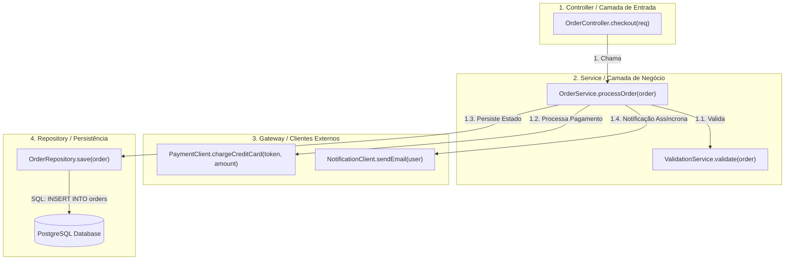

# 🔁 Análise de Fluxo de Execução e Call Graphs (Mapa de Chamadas)

Esta skill orienta a inteligência artificial a atuar como **Especialista em Análise de Fluxo de Execução e Call Graphs**, reconstruindo a cadeia hierárquica de chamadas entre métodos, funções, serviços e bancos de dados, combinando análise estática de chamadas e rastreamento dinâmico em tempo de execução.

---

## 🧭 1. Análise Estática vs Análise Dinâmica de Fluxo

A reconstrução de caminhos de execução envolve duas abordagens sinérgicas:
1. **Call Graph Estático (Static Call Graph)**: Analisa o código-fonte, AST e tabelas de símbolos para identificar todas as invocações de funções possíveis, lidando com chamadas polimórficas via algoritmos de análise de pontos de chamada (Class Hierarchy Analysis - CHA, Rapid Type Analysis - RTA, Pointer Analysis).
2. **Call Graph Dinâmico (Dynamic Call Graph / Tracing)**: Inspeciona chamadas reais executadas em runtime através de instrumentação de bytecode, profilers de CPU ou spans do OpenTelemetry/Jaeger, capturando a ordem exata, contagem de execuções e tempo gasto em cada nó.



---

## 🛠️ 2. Ferramentas Especialistas de Geração de Call Graphs

### 1. Code2Flow
- **Conceito**: Utilitário multilíngue (Python, JavaScript, Ruby, PHP) que gera fluxogramas executáveis visuais a partir de código-fonte, mapeando de forma direta como as funções interagem entre si.
- **Uso CLI**:
```bash
# Gerar fluxograma de execução em SVG
code2flow src/main.py src/auth.py src/database.py -o execution_flow.svg
```

### 2. Go Callvis (Go / Golang)
- **Conceito**: Gerador de grafo de chamadas interativo para Go. Utiliza análise estática avançada de ponteiros (`pointer analysis`) para resolver interfaces e despachos dinâmicos, agrupando funções por pacote de origem.
- **Uso CLI**:
```bash
# Focar no ponto de entrada main e ignorar bibliotecas padrão do Go
go-callvis -nostd -focus github.com/empresa/projeto/cmd/server .
```

### 3. Pyan3 (Python)
- **Conceito**: Analisador estático para Python 3 que analisa definições de classes, métodos e chamadas através do módulo `ast`, gerando arquivos DOT detalhados.
- **Comando**:
```bash
pyan3 $(find ./app -name "*.py") --uses --defines --colored --grouped --nested-groups --dot > app_callgraph.dot
dot -Tpng app_callgraph.dot -o app_callgraph.png
```

### 4. Doxygen + Graphviz DOT (C, C++, Java, C#)
- **Conceito**: Gera diagramas de chamadas diretas (*Call Graph*) e chamadas inversas (*Caller Graph*) para qualquer função/método do sistema.
- **Visualização**: Cada nó de função exibe hiperlinks para o código-fonte correspondente e destaca se a função faz parte de uma API pública ou é interna.

### 5. SciTools Understand & Sourcetrail
- **SciTools Understand**: Plataforma líder para análise estática em escala de milhões de linhas de código. Gera diagramas de **Butterfly Graphs** (mostra simultaneamente quem chama e quem é chamado por uma função selecionada), árvores de dependência e métricas de complexidade ciclomática.
- **Sourcetrail**: Indexador de código interativo open-source que permite navegar graficamente em nós de código (`Type`, `Function`, `Variable`) com sincronização em tempo real na tela do código-fonte.

### 6. Rastreamento Dinâmico com OpenTelemetry + Jaeger
- **Conceito**: Permite visualizar o grafo de chamadas reais em runtime com métricas de tempo distribuídas entre microsserviços e componentes locais.
- **Exemplo de DAG de Spans**:
```text
[Trace: 8a7f9b2c3d] Total: 250ms
 ├── HTTP POST /api/checkout (OrderController) [250ms]
 │    ├── OrderService.process [210ms]
 │    │    ├── PaymentClient.charge (HTTP POST api.stripe.com) [140ms]
 │    │    └── OrderRepository.save (SQL INSERT) [35ms]
 │    └── EventPublisher.emit [10ms]
```

---

## 📊 3. Tipos de Resolução Polimórfica em Call Graphs

Ao mapear código orientado a objetos ou funcional, o especialista deve considerar a técnica de resolução de despacho dinâmico:

| Algoritmo | Precisão | Custo Computacional | Descrição |
| :--- | :--- | :--- | :--- |
| **CHA (Class Hierarchy Analysis)** | Média | Muito Baixo | Conecta a chamada a todas as subclasses que implementam o método. |
| **RTA (Rapid Type Analysis)** | Alta | Baixo | Filtra apenas classes concretas que são efetivamente instanciadas na aplicação. |
| **Pointer Analysis (Andersen/Steensgaard)** | Muito Alta | Alto | Rastreia o fluxo de ponteiros/referências para identificar o objeto exato apontado. |
| **Dynamic Execution (Tracing)** | Exata (100%) | Overhead em runtime | Registra apenas as chamadas reais disparadas durante a execução. |

---

## 🎯 4. Boas Práticas

- [ ] **Filtragem de Bibliotecas Padrão**: Sempre filtre bibliotecas utilitárias do runtime (`java.lang.*`, `fmt.Println`, `builtins`, `lodash`) para evitar que o Call Graph fique poluído e ilegível.
- [ ] **Identificação de Métodos Folha Críticos (Critical Leaf Methods)**: Localize métodos no final da cadeia de chamadas que realizam I/O bloqueante ou operações matemáticas pesadas para otimização de performance.
- [ ] **Detecção de Código Morto (Dead Code)**: Funções privadas ou internas com grau de entrada zero ($In\text{-}Degree = 0$) no grafo completo devem ser investigadas para refatoração e remoção.
