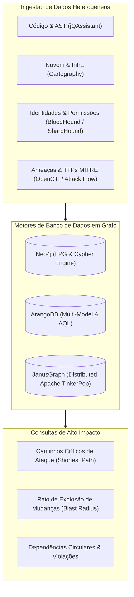

# 🕸️ Mapeamento de Relacionamentos, Grafos de Conhecimento e Segurança

Esta skill orienta a inteligência artificial a atuar como **Especialista em Grafos de Conhecimento e Análise de Relacionamentos de Sistemas e Segurança**, integrando dados heterogêneos de código, nuvem, identidade (Active Directory / Entra ID), ameaças (Threat Intelligence) e infraestrutura em grafos de propriedades direcionados (Labeled Property Graphs - LPG) para consultas de impacto e caminhos de ataque (*Attack Paths*).

---

## 🌐 1. Arquitetura Unificada de Grafos de Conhecimento

A modelagem em grafos transforma silos isolados de informação em uma malha relacional navegável através de linguagens de consulta declarativas (Cypher, AQL, Gremlin):



---

## 🛠️ 2. Ferramentas Especialistas de Grafos e Modelos

### 1. Neo4j & Linguagem Cypher
- **Conceito**: O banco de dados orientado a grafos nativo mais utilizado no mundo. Modela nós (*Nodes*), rótulos (*Labels*), relacionamentos (*Relationships*) e propriedades de chave-valor (*Properties*).
- **Consulta Cypher: Mapeamento de Raio de Explosão (Blast Radius) de uma Classe de Domínio**:
```cypher
// Identificar todos os métodos, classes e endpoints afetados pela alteração de UserEntity
MATCH path = (e:Entity {name: 'UserEntity'})<-[:DEPENDS_ON*1..4]-(caller)
RETURN path, count(caller) AS total_affected_nodes
ORDER BY length(path) ASC;
```

### 2. BloodHound (Active Directory & Azure/Entra ID Attack Paths)
- **Conceito**: Ferramenta de auditoria que utiliza teoria dos grafos para mapear e visualizar relacionamentos de controle e privilégios ocultos no Active Directory e Azure AD. Identifica caminhos indiretos de escalada de privilégios para Domain Admin (*Shortest Path to High Value Targets*).
- **Coleta e Consulta BloodHound**:
  - Coleta via `SharpHound.exe` ou `bloodhound-python`.
  - Ingestão no Neo4j e visualização de nós (`User`, `Group`, `Computer`, `OU`, `GPO`, `Domain`) e arestas (`MemberOf`, `AdminTo`, `HasSession`, `WriteDacl`, `GenericAll`, `AddMember`, `GetChangesAll`).

### 3. jQAssistant (Software Architecture Graph)
- **Conceito**: Framework de controle de qualidade arquitetural que analisa projetos Java, Maven, JPA, Git e Docker, gravando a estrutura completa no Neo4j e validando regras corporativas via Cypher.
- **Exemplo de Regra Cypher no `jqassistant-rules.xml`**:
```cypher
// Bloquear acesso direto de Controllers aos Repositories
MATCH (c:Type)-[:DECLARES]->(m:Method)-[:CALLS]->(rMethod:Method)<-[:DECLARES]-(r:Type)
WHERE c:Controller AND r:Repository
CREATE (c)-[:VIOLATES_LAYER]->(r)
RETURN c.name AS ViolatingController, r.name AS TargetRepository;
```

### 4. ArangoDB & JanusGraph
- **ArangoDB**: Banco multi-modelo nativo (Documentos, Key-Value e Grafos) com suporte à linguagem AQL (ArangoDB Query Language) e algoritmos de caminhamento de grafo distribuídos.
- **JanusGraph**: Banco de grafos distribuído de alta escala (escalável sobre Apache Cassandra, HBase ou ScyllaDB) compatível com o padrão **Apache TinkerPop / Gremlin**.

### 5. Attack Flow & OpenCTI (Segurança & Threat Intelligence)
- **Attack Flow (MITRE Center for Threat-Informed Defense)**: Linguagem e formato declarativo JSON para mapeamento da sequência temporal de ações e técnicas adversárias baseadas no MITRE ATT&CK.
- **OpenCTI**: Plataforma aberta de gerenciamento de inteligência de ameaças cibernéticas (CTI) que estrutura relacionamentos de vulnerabilidades (CVE), atores de ameaça (Threat Actors), malwares e incidentes em grafos interoperáveis com o padrão STIX 2.1.

---

## 📊 3. Algoritmos de Grafos Essenciais para Mapeamento

Ao analisar grafos de dependência e segurança, o especialista deve aplicar algoritmos clássicos de teoria dos grafos:

| Algoritmo | Aplicação no Mapeamento | Implementação Neo4j GDS / Python NetworkX |
| :--- | :--- | :--- |
| **Shortest Path (Dijkstra / BFS)** | Menor caminho de escalada de privilégio ou chamada de API | `gds.shortestPath.dijkstra.stream` |
| **PageRank / Centralidade** | Identificação dos componentes e classes mais críticos do sistema | `gds.pageRank.stream` |
| **Betweenness Centrality** | Nós de ponte (Gargalos de comunicação ou Single Points of Failure) | `gds.betweenness.stream` |
| **Louvain / Leiden (Community Detection)**| Identificação de módulos de código coesos para refatoração em microsserviços | `gds.louvain.stream` |
| **Cycle Detection (Tarjan / Johnson)** | Detecção de ciclos de dependência proibidos na arquitetura | `apoc.algo.cycles` |

---

## 🎯 4. Boas Práticas na Modelagem em Grafo

- [ ] **Arestas Direcionadas com Semântica Clara**: Nomeie relacionamentos com verbos expressivos (`[:CALLS]`, `[:IMPLEMENTS]`, `[:DEPENDS_ON]`, `[:COMMUNICATES_WITH]`, `[:ADMIN_TO]`).
- [ ] **Indexação de Propriedades de Busca**: Crie índices exclusivos em IDs e nomes de nós (`CREATE CONSTRAINT FOR (n:Node) REQUIRE n.id IS UNIQUE`) para garantir consultas Cypher sub-segundo em grafos com milhões de vértices.
- [ ] **Limpeza de Nós Órfãos**: Execute rotinas periódicas de manutenção para remover nós sem relacionamentos remanescentes de versões antigas do código.
