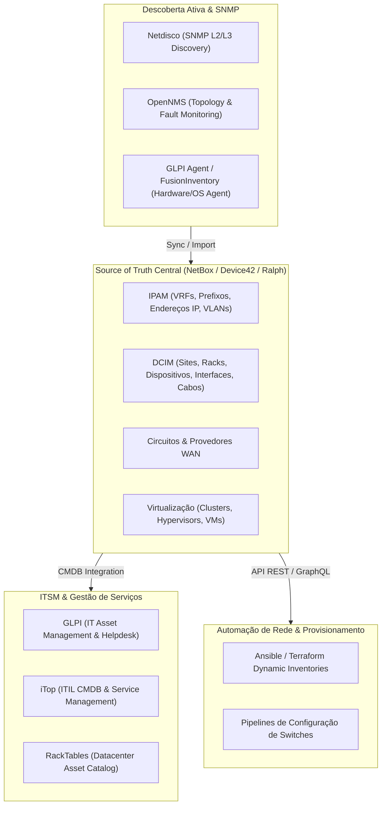

# 🏢 Inventário de Infraestrutura, IPAM, DCIM e CMDB

Esta skill orienta a inteligência artificial a atuar como **Especialista em Mapeamento de Infraestrutura Física, Lógica e Ativos de Rede**, gerenciando a Fonte Única de Verdade (*Source of Truth*) para redes, servidores, racks, topologias de cabeamento, circuitos WAN e configurações de serviços corporativos.

---

## 🏛️ 1. Modelo de Dados de Infraestrutura e Fonte da Verdade (Source of Truth)

O gerenciamento moderno de infraestrutura baseia-se no conceito de **Infrastructure as Code (IaC)** sustentado por um Source of Truth centralizado:



---

## 🛠️ 2. Ferramentas Especialistas de Inventário e CMDB

### 1. NetBox (The Network Source of Truth)
- **Conceito**: Plataforma de referência aberta para IPAM e DCIM. Desenvolvida para documentar e modelar redes de computadores com rigor relacional (Sites -> Racks -> Devices -> Interfaces -> Cables -> IP Addresses). Fornece APIs REST e GraphQL abrangentes para automação de rede.
- **Automação via Python (pynetbox)**:
```python
import pynetbox

nb = pynetbox.api(
    url="https://netbox.corp.local",
    token="0123456789abcdef0123456789abcdef01234567"
)

# Criar prefixo de sub-rede e alocar primeiro IP disponível
prefix = nb.ipam.prefixes.get(prefix="10.20.0.0/24")
available_ips = prefix.available_ips.list()
print(f"Próximo IP livre: {available_ips[0]['address']}")

# Consultar topologia de interfaces conectadas a um switch
device = nb.dcim.devices.get(name="sw-core-01")
for interface in nb.dcim.interfaces.filter(device_id=device.id):
    if interface.cable:
        print(f"Interface {interface.name} conectada a {interface.connected_endpoint}")
```

### 2. OpenNMS (Enterprise-Grade Network Management)
- **Conceito**: Plataforma de monitoramento e descoberta de rede corporativa de alta escala. Suporta protocolos SNMP v1/v2c/v3, gRPC Telemetry, WMI e OpenNMS Compass para mapeamento de topologias L2/L3 através de LLDP, CDP e Bridge-MIB.

### 3. Netdisco (Automatic Layer 2/3 Network Discovery)
- **Conceito**: Utilitário baseado em Perl e SNMP que descobre automaticamente todos os dispositivos de rede interconectados via CDP/LLDP, mapeando qual endereço MAC e IP está conectado a cada porta de switch em tempo real.
- **Consultas Netdisco CLI**:
```bash
# Localizar porta e switch físico de um endereço MAC/IP específico
netdisco-do location -d 192.168.1.50
netdisco-do macsuck -d sw-access-floor2.corp.local
```

### 4. Ralph (Asset Management & DCIM)
- **Conceito**: Sistema de gerenciamento de ativos de TI (Hardware, Licenças de Software, Servidores de Rack, Nuvem) focado em contabilidade, ciclo de vida de ativos e integração com data centers físicos.

### 5. GLPI (IT Asset Management & Helpdesk)
- **Conceito**: Sistema open-source completo de gerenciamento de ativos de TI (ITAM) e CMDB compatível com ITIL. Coleta automaticamente inventários detalhados de hardware, sistemas operacionais, pacotes de software e periféricos através de agentes instalados nos endpoints (`glpi-agent`).
- **Comando de inventário manual do agente**:
```bash
glpi-agent --server https://glpi.corp.local/front/inventory.php --force --debug
```

### 6. iTop (ITIL Service Management & CMDB)
- **Conceito**: CMDB relacional com motor de análise de impacto de mudanças (*Impact Analysis Engine*). Permite modelar a cadeia de dependências entre componentes físicos (servidores, switches), virtuais (bancos de dados, instâncias) e serviços de negócio (*Business Services*).

### 7. Device42
- **Conceito**: Solução de descoberta automatizada sem agente para data centers e nuvens híbridas. Mapeia automaticamente topologias de rede, inventário de hardware, mapas de dependência de aplicações (ADM - Application Dependency Mapping) e certificados SSL expirados.

### 8. RackTables
- **Conceito**: Ferramenta clássica de gerenciamento de espaço de datacenter, endereçamento IP e alocação de unidades de rack (RU) com mapeamento de conexões de patch panels e portas de rede.

---

## 📊 3. Matriz Comparativa: IPAM vs DCIM vs CMDB vs ITAM

| Ferramenta | Foco Primário | Protocolos de Coleta | APIs e Integrações |
| :--- | :--- | :--- | :--- |
| **NetBox** | Source of Truth de Rede / IPAM / DCIM | Manual / GitOps / Scripts IaC | REST API, GraphQL, Webhooks |
| **Netdisco** | Mapeamento L2/L3 de Switches / MACs | SNMP (v1/v2c/v3), LLDP, CDP | REST API, PostgreSQL nativo |
| **OpenNMS** | Descoberta e Monitoramento de Falhas | SNMP, ICMP, gRPC, JMX | REST API, Kafka Ingestion |
| **GLPI** | ITAM, CMDB e Gestão de Incidentes | Agente Local (WMI, DMI, lshw) | REST API, Plugins Marketplace |
| **iTop** | CMDB ITIL e Análise de Impacto | REST / CSV / Sync Data Collectors | REST API, OQL (Object Query Lang) |
| **Device42** | Auto-Discovery Enterprise & ADM | SNMP, WMI, SSH, Cloud APIs | REST API, Jira, Confluence, ServiceNow |

---

## 🎯 4. Boas Práticas na Manutenção do Inventário

- [ ] **Distinção entre Source of Truth e Descoberta**: Trate o NetBox como *design pretendido* (o que deve existir) e ferramentas como Netdisco/OpenNMS como *estado observado* (o que está ativo), alertando desvios (*drift detection*).
- [ ] **Uso de IDs Universais e Serial Numbers**: Registre números de série e endereços MAC como identificadores únicos imutáveis para evitar duplicação de ativos em migrações.
- [ ] **Alimentação Dinâmica de Inventários Ansible**: Substitua arquivos `hosts` estáticos pelo plugin de inventário dinâmico do NetBox (`netbox.netbox.nb_inventory`).
