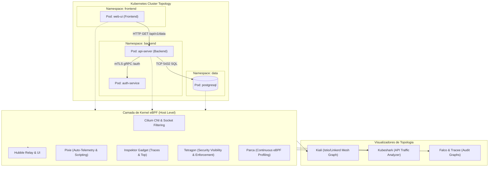

# ☸️ Mapeamento de Topologia, Tráfego e Segurança em Kubernetes & Containers (eBPF & Service Mesh)

Esta skill orienta a inteligência artificial a atuar como **Especialista em Mapeamento de Clusters Kubernetes e Ambientes de Containers**, utilizando tecnologias eBPF em nível de kernel, Service Meshes e ferramentas de inspeção dinâmica para construir mapas de comunicação entre Pods, Services, Namespaces, políticas de rede e eventos de segurança em runtime.

---

## 🏛️ 1. Arquitetura de Mapeamento em Kubernetes via eBPF & Service Mesh

A combinação de CNI baseado em eBPF e Service Mesh permite visibilidade total nas camadas L3, L4 e L7 sem a necessidade de sidecars pesados:



---

## 🛠️ 2. Ferramentas Especialistas e Comandos

### A. Mapeamento de Rede e Topologia L3/L4/L7

#### 1. Cilium & Hubble
- **Conceito**: CNI de alta performance baseado em eBPF que substitui o `kube-proxy` (via eBPF host routing) e o **Hubble**, sua camada de observabilidade que constrói grafos de fluxo de serviço em tempo real, monitoramento de DNS, HTTP e quedas de políticas de segurança (*Network Policy drops*).
- **Comandos de Inspeção e Mapeamento CLI**:
```bash
# Observar fluxos L7 em tempo real filtrados por namespace e protocolo
hubble observe --namespace backend --protocol http --follow

# Inspecionar quedas de tráfego (Network Policy Drops)
hubble observe --verdict DROPPED --namespace backend

# Gerar mapa de fluxo entre serviços e endpoints
hubble observe --to-service backend/api-server -o jsonpb | jq '.flow | {src: .source.workload_names, dst: .destination.workload_names, l7: .l7}'
```

#### 2. Kiali (Service Mesh Topology)
- **Conceito**: Console de gerenciamento e visualização de topologias para **Istio** e **Linkerd**. Renderiza grafos direcionados de chamadas, identificando taxas de sucesso de requisições, status de injeção de sidecar mTLS, versionamento de rotas Canary/Blue-Green e tempos de resposta.

#### 3. Kubeshark (The API Traffic Analyzer for Kubernetes)
- **Conceito**: Sniffer e analisador de tráfego L7 para Kubernetes, capaz de interceptar e decodificar protocolos como HTTP/1.1, HTTP/2, gRPC, WebSocket, AMQP, Kafka e Redis em tempo real, inclusive em canais criptografados via TLS através de uretprobes eBPF.
- **Uso CLI**:
```bash
# Iniciar Kubeshark e abrir interface web local
kubeshark tap -n production
# Filtrar apenas chamadas com erro de status HTTP >= 400
kubeshark tap "response.status >= 400"
```

#### 4. Pixie (Open Source Kubernetes Observability via eBPF)
- **Conceito**: Plataforma de telemetria sem código que coleta automaticamente traces de requisições, métricas de rede, uso de CPU e memória por pod, além de tabelas completas de mensagens HTTP/gRPC/SQL utilizando scripts **PxL** (Pixie Language).
- **Consulta PxL para mapeamento de dependências de banco de dados**:
```python
import px

# Mapear latência e queries SQL executadas por serviço
df = px.DataFrame(table='pgsql_events', start_time='-5m')
df.service = df.ctx['service']
df = df.groupby(['service', 'req']).agg(
    latency=('latency', px.mean),
    count=('latency', px.count)
)
px.display(df)
```

---

### B. Mapeamento de Recursos do Kernel, Profiling e Segurança em Runtime

#### 1. Inspektor Gadget
- **Conceito**: Coleção de ferramentas e ferramentas eBPF empacotadas para depuração, mapeamento de processos e auditoria de contêineres no Kubernetes.
- **Gadgets Essenciais**:
```bash
# Rastrear novas conexões TCP abertas por pods em tempo real
kubectl gadget trace tcp --namespace production

# Mapear arquivos abertos e modificados por contêineres
kubectl gadget trace open -A

# Perfil de processos que mais consomem I/O de disco
kubectl gadget top block-io
```

#### 2. Parca (Continuous Profiling via eBPF)
- **Conceito**: Sistema de profiling contínuo que captura Flamegraphs de CPU, alocação de memória e chamadas nativas em toda a frota de contêineres sem necessidade de overhead ou recompilação de código.

#### 3. Tetragon (eBPF-based Security Observability & Runtime Enforcement)
- **Conceito**: Mecanismo de visibilidade e aplicação de segurança do projeto Cilium que mapeia execuções de processos (`execve`), acessos a arquivos confidenciais, conexões de socket de rede e escalada de privilégios com bloqueio síncrono no kernel.
- **Exemplo de Política TracingPolicy (`monitor-binaries.yaml`)**:
```yaml
apiVersion: cilium.io/v1alpha1
kind: TracingPolicy
metadata:
  name: "monitor-exec-sensitive"
spec:
  kprobes:
    - call: "sys_execve"
      syscall: true
      args:
        - index: 0
          type: "string"
      selectors:
        - matchArgs:
            - index: 0
              operator: "Prefix"
              values:
                - "/bin/bash"
                - "/bin/sh"
                - "/usr/bin/nc"
```

#### 4. Falco & Tracee
- **Falco (CNCF Graduated Runtime Security)**: Analisa eventos de chamadas de sistema através de drivers de kernel ou eBPF para detectar anomalias comportamentais (shells em pods, escrita em diretórios binários, modificação de `/etc/passwd`).
- **Tracee (Aqua Security)**: Mecanismo de rastreamento forense de eventos eBPF, especializado em detectar técnicas do MITRE ATT&CK para contêineres e Linux.

---

## 📊 3. Matriz de Seleção de Ferramentas por Caso de Uso

| Necessidade de Mapeamento | Ferramenta Recomendada | Camada de Atuação |
| :--- | :--- | :--- |
| **Topologia Pod-a-Pod e Network Policies** | **Cilium + Hubble** | Kernel eBPF / L3-L4-L7 |
| **Inspeção de Payload HTTP/gRPC em Tempo Real** | **Kubeshark** | eBPF uretprobes / L7 |
| **Visualização de Service Mesh Istio/Linkerd** | **Kiali** | Sidecar Proxy / Control Plane |
| **Mapeamento de Queries SQL & Dependências** | **Pixie** | eBPF Kernel / Socket Data |
| **Profiling de CPU/Memória (Flamegraphs)** | **Parca** | eBPF Perf Events |
| **Rastreamento de Syscalls & Acesso a Arquivos** | **Inspektor Gadget** | eBPF Kprobes / Tracepoints |
| **Detecção de Anomalias de Segurança em Pods** | **Tetragon / Falco** | eBPF Kernel Hooks |

---

## 🎯 4. Boas Práticas e Recomendações

- [ ] **Desativação de kube-proxy**: Ao adotar Cilium eBPF, habilite o modo `kubeProxyReplacement=true` para diminuir a sobrecarga de iptables e melhorar o roteamento de tráfego inter-serviço.
- [ ] **Métricas de Latência L7 com Hubble**: Ative `hubble.metrics.enabled="{dns,drop,tcp,flow,port-distribution,icmp,http}"` para exportar dados completos para o Prometheus.
- [ ] **Políticas de Isolamento de Rede**: Utilize a visualização do Hubble para criar **CiliumNetworkPolicies** de menor privilégio (Default Deny) baseadas em fluxos reais observados.
