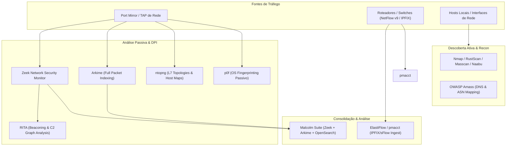

# 🌐 Análise de Fluxo de Rede, Inspeção Profunda de Pacotes (DPI) e Descoberta Ativa/Passiva

Esta skill orienta a inteligência artificial a atuar como **Especialista em Análise de Fluxos de Rede e Descoberta de Topologias de Comunicação**, cobrindo o mapeamento de conexões L3/L4/L7, inventário passivo de sistemas operacionais e serviços, detecção de canais de comunicação ocultos e telemetria baseada em NetFlow/IPFIX/sFlow e PCAP.

---

## 🔍 1. Arquitetura de Mapeamento de Rede e Fluxos

O mapeamento de rede combina telemetria estatística de fluxo (NetFlow/IPFIX), análise comportamental de protocolos em tempo real (Zeek/Arkime) e escaneamento ativo de portas/serviços:



---

## 🛠️ 2. Ferramentas Especialistas e Comandos Práticos

### A. Análise Passiva de Tráfego & DPI

#### 1. Zeek (antigo Bro)
- **Conceito**: Mecanismo de monitoramento de segurança e análise de protocolos em nível de aplicação (DNS, HTTP, SSL/TLS, SSH, SMB, DHCP, Modbus). Gera logs estruturados por protocolo e correlaciona conexões através de um identificador único de conexão (`uid`).
- **Comando de análise de PCAP e geração de logs**:
```bash
# Executar análise de captura e extrair metadados estruturados
zeek -r capture.pcap local "Site::local_nets += { 192.168.0.0/16, 10.0.0.0/8 }"

# Filtrar conexões HTTP de longa duração e serviços mapeados
zeek-cut id.orig_h id.orig_p id.resp_h id.resp_p service proto orig_bytes resp_bytes < conn.log
```

#### 2. ntopng
- **Conceito**: Monitor de tráfego de alta velocidade com suporte a nDPI (Deep Packet Inspection), categorizando fluxos por aplicação L7, identificando anomalias de largura de banda, hosts conversadores (*Top Talkers*) e mapas de rede locais.
- **Execução CLI / Monitoramento**:
```bash
ntopng -i eth0 --local-networks "192.168.1.0/24,10.10.0.0/16" -F "es;flow;http://localhost:9200/_bulk;"
```

#### 3. Arkime (antigo Moloch)
- **Conceito**: Sistema indexador e visualizador de sessões e captura completa de pacotes (PCAP). Oferece busca visual por nós de rede, certificados SSL negociados e fluxos de transferência de dados em escala de terabytes/petabytes.

#### 4. Wireshark & TShark & tcpdump
- **tcpdump**: Captura e filtragem leve em linha de comando utilizando BPF (Berkeley Packet Filters).
```bash
# Capturar tráfego SYN e RST entre sub-redes para mapeamento de conexões
tcpdump -nn -i eth0 'tcp[tcpflags] & (tcp-syn|tcp-rst) != 0' -w syn_flows.pcap
```
- **tshark**: Interface CLI do Wireshark para dissecação e extração de campos estruturados.
```bash
# Mapear pares IP, portas e SNI TLS passivamente
tshark -r capture.pcap -Y "tls.handshake.extensions_server_name" -T fields -e ip.src -e ip.dst -e tls.handshake.extensions_server_name
```

#### 5. pmacct & ElastiFlow
- **pmacct**: Daemon agregador de NetFlow v5/v9, IPFIX, sFlow e BGP para roteadores e firewalls corporativos.
- **ElastiFlow**: Pipeline de alto desempenho para enriquecimento e visualização de dados de fluxo (Autonomous Systems, GeoIP, tipos de tráfego) no OpenSearch / Elastic Stack.

#### 6. p0f & NetworkMiner
- **p0f (Passive OS Fingerprinting)**: Identifica sistemas operacionais, MTU, uptime e presença de NAT ou firewalls sem enviar um único pacote para a rede alvo.
```bash
p0f -i eth0 -o /tmp/p0f_fingerprints.log
```
- **NetworkMiner**: Analisador forense de rede passivo que organiza o tráfego por hosts, extraindo arquivos transferidos, credenciais, certificados e imagens de forma estruturada.

#### 7. RITA & Malcolm
- **RITA (Real Intelligence Threat Analytics)**: Framework de análise de logs do Zeek para identificação de padrões periódicos de comunicação (Beacons), túneis DNS e conexões C2 persistentes.
```bash
rita import --logs /path/to/zeek_logs/ dataset_prod
rita show-beacons dataset_prod
```
- **Malcolm**: Suíte unificada de análise de tráfego de rede combinando Zeek, Arkime, Suricata, File Extraction e dashboards prontos no OpenSearch Dashboards.

---

### B. Descoberta Ativa de Ativos e Mapeamento de Portas

#### 1. Nmap (Network Mapper)
- **Varredura rápida de serviços, versões e topologia de rede**:
```bash
# Mapear sub-rede com resolução de serviços, scripts NSE seguros e traceroute
nmap -sS -sV -O --traceroute -p- --min-rate 1000 -T4 192.168.1.0/24 -oA network_map_subnet
```

#### 2. RustScan & Masscan & Naabu
- **RustScan**: Varredor de portas ultrarrápido em Rust integrado ao Nmap para descoberta quase instantânea de portas abertas em grandes blocos CIDR.
```bash
rustscan -a 192.168.1.0/24 --ulimit 5000 -b 2000 -- -sV -sC -oN rustscan_out.txt
```
- **Masscan**: Scanner assíncrono capaz de escanear toda a Internet em minutos utilizando driver de rede customizado.
```bash
masscan -p1-65535 10.0.0.0/8 --rate=10000 --exclude 255.255.255.255 -oJ masscan_corp.json
```
- **Naabu**: Scanner de portas leve e altamente concorrente da ProjectDiscovery focado em pipelines automatizados de recon e integração com JSON.
```bash
naabu -list targets.txt -c 50 -rate 1000 -json -o open_ports.json
```

#### 3. OWASP Amass
- **Mapeamento de Superfície de Ataque e Topologia DNS/ASN**: Mapeia relacionamentos entre domínios, endereços IP, blocos ASN, certificados SSL e WHOIS utilizando fontes abertas e técnicas ativas de enumeração DNS.
```bash
amass enum -d empresa.com -active -brute -asn 12345 -json amass_topology.json
amass viz -d3 -json amass_topology.json
```

---

## 📊 3. Matriz de Correlação de Fluxos L4/L7

| Protocolo | Porta Padrão | Analisador Recomendado | Metadado de Mapeamento Extraído |
| :--- | :--- | :--- | :--- |
| **HTTP/HTTPS** | 80, 443, 8080 | Zeek (`http.log`, `ssl.log`), ntopng | Host Header, SNI TLS, User-Agent, URIs, Métodos |
| **DNS** | 53 (UDP/TCP), 853 | Zeek (`dns.log`), Wireshark | Query Names (FQDN), Respostas, Servidores DNS autoritativos |
| **Bancos de Dados** | 5432, 3306, 1433, 27017 | TShark, Zeek Plugins | Par IP/Porta cliente-servidor, volume de queries, erros |
| **Mensageria** | 9092 (Kafka), 5672 (AMQP) | Arkime, ntopng | Tópicos, taxa de mensagens, nós de cluster |
| **SSH / RDP** | 22, 3389 | p0f, Zeek (`ssh.log`, `rdp.log`) | Cifras suportadas, versões de cliente, conexões anômalas |

---

## 🎯 4. Boas Práticas e Recomendações

- [ ] **Captura Sem Perda de Pacotes**: Ao utilizar SPAN/Mirror ports, configure buffers de anel (`ring buffer`) adequados no `tcpdump`/`dumpcap` para evitar descarte de pacotes durante picos de tráfego.
- [ ] **Preservação de Privacidade**: Ao coletar PCAP em ambientes com dados sensíveis (PII, PCI-DSS), utilize regras de truncamento (`snaplen`) para capturar apenas cabeçalhos IP/TCP/UDP (ex.: `-s 96`).
- [ ] **Correlação Bidirecional**: Garanta a correlação de fluxos de ida e volta através do par `(src_ip, src_port, dst_ip, dst_port, protocol)` e calcule métricas de assimetria de tráfego.
