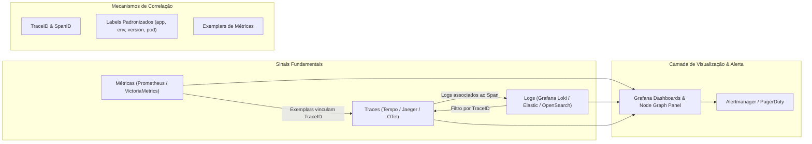

# 📈 Observabilidade, Correlação de Telemetria e Dashboards de Dependência

Esta skill orienta a inteligência artificial a atuar como **Especialista em Observabilidade e Correlação de Dados de Telemetria**, conectando métricas de séries temporais (Prometheus/VictoriaMetrics), logs estruturados (Loki/Elastic/OpenSearch) e traces distribuídos para construir dashboards unificados de saúde e dependências de sistemas.

---

## 🔗 1. A Tríade da Observabilidade e Correlação Multidimensional

A correlação efetiva entre sinais de observabilidade permite que o engenheiro navegue fluidamente de um alerta de métrica para os logs correspondentes e o trace exato da requisição com erro:



---

## 🛠️ 2. Ferramentas Especialistas e Linguagens de Consulta

### 1. Grafana & Node Graph Panel
- **Conceito**: Plataforma de visualização e dashboards analíticos. Oferece o painel **Node Graph Panel**, capaz de renderizar grafos de nós e arestas direcionadas representando a topologia de microsserviços, com métricas de taxa de requisições (*Requests per second*), taxa de erro (%) e latência média em cada nó.
- **Configuração de Datasources Correlacionados**: Permite configurar *Data links* para que ao clicar em uma barra de erro em um gráfico Prometheus, o usuário seja redirecionado automaticamente para o Loki filtrando pelo mesmo intervalo temporal e `service_name`.

### 2. Prometheus & PromQL
- **Conceito**: Banco de dados de séries temporais pull-based e padrão de fato na Cloud Native Computing Foundation (CNCF).
- **Consultas PromQL para Mapeamento de Dependências e Latência**:
```promql
# Taxa de requisições HTTP entre serviços nos últimos 5 minutos
sum by (service, endpoint, status_code) (rate(http_requests_total[5m]))

# Latência p99 de comunicação inter-serviços
histogram_quantile(0.99, sum by (le, service) (rate(http_request_duration_seconds_bucket[5m])))

# Taxa de erros 5xx que afetam SLAs
sum(rate(http_requests_total{status_code=~"5.."}[5m])) 
  / 
sum(rate(http_requests_total[5m])) * 100
```

### 3. VictoriaMetrics (High-Performance Time Series Database)
- **Conceito**: Banco de dados de séries temporais rápido, com alta eficiência de compressão de RAM/disco e compatibilidade total com PromQL e a API do Prometheus (MetricsQL). Ideal para retenção de métricas de longo prazo em ambientes corporativos.

### 4. Grafana Loki & LogQL
- **Conceito**: Sistema de agregação de logs inspirado no Prometheus, indexando apenas metadados (labels) em vez de todo o texto, resultando em menor consumo de armazenamento e suporte nativo a correlação com métricas.
- **Exemplo de Consulta LogQL correlacionando TraceID**:
```logql
{app="payment-service", env="production"} 
  |= "error" 
  | json 
  | trace_id != "" 
  | line_format "{{.timestamp}} [TraceID: {{.trace_id}}] - {{.message}}"
```

### 5. Elastic Stack (ELK: Elasticsearch, Logstash, Kibana) & OpenSearch
- **Conceito**: Mecanismos de busca e análise distribuída orientados a documentos JSON em escala de petabytes.
- **Mapeamento ECS (Elastic Common Schema)**: Padronização de nomes de campos (`service.name`, `client.ip`, `http.response.status_code`, `trace.id`) para permitir correlações universais entre logs de infraestrutura, proxies, firewalls e aplicações.
- **OpenSearch Dashboards & Trace Analytics**: Módulo integrado para geração de gráficos de serviço baseados em dados OpenTelemetry.

---

## 📊 3. Padrão de Labels para Correlação Universal

Para permitir o cruzamento transparente de dados entre métricas, logs e traces no Grafana, todas as aplicações e coletores devem emitir as seguintes tags/labels unificadas:

| Label | Descrição | Exemplo |
| :--- | :--- | :--- |
| `service.name` ou `app` | Nome canônico do serviço | `order-service` |
| `service.version` | Versão do commit ou tag de release | `v2.4.1` |
| `deployment.environment` | Ambiente de execução | `production`, `staging` |
| `k8s.namespace.name` | Namespace do Kubernetes | `ecommerce-backend` |
| `k8s.pod.name` | Nome da instância do pod | `order-service-7f8d9b-x2k9l` |
| `trace.id` | Identificador único de trace W3C | `4bf92f3577b34da6a3ce929d0e0e4736` |

---

## 🎯 4. Boas Práticas de Observabilidade

- [ ] **Alinhe os 4 Sinais Dourados (Four Golden Signals do Google SRE)**: Garanta que todos os mapas de dependência exibam **Latência**, **Tráfego**, **Erros** e **Saturação** (CPU/RAM/Conexões).
- [ ] **Habilite Exemplars no Prometheus/Grafana**: Permite que pontos isolados de alta latência nos gráficos de métricas contenham o `traceID` direto para depuração instantânea no Tempo/Jaeger.
- [ ] **Estruturação JSON em Logs**: Abandone prints de texto puro em logs; utilize sempre formato JSON estruturado com chave `trace_id` injetada pelo contexto da thread.
