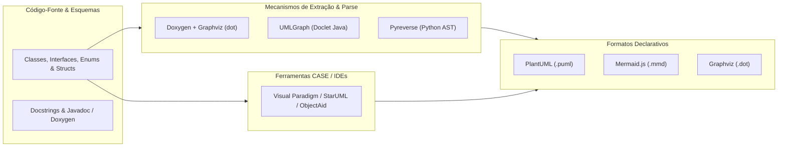
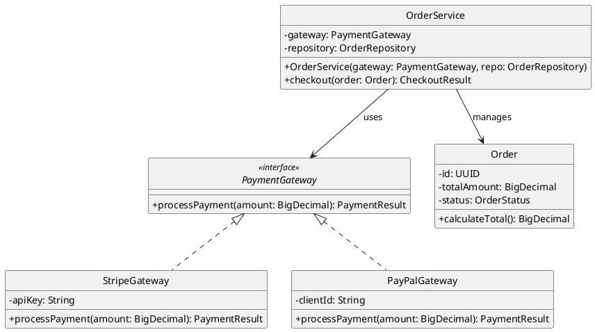
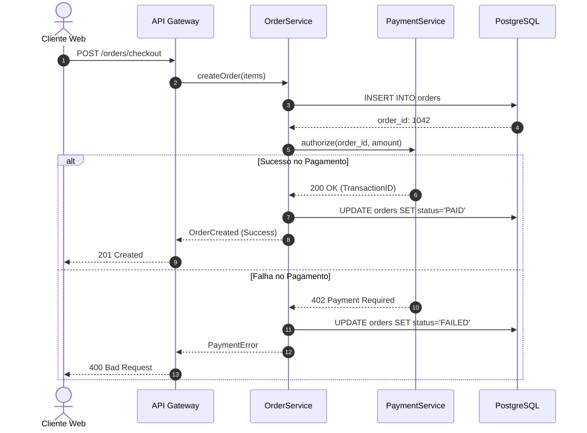

# 📐 Geração de Diagramas UML, Topologias e Modelagem Visual a partir de Código

Esta skill orienta a inteligência artificial a atuar como **Especialista em Engenharia Reversa e Geração Automatizada de Diagramas UML e Estruturais**, traduzindo código-fonte e esquemas arquiteturais em diagramas de classes, sequências, componentes, pacotes e fluxos de estado.

---

## 🎨 1. Ecossistema de Modelagem como Código (Diagrams as Code)

A modelagem baseada em texto declarativo permite versionamento no Git, integração contínua e renderização automática em pipelines de documentação:



---

## 🛠️ 2. Ferramentas Especialistas de Geração de Diagramas

### 1. PlantUML
- **Conceito**: Componente open-source baseado em texto para modelagem UML. Ele não lê o código diretamente sozinho, mas pode ser perfeitamente combinado com ferramentas livres (como o `pyreverse` para Python ou doclets Java) para extrair as classes e gerar os diagramas de forma totalmente automatizada. Suporta diagramas de Classes, Sequência, Componentes, Atividades, Estado, Casos de Uso e C4 Model.
- **Exemplo de Engenharia Reversa para Diagrama de Classes e Injeção de Dependência**:


### 2. Doxygen + Graphviz (dot)
- **Conceito**: Uma das ferramentas mais tradicionais do mercado para documentação técnica e engenharia reversa em C, C++, C#, Java e Python. Gera diagramas de herança, colaboração e dependência de funções utilizando o motor open-source **Graphviz** para renderizar os gráficos automaticamente a partir do código-fonte.
- **Configuração essencial no `Doxyfile`**:
```text
PROJECT_NAME           = "CoreArchitecture"
EXTRACT_ALL            = YES
EXTRACT_PRIVATE        = YES
HAVE_DOT               = YES
CLASS_GRAPH            = YES
COLLABORATION_GRAPH    = YES
GROUP_GRAPHS           = YES
UML_LOOK               = YES
CALL_GRAPH             = YES
CALLER_GRAPH           = YES
DOT_IMAGE_FORMAT       = svg
GENERATE_LATEX         = NO
GENERATE_HTML          = YES
```

### 3. UMLGraph
- **Conceito**: Doclet para o compilador `javadoc` que analisa o código-fonte Java e anotações `@opt`, `@hidden`, `@depend` para gerar especificações Graphviz e renderizar diagramas de classe com precisão cirúrgica sem ferramentas externas.

### 4. Mermaid.js
- **Conceito**: Sintaxe declarativa de diagramação integrada nativamente ao GitHub, GitLab, Notion e IDEs modernas.
- **Exemplo de Diagrama de Sequência de Checkout**:


### 5. StarUML & Visual Paradigm & ObjectAid
- **StarUML**: Modelador UML 2.x com suporte a engenharia reversa para Java, C++, C# e geração de modelos em formato XMI e JSON.
- **Visual Paradigm**: Suíte corporativa de engenharia de software com suporte a modelagem C4, SysML, BPMN, ERD e sincronização bidirecional de código (*Round-trip Engineering*).
- **ObjectAid UML Explorer**: Plugin para o Eclipse IDE que desenha diagramas de classes e sequências em tempo real via drag-and-drop de arquivos `.java`.

### 6. Markmap (Interactive Markdown Mindmaps)
- **Conceito**: Componente open-source de visualização que renderiza árvores hierárquicas de Markdown como mapas mentais interativos vetoriais (SVG/D3.js). Excelente para documentar a topologia e arquitetura de pastas, pacotes e fluxos de sistemas de forma dinâmica e navegável.
- **Uso CLI**:
```bash
npx markmap-cli architecture.md -o architecture-mindmap.html --open
```

---

## 📊 3. Tipos de Diagramas e Casos de Uso Recomendados

| Diagrama UML | Foco do Mapeamento | Notação Recomendada |
| :--- | :--- | :--- |
| **Diagrama de Classes** | Estrutura de tipos, herança, interfaces, atributos e métodos | PlantUML / Mermaid `classDiagram` |
| **Diagrama de Sequência** | Ordem temporal de troca de mensagens entre objetos e serviços | Mermaid `sequenceDiagram` / PlantUML |
| **Diagrama de Componentes** | Organização de bibliotecas, APIs e subsistemas de execução | PlantUML / C4 Model Component |
| **Diagrama de Estado (FSM)** | Ciclo de vida e transições de entidades (ex: Pedido, Pagamento) | PlantUML `stateDiagram-v2` |
| **Call Graph / Inclusão** | Árvore de chamadas de funções e dependências de cabeçalho | Doxygen + Graphviz DOT |

---

## 🎯 4. Boas Práticas na Geração de Diagramas

- [ ] **Abstração Apropriada**: Em diagramas de classes de alto nível, omita getters/setters e atributos utilitários privados para focar no domínio e nas interações essenciais.
- [ ] **Uso de Cores e Estilos Consistentes**: Padronize interfaces com cores distintas de classes concretas e use estereótipos claros (`<<entity>>`, `<<value object>>`, `<<aggregate root>>`).
- [ ] **Documentação Viva no Repositório**: Mantenha os fontes `.puml` e `.mmd` no mesmo repositório do código para permitir revisão em Pull Requests.
