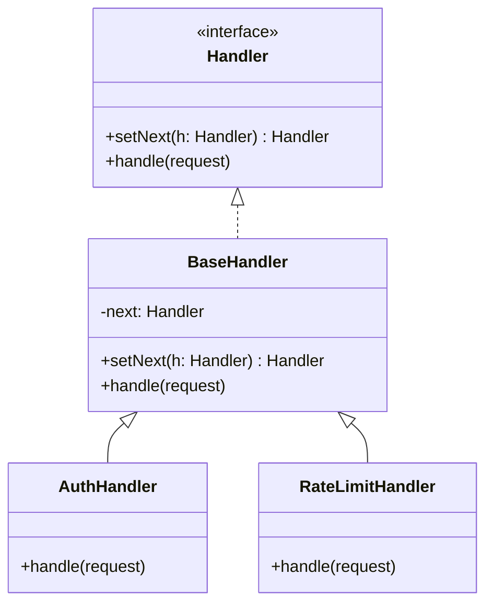
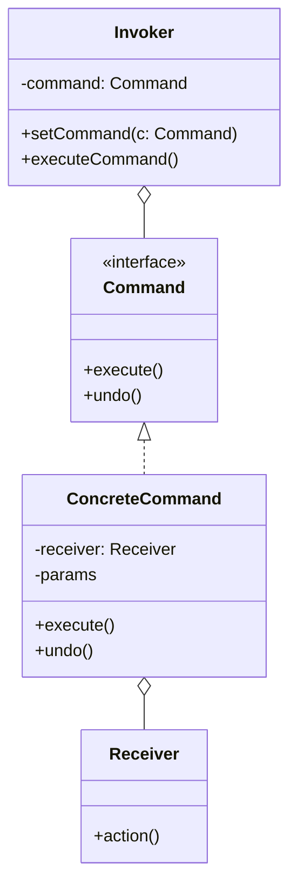
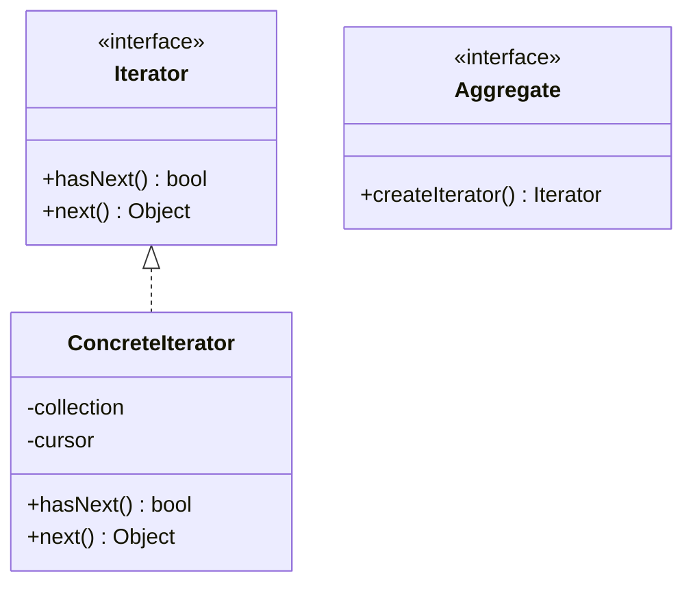
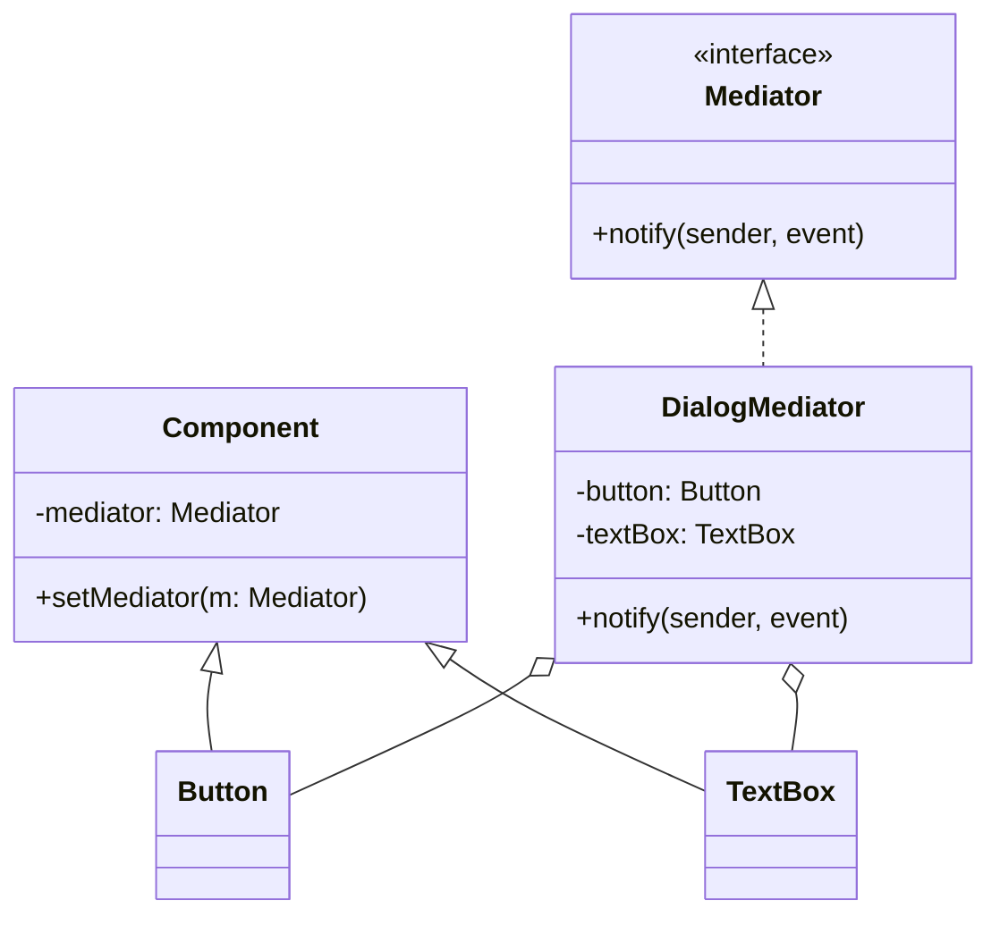
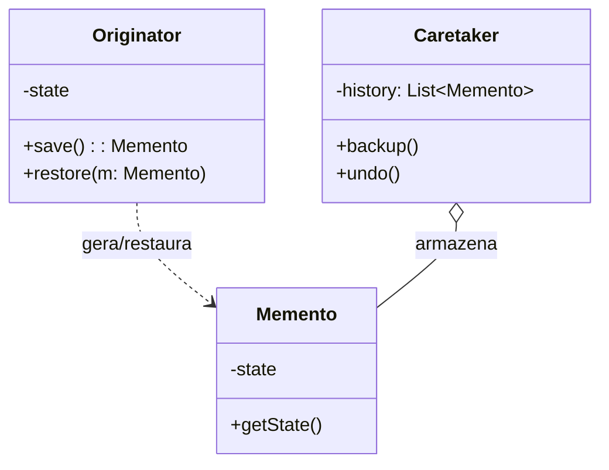
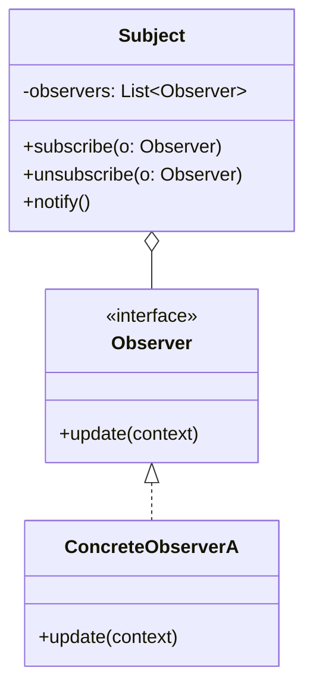
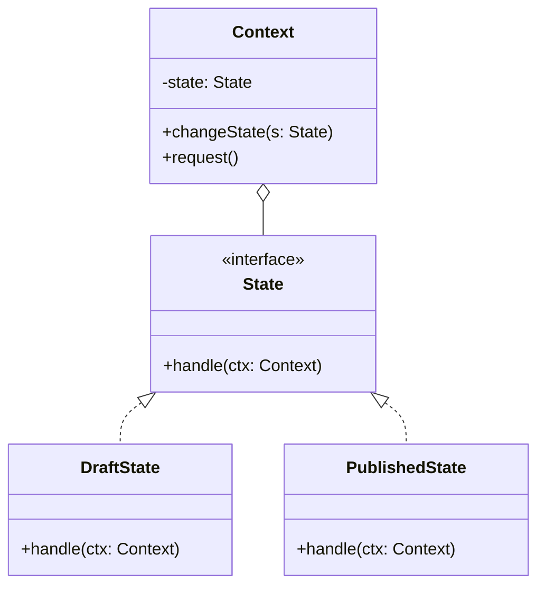
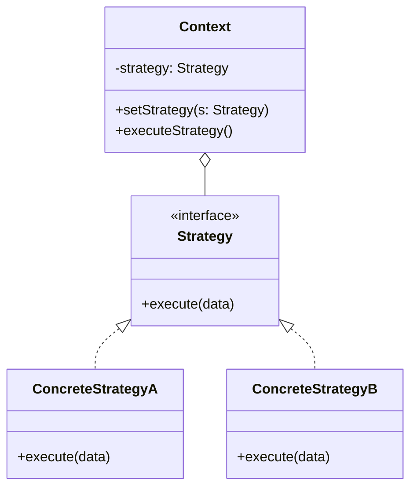
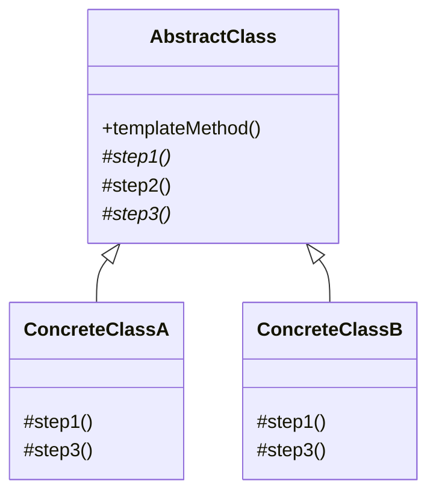
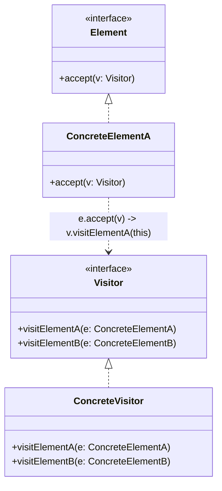

# Padrões de Projeto Comportamentais (GoF Behavioral Patterns)

Os padrões comportamentais cuidam de algoritmos e da atribuição de responsabilidades entre objetos. Eles não descrevem apenas padrões de objetos ou classes, mas também os padrões de comunicação entre eles, desacoplando o emissor de uma solicitação de seu receptor.

---

## ⛓️ 1. Chain of Responsibility (Cadeia de Responsabilidade)
Permite passar pedidos por uma corrente de manipuladores. Ao receber um pedido, cada manipulador decide se processa o pedido ou o passa para o próximo manipulador na cadeia (ex: pipelines de middlewares HTTP, filtros de autenticação).

---

## 🕹️ 2. Command (Comando)
Transforma um pedido em um objeto independente que contém todas as informações sobre a solicitação. Essa transformação permite parametrizar métodos com diferentes pedidos, enfileirar operações, registrar histórico e suportar operações de desfazer/refazer (*Undo/Redo*).

---

## 🔁 3. Iterator (Iterador)
Permite percorrer elementos de uma coleção agregada (lista, árvore, grafo) sem expor sua representação subjacente ou estrutura de dados interna.

---

## 🎛️ 4. Mediator (Mediador)
Reduz as dependências caóticas entre objetos comunicantes. O padrão restringe comunicações diretas entre os objetos e os força a colaborar apenas através de um objeto mediador central (ex: componentes de formulário de UI, event broker em microsserviços).

---

## 💾 5. Memento (Lembrança / Snapshot)
Permite capturar e salvar o estado interno de um objeto sem violar o encapsulamento, de modo que o objeto possa ser restaurado para esse estado posteriormente.

---

## 📡 6. Observer (Observador / Pub-Sub)
Define um mecanismo de assinatura para notificar múltiplos objetos observadores sobre quaisquer eventos ou mudanças de estado que aconteçam no objeto sujeito que eles estão observando.

---

## 🔄 7. State (Estado)
Permite que um objeto altere seu comportamento quando seu estado interno muda. O objeto parecerá ter mudado de classe, substituindo condicionais gigantescas (`if/switch`) por classes de estado polimórficas.

---

## 🎯 8. Strategy (Estratégia)
Define uma família de algoritmos intercambiáveis, encapsula cada um deles em uma classe separada e torna os objetos intercambiáveis em tempo de execução (ex: diferentes formas de pagamento, estratégias de compressão ou algoritmos de roteamento).

---

## 📐 9. Template Method (Método Padrão)
Define o esqueleto de um algoritmo na superclasse, mas deixa as subclasses sobrescreverem etapas específicas do algoritmo sem modificar a sua estrutura geral (Inversão de Controle / Princípio de Hollywood: *"Don't call us, we'll call you"*).

---

## 🚶 10. Visitor (Visitante)
Permite separar algoritmos dos objetos nos quais eles operam (Double Dispatch), permitindo adicionar novas operações a estruturas de objetos complexas (como árvores sintáticas AST) sem modificar as classes desses objetos.

---

## ⚖️ Matriz Comparativa dos Padrões Comportamentais

| Padrão | Foco Principal | Mecanismo |
| :--- | :--- | :--- |
| **Chain of Responsibility** | Processamento sequencial de requisição | Passagem de ponteiro recursivo ao próximo manipulador |
| **Command** | Encapsulamento de requisição como objeto | Objeto com método `execute()` e `undo()` |
| **Iterator** | Varredura sequencial de coleções | Objeto cursor com `hasNext()` e `next()` |
| **Mediator** | Centralização de comunicação many-to-many | Hub mediador desacoplando nós comunicantes |
| **Memento** | Restauração de snapshots de estado | Objeto de estado opaco para o Caretaker |
| **Observer** | Notificação de eventos 1-para-N | Lista de inscritos com método `update()` |
| **State** | Variação de comportamento por estado da máquina | Delegação para objeto de estado ativo |
| **Strategy** | Algoritmos alternativos intercambiáveis | Composição de interface de estratégia |
| **Template Method** | Esqueleto de algoritmo invariante | Herança com métodos abstratos/ganchos |
| **Visitor** | Novas operações sobre estruturas compostas | Double dispatch `accept(visitor)` |
