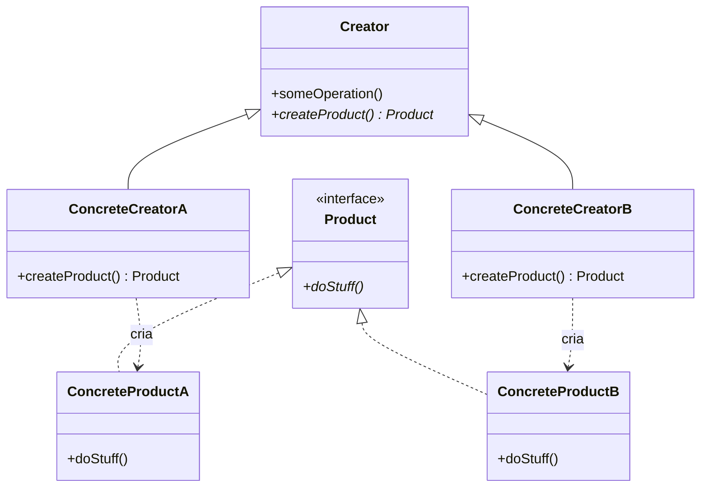
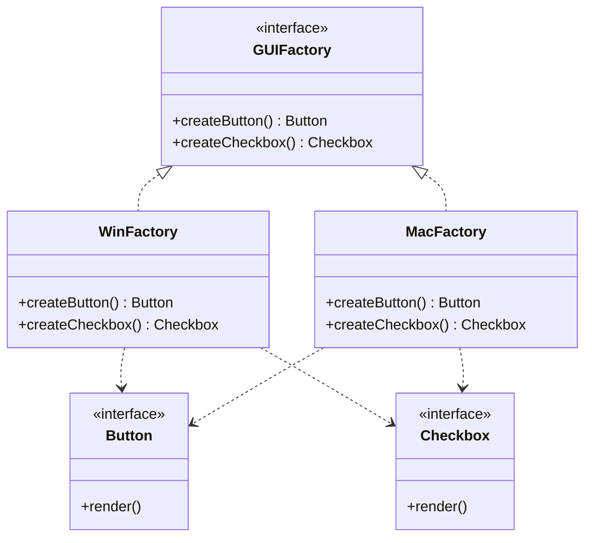
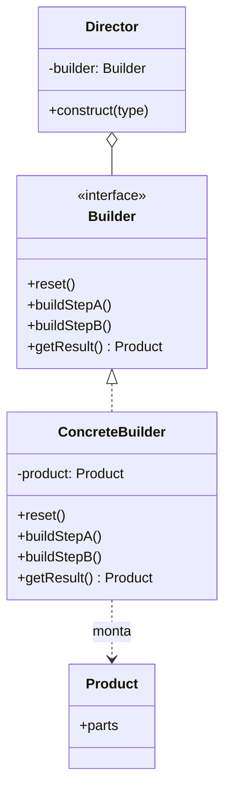
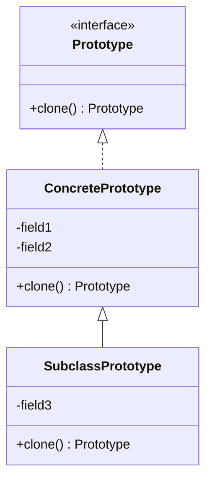
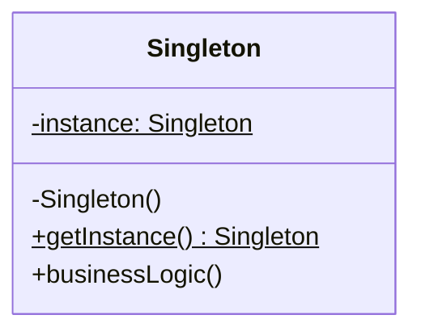

# Padrões de Projeto Criacionais (GoF Creational Patterns)

Os padrões criacionais abstraem o processo de instanciação, tornando o sistema independente de como seus objetos são criados, compostos e representados. Eles encapsulam o conhecimento sobre quais classes concretas são utilizadas e ocultam como as instâncias são criadas e combinadas.

---

## 🏭 1. Factory Method

### 1.1 Intenção e Motivação
Define uma interface para criar um objeto, mas permite que as subclasses decidam qual classe instanciar. O Factory Method permite adiar a instanciação para subclasses.



### 1.2 Aplicabilidade
- Quando uma classe não pode antecipar a classe dos objetos que deve criar.
- Quando uma classe quer que suas subclasses especifiquem os objetos que criam.
- Quando classes delegam responsabilidade para uma de várias subclasses auxiliares.

---

## 🏢 2. Abstract Factory

### 2.1 Intenção e Motivação
Fornece uma interface para criar famílias de objetos relacionados ou dependentes sem especificar suas classes concretas (ex: temas de UI para Mac, Windows e Linux).



### 2.2 Aplicabilidade
- Um sistema deve ser independente de como seus produtos são criados, compostos e representados.
- Um sistema deve ser configurado com uma de múltiplas famílias de produtos.
- Uma família de objetos relacionados foi projetada para ser usada em conjunto e você precisa garantir essa restrição.

---

## 🔨 3. Builder

### 3.1 Intenção e Motivação
Separa a construção de um objeto complexo da sua representação, de modo que o mesmo processo de construção possa criar diferentes representações passo a passo.



### 3.2 Aplicabilidade
- Para livrar-se de um "construtor telescópico" com múltiplos parâmetros opcionais.
- Quando o algoritmo para criação de um objeto complexo deve ser independente das partes que compõem o objeto e de como elas são montadas.

---

## 🧬 4. Prototype

### 4.1 Intenção e Motivação
Permite copiar objetos existentes sem tornar seu código dependente de suas classes concretas, delegando o processo de clonagem aos próprios objetos.



### 4.2 Aplicabilidade
- Quando as classes a instanciar são especificadas em tempo de execução.
- Para evitar a construção de uma hierarquia de fábricas paralela à hierarquia de produtos.
- Quando instâncias de uma classe podem ter apenas uma de poucas combinações diferentes de estado.

---

## 🔒 5. Singleton

### 5.1 Intenção e Motivação
Garante que uma classe tenha apenas uma única instância em todo o ciclo de vida da aplicação e fornece um ponto de acesso global para ela.



### 5.2 Implementação Thread-Safe (Double-Checked Locking)
```python
import threading

class DatabaseConnection:
    _instance = None
    _lock = threading.Lock()

    def __new__(cls, *args, **kwargs):
        if not cls._instance:
            with cls._lock:
                if not cls._instance:
                    cls._instance = super().__new__(cls)
        return cls._instance
```

---

## ⚖️ Matriz Comparativa dos Padrões Criacionais

| Padrão | Complexidade | Propósito Central | Quando Escolher |
| :--- | :---: | :--- | :--- |
| **Factory Method** | Baixa | Delega instanciação para subclasses | Criação polimórfica de um único produto |
| **Abstract Factory** | Média-Alta | Cria famílias completas de produtos compatíveis | Suites de UI, drivers multiplataforma |
| **Builder** | Média | Constrói objetos passo a passo | Objetos complexos com muitas etapas/configurações |
| **Prototype** | Baixa-Média | Clona objetos existentes com cópia profunda | Custo de instanciação alto ou estados dinâmicos |
| **Singleton** | Baixa | Ponto único de acesso a recurso compartilhado | Thread pools, caches, gerenciadores de conexão |
