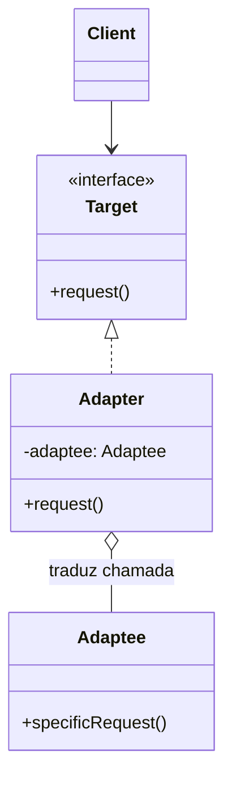
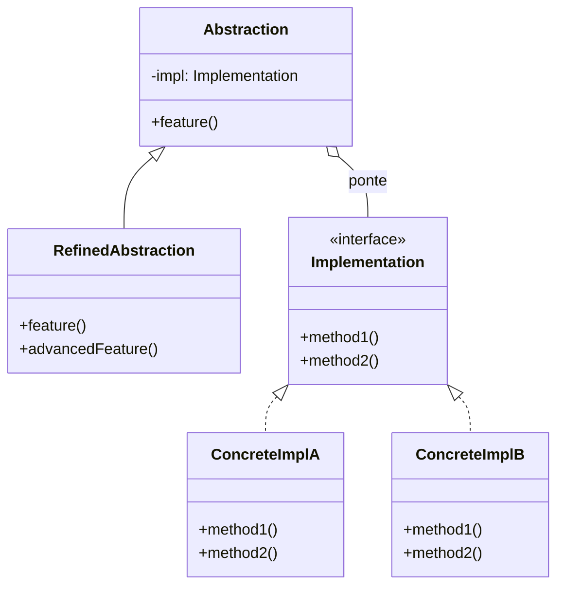
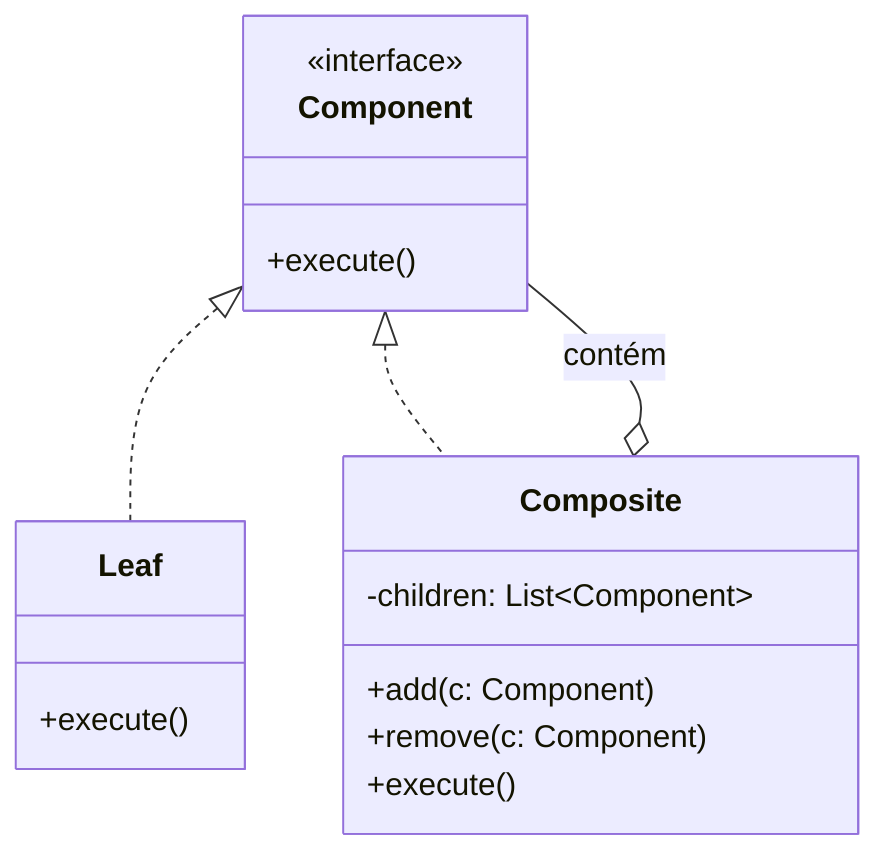
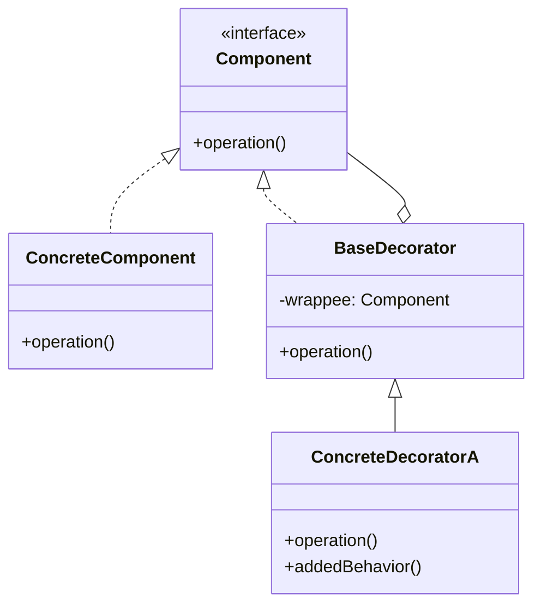
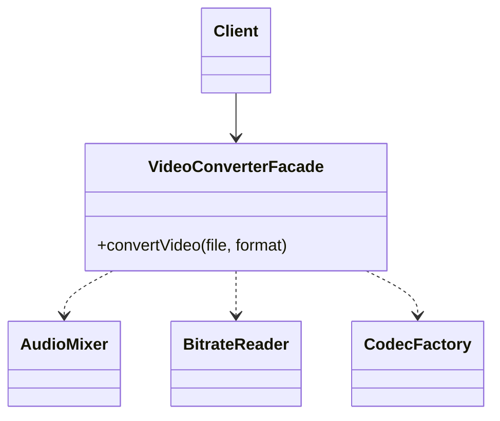
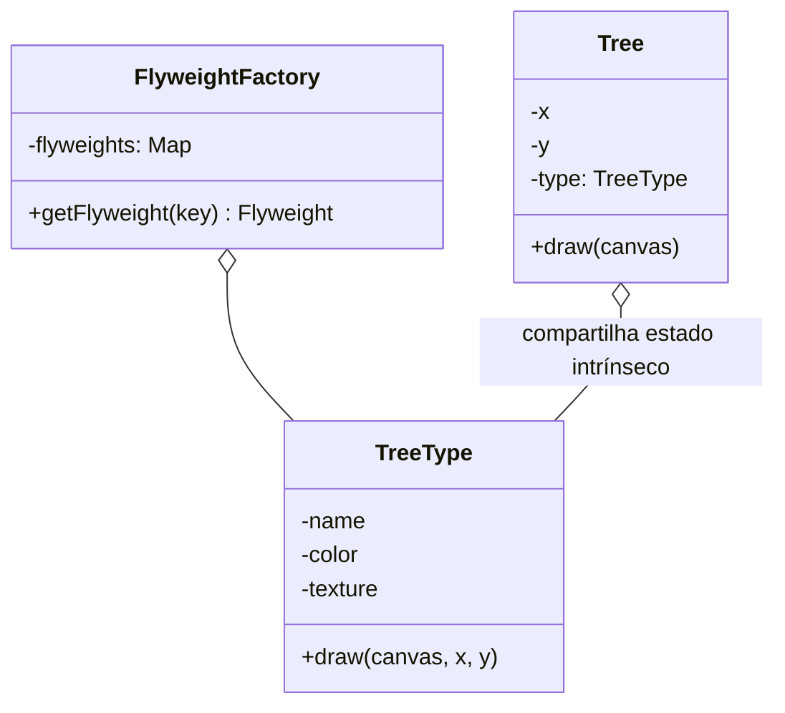
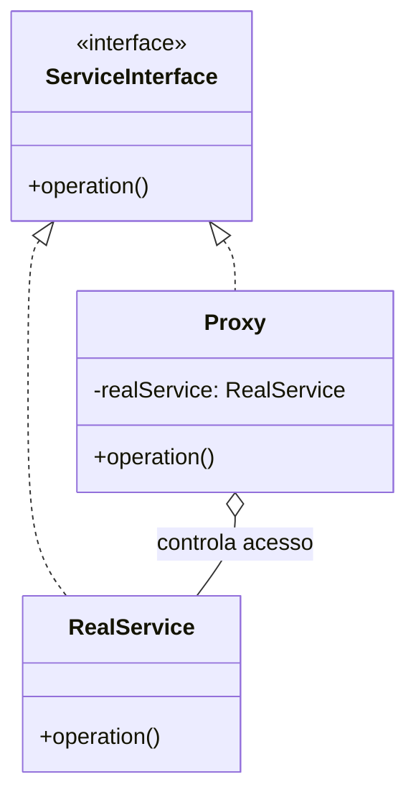

# Padrões de Projeto Estruturais (GoF Structural Patterns)

Os padrões estruturais explicam como compor classes e objetos em estruturas maiores, mantendo essas estruturas flexíveis e eficientes. A composição de objetos oferece muito mais flexibilidade em tempo de execução do que a herança estática de classes.

---

## 🔌 1. Adapter (Adaptador)

### 1.1 Intenção e Motivação
Converte a interface de uma classe em outra interface esperada pelos clientes. Permite que classes com interfaces incompatíveis trabalhem juntas.

---

## 🌉 2. Bridge (Ponte)

### 2.1 Intenção e Motivação
Desacopla uma abstração de sua implementação, permitindo que ambas possam variar independentemente através de hierarquias separadas ligadas por composição.

---

## 🌳 3. Composite (Composto)

### 3.1 Intenção e Motivação
Compõe objetos em estruturas de árvore para representar hierarquias do tipo parte-todo. Permite que clientes tratem objetos individuais e composições de objetos de maneira uniforme.

---

## 🎀 4. Decorator (Decorador / Wrapper)

### 4.1 Intenção e Motivação
Acopla responsabilidades adicionais a um objeto dinamicamente. Os decoradores fornecem uma alternativa flexível ao uso de subclasses para extensão de funcionalidades.

---

## 🏛️ 5. Facade (Fachada)

### 5.1 Intenção e Motivação
Fornece uma interface simplificada e de alto nível para um subsistema complexo composto por múltiplas classes, tornando o subsistema mais fácil de usar e desacoplando clientes de detalhes internos.

---

## 🪶 6. Flyweight (Peso-Mosca)

### 6.1 Intenção e Motivação
Permite ajustar uma enorme quantidade de objetos na memória RAM compartilhando partes comuns de estado (estado intrínseco) entre múltiplos objetos em vez de manter todos os dados em cada instância (estado extrínseco).

---

## 🛡️ 7. Proxy (Procurador)

### 7.1 Intenção e Motivação
Fornece um substituto ou espaço reservado para outro objeto para controlar o acesso a ele. Tipos comuns: Proxy Remoto, Proxy Virtual (Lazy Loading), Proxy de Proteção (Controle de Acesso) e Proxy de Cache/Log.

---

## ⚖️ Matriz Comparativa dos Padrões Estruturais

| Padrão | Problema Resolvido | Estratégia Estrutural |
| :--- | :--- | :--- |
| **Adapter** | Interfaces incompatíveis entre sistemas legados/terceiros | Encapsula um objeto existente traduzindo chamadas |
| **Bridge** | Explosão combinatória de subclasses em 2 dimensões ortogonais | Separa Abstração e Implementação via referência |
| **Composite** | Manipulação recursiva de estruturas hierárquicas (árvores) | Trata folhas e nós compostos com a mesma interface |
| **Decorator** | Adição dinâmica de responsabilidades sem herança | Envolve o objeto real delegando e adicionando comportamento |
| **Facade** | Complexidade de inicialização/orquestração de subsistemas | Ponto de entrada simplificado para múltiplos componentes |
| **Flyweight** | Alto consumo de memória com milhões de objetos semelhantes | Separa estado intrínseco (compartilhado) de extrínseco |
| **Proxy** | Acesso direto a objeto pesado, remoto ou protegido | Intercepta requisições aplicando lazy load, auth ou cache |
