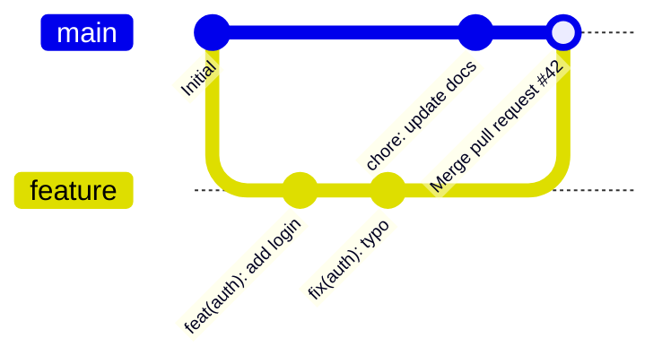
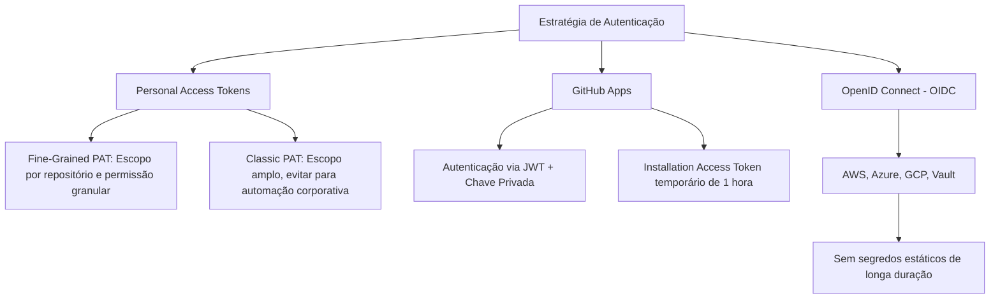

# Habilidade de IA: Especialista na Plataforma GitHub (program-github)

Esta skill orienta a inteligência artificial a atuar como especialista na plataforma **GitHub**, abrangendo governança de repositórios, fluxos de trabalho colaborativos, segurança de software, ambientes em nuvem e automação integral de ciclo de vida de desenvolvimento (SDLC). Fornece padrões técnicos para engenharia de código, infraestrutura como código (IaC) e integrações avançadas usando as melhores práticas oficiais do ecossistema GitHub.

---

## 🌿 Gerenciamento e Governança de Repositórios

### 1. Estratégias de Branching

A escolha do modelo de ramificação dita a frequência de integração, a complexidade dos merges e a velocidade de entrega:

| Modelo | Casos de Uso Ideais | Principais Características |
| :--- | :--- | :--- |
| **GitHub Flow** | Web apps, microsserviços, CD contínuo | Branch principal (`main`) sempre implantável; feature branches curtas; deploy após aprovação de PR. |
| **Trunk-Based Development** | Equipes maduras, DevOps de alta performance | Commits diretos na `main` ou branches com vida útil < 24h; uso extensivo de *feature flags* (toggles). |
| **GitFlow** | Softwares com versionamento semântico rígido (on-premise, apps mobile) | Branches `develop`, `main`, `feature/*`, `release/*` e `hotfix/*`; ciclo formal de releases. |

### 2. Regras de Proteção de Branch e Repository Rulesets

Repository Rulesets representam a evolução moderna das Branch Protection Rules, permitindo aplicação granular em múltiplos branches via padrões glob e herança hierárquica na organização.

Exemplo de configuração conceitual para branch `main`:
- **Require a pull request before merging**: Exigir no mínimo 1 ou 2 aprovações; dispensar aprovações obsoletas quando novos commits forem enviados (*Dismiss stale pull request approvals when new commits are pushed*).
- **Require status checks to pass before merging**: Definir builds e testes de CI como bloqueantes; exigir que o branch esteja atualizado com a base antes do merge (*Require branches to be up to date*).
- **Require signed commits**: Bloquear commits que não contenham assinatura GPG/SSH válida.
- **Require linear history**: Bloquear merge commits tradicionais se a equipe adotar rebase/squash.
- **Block force pushes**: Impedir `git push --force` acidental na branch principal.

### 3. Governança com CODEOWNERS

O arquivo `.github/CODEOWNERS` define automaticamente revisores obrigatórios para arquivos ou diretórios específicos quando um Pull Request é aberto.

```ini
# .github/CODEOWNERS

# Default fallback owners for the entire repository
* @org-core-team @octocat

# Infrastructure and CI/CD workflows
.github/workflows/ @org-devops-team
terraform/ @org-devops-team
docker/ @org-devops-team

# Backend service ownership
src/backend/ @org-backend-leads
src/backend/auth/ @org-security-team

# Frontend application
src/frontend/ @org-frontend-team

# Documentation and skills
docs/ @org-tech-writers
*.md @org-tech-writers
```

### 4. Arquivos de Configuração do Repositório: `.gitignore` e `.gitattributes`

#### Padrão de `.gitattributes` (Controle de Fim de Linha e Tratamento LFS)
```gitattributes
# Set default behavior to automatically normalize line endings to LF in repo
* text=auto eol=lf

# Explicit text files
*.js text eol=lf
*.ts text eol=lf
*.json text eol=lf
*.py text eol=lf
*.md text eol=lf
*.yml text eol=lf
*.yaml text eol=lf

# Windows-specific files
*.bat text eol=crlf
*.ps1 text eol=crlf

# Binary files - prevent corruption by line ending conversions
*.png binary
*.jpg binary
*.jpeg binary
*.gif binary
*.ico binary
*.pdf binary
*.zip binary
*.tar.gz binary

# Git LFS tracking for large assets
*.onnx filter=lfs diff=lfs merge=lfs -text
*.bin filter=lfs diff=lfs merge=lfs -text
*.psd filter=lfs diff=lfs merge=lfs -text
```

#### Padrão de `.gitignore` Recomendado
```gitignore
# Compiled outputs and dependencies
node_modules/
dist/
build/
bin/
obj/
__pycache__/
*.pyc
target/

# Environment files and credentials
.env
.env.local
.env.*.local
*.pem
*.key

# IDE and OS artifacts
.vscode/*
!.vscode/settings.json
!.vscode/extensions.json
.idea/
*.swp
.DS_Store
Thumbs.db

# Logs and runtime artifacts
logs/
*.log
npm-debug.log*
yarn-debug.log*
```

---

## 🔀 Pull Requests & Engenharia de Code Review

### 1. Pull Request Templates

Armazene o template padrão em `.github/PULL_REQUEST_TEMPLATE.md` ou múltiplos templates em `.github/PULL_REQUEST_TEMPLATE/`.

```markdown
<!-- .github/PULL_REQUEST_TEMPLATE.md -->
## 📝 Descrição
<!-- Descreva de forma clara e sucinta o objetivo deste Pull Request. -->

Fixes #(issue)

## 🛠️ Tipo de Mudança
- [ ] 🐛 Bug fix (correção de erro que não quebra compatibilidade)
- [ ] ✨ Nova funcionalidade (adição sem quebra de compatibilidade)
- [ ] 💥 Breaking change (correção ou recurso que altera contratos existentes)
- [ ] ♻️ Refatoração / Performance / Débito Técnico
- [ ] 📚 Atualização de Documentação

## 🧪 Checklist de Qualidade e Testes
- [ ] Meus commits seguem o padrão [Conventional Commits](https://www.conventionalcommits.org/).
- [ ] Adicionei ou atualizei testes automatizados cobrindo as alterações.
- [ ] Executei a suíte de testes localmente e todos os testes passaram.
- [ ] Atualizei a documentação relevante (README, SKILL.md, Swagger/OpenAPI).
- [ ] Não há secrets ou dados sensíveis expostos no código.
```

### 2. Estratégias de Merge e Casos de Uso



1. **Merge Commit (`Create a merge commit`)**:
   - Preserva o histórico exato de todos os commits individuais e a topologia do branch de origem.
   - Indicado para projetos open source grandes com múltiplos colaboradores onde a linhagem exata de ramificação é relevante.
2. **Squash and Merge (`Squash and merge`)**:
   - Condensa todos os commits do branch de feature em um único commit atômico na branch alvo.
   - Ideal para manter o histórico da branch `main` limpo, linear e legível.
3. **Rebase and Merge (`Rebase and merge`)**:
   - Aplica os commits individuais do branch de feature diretamente no topo da branch alvo sem criar um commit de merge.
   - Mantém histórico linear preservando a granularidade dos commits (exige que os commits da feature sejam limpos e atômicos).
4. **Auto-Merge**:
   - Permite que PRs aprovados sejam mesclados automaticamente assim que todos os status checks passarem, reduzindo o tempo de espera (*lead time*).

---

## 📋 Gestão de Trabalho: Issues & GitHub Projects v2

### 1. Issue Forms com Schema YAML

Substitua templates em Markdown puro por formulários estruturados em `.github/ISSUE_TEMPLATE/bug_report.yml`:

```yaml
name: "🐛 Bug Report"
description: "Crie um relatório estruturado para nos ajudar a reproduzir e corrigir o problema"
title: "[BUG]: "
labels: ["kind/bug", "status/triage"]
body:
  - type: markdown
    attributes:
      value: |
        Obrigado por reportar o problema! Por favor, preencha as informações abaixo com precisão.
  - type: input
    id: version
    attributes:
      label: Versão da Aplicação / Commit SHA
      placeholder: "ex: v1.4.2 ou sha abc1234"
    validations:
      required: true
  - type: textarea
    id: reproduction
    attributes:
      label: Passos para Reproduzir
      description: Como podemos reproduzir o comportamento anômalo?
      placeholder: |
        1. Acessar '...'
        2. Clicar em '....'
        3. Observar erro '...'
    validations:
      required: true
  - type: textarea
    id: expected
    attributes:
      label: Comportamento Esperado
      description: O que deveria ter acontecido?
    validations:
      required: true
  - type: dropdown
    id: severity
    attributes:
      label: Severidade do Impacto
      options:
        - "Baixa (Incômodo visual ou cosmético)"
        - "Média (Funcionalidade secundária afetada com workaround)"
        - "Alta (Funcionalidade principal indisponível)"
        - "Crítica (Bloqueio total / Perda de dados)"
    validations:
      required: true
```

Configuração mestre de templates em `.github/ISSUE_TEMPLATE/config.yml`:
```yaml
blank_issues_enabled: false
contact_links:
  - name: "💬 Discussões e Dúvidas Gerais"
    url: "https://github.com/org/repo/discussions"
    about: "Para dúvidas de uso, arquitetura e sugestões de ideias."
  - name: "🛡️ Reportar Vulnerabilidade de Segurança"
    url: "https://github.com/org/repo/security/advisories/new"
    about: "Reporte vulnerabilidades de forma responsável e confidencial."
```

### 2. Taxonomia de Labels e Milestones

Uma convenção padronizada melhora o fluxo de triagem e visualização nos boards:

- **Tipo (`kind/*`)**: `kind/bug` (vermelho), `kind/feature` (azul), `kind/enhancement` (ciano), `kind/tech-debt` (amarelo), `kind/documentation` (roxo).
- **Prioridade (`priority/*`)**: `priority/critical` (vermelho escuro), `priority/high` (laranja), `priority/medium` (amarelo), `priority/low` (cinza).
- **Área (`area/*`)**: `area/frontend`, `area/backend`, `area/auth`, `area/infra`, `area/security`.
- **Status (`status/*`)**: `status/triage`, `status/in-progress`, `status/blocked`, `status/needs-review`.

### 3. GitHub Projects v2 (Memex) e Automações

- **Visualizações Flexíveis**: Tabelas personalizadas, Boards estilo Kanban e visualizações de Roadmap/Timeline baseadas em datas de início e término.
- **Campos Customizados**: Campos numéricos (Story Points, Estimativas), datas (Sprint Start/End), seleção única (T-Shirt Size) e iterações nativas.
- **Automações Nativas de Workflow**:
  * Adicionar automaticamente novas issues ou PRs do repositório ao projeto.
  * Mover itens para `In Progress` quando um PR vinculado for aberto.
  * Mover itens para `Done` quando a issue ou PR for fechado.
  * Arquivar itens automaticamente após conclusão após período determinado.

---

## 📦 GitHub Packages e Container Registry (ghcr.io)

O GitHub Packages oferece hospedagem integrada para artefatos de software e containers OCI com suporte a autenticação nativa via `GITHUB_TOKEN`.

### 1. Ecossistemas Suportados e Endpoints

| Ecossistema | Registro / Endpoint | Exemplo de Pacote |
| :--- | :--- | :--- |
| **Containers (OCI/Docker)** | `ghcr.io` | `ghcr.io/org-name/app-backend:v1.2.0` |
| **Node.js (npm)** | `npm.pkg.github.com` | `@org-name/shared-ui` |
| **Java (Maven/Gradle)** | `maven.pkg.github.com` | `com.example:core-lib:2.0.0` |
| **.NET (NuGet)** | `nuget.pkg.github.com` | `OrgName.Common.Utilities` |
| **Ruby (RubyGems)** | `rubygems.pkg.github.com` | `org_api_client` |

### 2. Publicação no Container Registry (`ghcr.io`) via GitHub Actions

```yaml
name: "Publish Docker Image to GHCR"

on:
  push:
    tags:
      - 'v*.*.*'

env:
  REGISTRY: ghcr.io
  IMAGE_NAME: ${{ github.repository }}

jobs:
  build-and-push:
    runs-on: ubuntu-latest
    permissions:
      contents: read
      packages: write

    steps:
      - name: Checkout repository
        uses: actions/checkout@v4

      - name: Log in to GitHub Container Registry
        uses: docker/login-action@v3
        with:
          registry: ${{ env.REGISTRY }}
          username: ${{ github.actor }}
          password: ${{ secrets.GITHUB_TOKEN }}

      - name: Extract metadata for Docker
        id: meta
        uses: docker/metadata-action@v5
        with:
          images: ${{ env.REGISTRY }}/${{ env.IMAGE_NAME }}
          tags: |
            type=semver,pattern={{version}}
            type=semver,pattern={{major}}.{{minor}}
            type=sha,format=long

      - name: Build and push Docker image
        uses: docker/build-push-action@v5
        with:
          context: .
          push: true
          tags: ${{ steps.meta.outputs.tags }}
          labels: ${{ steps.meta.outputs.labels }}
```

---

## ☁️ Ambientes de Desenvolvimento com GitHub Codespaces

O GitHub Codespaces fornece ambientes de desenvolvimento em nuvem rápidos, reprodutíveis e configuráveis via especificação aberta Development Containers (`devcontainer.json`).

### 1. Estrutura de Configuração `.devcontainer/devcontainer.json`

```json
{
  "name": "Fullstack Cloud Environment",
  "image": "mcr.microsoft.com/devcontainers/base:ubuntu-22.04",
  "features": {
    "ghcr.io/devcontainers/features/docker-in-docker:2": {
      "version": "latest",
      "enableOnDataProxy": true
    },
    "ghcr.io/devcontainers/features/node:1": {
      "version": "20"
    },
    "ghcr.io/devcontainers/features/python:1": {
      "version": "3.11"
    },
    "ghcr.io/devcontainers/features/github-cli:1": {}
  },
  "customizations": {
    "vscode": {
      "extensions": [
        "dbaeumer.vscode-eslint",
        "esbenp.prettier-vscode",
        "ms-python.python",
        "eamodio.gitlens",
        "github.vscode-github-actions"
      ],
      "settings": {
        "editor.formatOnSave": true,
        "editor.defaultFormatter": "esbenp.prettier-vscode",
        "files.eol": "\n"
      }
    }
  },
  "forwardPorts": [3000, 8000, 5432],
  "portsAttributes": {
    "3000": {
      "label": "Frontend Application",
      "onAutoForward": "openBrowser"
    },
    "8000": {
      "label": "Backend API",
      "onAutoForward": "notify"
    },
    "5432": {
      "label": "PostgreSQL Database",
      "onAutoForward": "silent"
    }
  },
  "postCreateCommand": "bash -c 'npm install && pip install -r requirements.txt'",
  "postStartCommand": "echo 'Codespace ready for development!'",
  "remoteUser": "vscode"
}
```

### 2. Otimização com Prebuilds e Dotfiles
- **Prebuilds**: Configure workflows de pré-construção em *Settings > Codespaces > Prebuild configuration*. Permite que códigos, pacotes e imagens sejam pré-compilados a cada push, reduzindo o tempo de boot do Codespace de minutos para segundos.
- **Dotfiles**: Personalize aliases de terminal, configurações de shell (`.bashrc`, `.zshrc`) e arquivos `.gitconfig` vinculando um repositório pessoal de dotfiles nas preferências de usuário do GitHub.

---

## 🛡️ Segurança Avançada e GHAS (GitHub Advanced Security)

O GitHub Advanced Security (GHAS) integra ferramentas de segurança preventiva em todas as etapas do ciclo de desenvolvimento.

### 1. Dependabot: Alerts, Security Updates e Version Updates Agrupados

Configuração centralizada em `.github/dependabot.yml`:

```yaml
version: 2
updates:
  # Package ecosystem for Node.js / Frontend
  - package-ecosystem: "npm"
    directory: "/src/frontend"
    schedule:
      interval: "weekly"
      day: "monday"
      time: "08:00"
      timezone: "America/Sao_Paulo"
    open-pull-requests-limit: 10
    reviewers:
      - "org-frontend-team"
    groups:
      # Group minor and patch dependencies into a single PR
      minor-and-patch-dependencies:
        patterns:
          - "*"
        update-types:
          - "minor"
          - "patch"

  # Package ecosystem for Python / Backend
  - package-ecosystem: "pip"
    directory: "/src/backend"
    schedule:
      interval: "weekly"
      day: "monday"
    open-pull-requests-limit: 5
    groups:
      dev-dependencies:
        patterns:
          - "pytest*"
          - "flake8*"
          - "black*"

  # GitHub Actions Workflows
  - package-ecosystem: "github-actions"
    directory: "/"
    schedule:
      interval: "weekly"
    groups:
      actions:
        patterns:
          - "*"
```

### 2. Code Scanning com CodeQL

Análise Estática de Código (SAST) automatizada para identificar vulnerabilidades de injeção SQL, XSS, desserialização insegura e corrupção de memória.

```yaml
name: "CodeQL Analysis"

on:
  push:
    branches: [ "main" ]
  pull_request:
    branches: [ "main" ]
  schedule:
    - cron: '0 3 * * 1' # Every Monday at 03:00 UTC

jobs:
  analyze:
    name: Analyze Code
    runs-on: ubuntu-latest
    permissions:
      actions: read
      contents: read
      security-events: write

    strategy:
      fail-fast: false
      matrix:
        language: [ 'javascript-typescript', 'python' ]

    steps:
      - name: Checkout repository
        uses: actions/checkout@v4

      - name: Initialize CodeQL
        uses: github/codeql-action/init@v3
        with:
          languages: ${{ matrix.language }}
          queries: security-extended,security-and-quality

      - name: Perform CodeQL Analysis
        uses: github/codeql-action/analyze@v3
        with:
          category: "/language:${{ matrix.language }}"
```

### 3. Secret Scanning e Push Protection

- **Secret Scanning**: Verifica commits e issues em busca de tokens de provedores de nuvem (AWS, Azure, GCP), chaves de API, certificados privados e tokens de autenticação.
- **Push Protection**: Bloqueia em tempo real operações de `git push` caso detecte secrets conhecidos no diff, impedindo vazamentos antes que o código atinja o servidor.
- **Custom Patterns**: Permite que organizações criem expressões regulares proprietárias para detectar padrões de credenciais internas da empresa.

---

## 💻 GitHub CLI (`gh`) - Automação e Produtividade

O GitHub CLI traz a experiência completa do GitHub para o terminal e scripts de automação.

### 1. Autenticação e Configuração
```bash
# Authenticate interactively or with token
gh auth login --git-protocol https --web

# Check authentication status and active scopes
gh auth status

# Set default text editor
gh config set editor "code --wait"
```

### 2. Gerenciamento de Repositórios
```bash
# Create a new repository under an organization
gh repo create my-org/microservice-auth --private --clone --add-readme

# Fork an existing repository
gh repo fork upstream-org/open-project --clone=true

# View repository metadata and status
gh repo view my-org/microservice-auth --web
```

### 3. Operações com Pull Requests
```bash
# Create a pull request interactively
gh pr create --title "feat(auth): add OAuth2 refresh token flow" --body "Implements refresh token rotation" --base main

# Checkout a pull request locally by number
gh pr checkout 142

# Review and approve a pull request
gh pr review 142 --approve --comment "LGTM! Verified test coverage."

# Check continuous integration status
gh pr checks 142

# Merge a pull request with squash and branch deletion
gh pr merge 142 --squash --delete-branch --auto
```

### 4. Operações com Issues e Workflows
```bash
# Create an issue with labels and assignees
gh issue create --title "Investigate high latency on /v1/checkout" --body "Observed p99 > 2.5s" --label "kind/bug,priority/high" --assignee "@me"

# List open issues assigned to user
gh issue list --assignee "@me" --state open

# Monitor CI/CD workflow executions
gh run list --workflow=ci.yml --limit 5
gh run watch
```

### 5. Execução de Chamadas Diretas à API com `gh api`
```bash
# REST API call with jq expression filter
gh api repos/:owner/:repo/releases/latest --jq '{tag: .tag_name, name: .name, published_at: .published_at}'

# GraphQL API call via CLI
gh api graphql -f query='
  query($owner: String!, $repo: String!) {
    repository(owner: $owner, name: $repo) {
      stargazerCount
      openIssues: issues(states: OPEN) { totalCount }
      openPRs: pullRequests(states: OPEN) { totalCount }
    }
  }' -F owner='octocat' -F repo='Hello-World'
```

---

## 🔌 GitHub API & Webhooks

### 1. REST API v3: Padrões e Headers

A API REST do GitHub adota versionamento por cabeçalho (`X-GitHub-Api-Version`) e serialização JSON padronizada:

```http
GET /repos/octocat/Hello-World/issues?state=open&per_page=30&page=1 HTTP/1.1
Host: api.github.com
Accept: application/vnd.github+json
Authorization: Bearer <GITHUB_TOKEN_OR_PAT>
X-GitHub-Api-Version: 2022-11-28
User-Agent: Enterprise-Integration-Agent/1.0
```

#### Exemplo de Chamada REST com Node.js (`@octokit/rest`)
```typescript
import { Octokit } from "@octokit/rest";

// Initialize Octokit client with authentication
const octokit = new Octokit({
  auth: process.env.GITHUB_TOKEN,
});

async function listOpenPullRequests(owner: string, repo: string) {
  // Fetch pull requests with explicit API version header
  const { data: pullRequests, headers } = await octokit.rest.pulls.list({
    owner,
    repo,
    state: "open",
    per_page: 20,
    headers: {
      "x-github-api-version": "2022-11-28",
    },
  });

  console.log(`Remaining Rate Limit: ${headers["x-ratelimit-remaining"]}`);
  return pullRequests.map(pr => ({
    id: pr.id,
    number: pr.number,
    title: pr.title,
    author: pr.user?.login,
    headSha: pr.head.sha,
  }));
}
```

### 2. GraphQL API v4

A API GraphQL permite consultar múltiplos recursos relacionados em uma única requisição com payload estritamente tipado.

```graphql
# Query to retrieve repository details, branches, and latest commit info
query GetRepositoryDetails($owner: String!, $repo: String!) {
  repository(owner: $owner, name: $repo) {
    id
    name
    isPrivate
    defaultBranchRef {
      name
      target {
        ... on Commit {
          oid
          message
          committedDate
          author {
            name
            email
          }
        }
      }
    }
    pullRequests(states: OPEN, first: 5, orderBy: {field: CREATED_AT, direction: DESC}) {
      nodes {
        number
        title
        author {
          login
        }
        reviewDecision
      }
    }
  }
}
```

### 3. Métodos de Autenticação



- **GitHub Apps (Recomendado para Integrações e Bots)**:
  * Não consomem assentos de usuário.
  * Possuem limites de taxa elevados (5.000 a 15.000 req/hora por instalação).
  * Geram tokens de acesso efêmeros com validade de 60 minutos.
- **OpenID Connect (OIDC)**:
  * Permite que workflows do GitHub Actions autentiquem diretamente em provedores de nuvem (AWS IAM Roles, Azure Managed Identity, GCP Workload Identity Federation) através de tokens JWT criptograficamente assinados pelo GitHub (`token.actions.githubusercontent.com`).

### 4. Validação Segura de Webhooks (HMAC SHA-256)

Todo webhook disparado pelo GitHub deve ser verificado contra manipulações utilizando a chave secreta compartilhada (*Webhook Secret*) e o cabeçalho `X-Hub-Signature-256`.

```typescript
import * as crypto from "crypto";
import { Request, Response, NextFunction } from "express";

/**
 * Middleware to verify GitHub Webhook signature integrity
 */
export function verifyGitHubWebhookSignature(
  req: Request & { rawBody?: Buffer },
  res: Response,
  next: NextFunction
): void {
  const signatureHeader = req.headers["x-hub-signature-256"] as string | undefined;
  const webhookSecret = process.env.GITHUB_WEBHOOK_SECRET;

  if (!signatureHeader || !webhookSecret) {
    res.status(401).json({ error: "Missing signature header or server secret" });
    return;
  }

  // Raw body buffer is required for accurate cryptographic hash comparison
  const payloadBuffer = req.rawBody || Buffer.from(JSON.stringify(req.body));
  const expectedSignature = "sha256=" + crypto
    .createHmac("sha256", webhookSecret)
    .update(payloadBuffer)
    .digest("hex");

  // Constant-time string comparison to prevent timing attacks
  const isValid = crypto.timingSafeEqual(
    Buffer.from(signatureHeader),
    Buffer.from(expectedSignature)
  );

  if (!isValid) {
    res.status(403).json({ error: "Invalid webhook HMAC signature" });
    return;
  }

  next();
}
```

---

## 🌐 GitHub Pages e Publicação Estática

O GitHub Pages permite hospedar documentações, landing pages e sites estáticos diretamente a partir de repositórios GitHub.

### 1. Fontes de Publicação
1. **GitHub Actions Customizado (Recomendado)**: Constrói frameworks modernos (Next.js, Astro, Docusaurus, VitePress) e publica o artefato estático via `actions/deploy-pages`.
2. **Branch Dedicada**: Deploy a partir da raiz `/` ou da pasta `/docs` na branch `main` ou `gh-pages`.

#### Workflow de Deploy Customizado com GitHub Actions
```yaml
name: "Deploy Static Site to GitHub Pages"

on:
  push:
    branches: [ "main" ]
  workflow_dispatch:

permissions:
  contents: read
  pages: write
  id-token: write

concurrency:
  group: "pages"
  cancel-in-progress: false

jobs:
  deploy:
    environment:
      name: github-pages
      url: ${{ steps.deployment.outputs.page_url }}
    runs-on: ubuntu-latest
    steps:
      - name: Checkout repository
        uses: actions/checkout@v4

      - name: Setup Node.js
        uses: actions/setup-node@v4
        with:
          node-version: 20
          cache: 'npm'

      - name: Build static site
        run: |
          npm ci
          npm run build

      - name: Setup Pages
        uses: actions/configure-pages@v5

      - name: Upload artifact
        uses: actions/upload-pages-artifact@v3
        with:
          path: './dist'

      - name: Deploy to GitHub Pages
        id: deployment
        uses: actions/deploy-pages@v4
```

### 2. Configuração de Jekyll (`_config.yml`)
Para sites estáticos nativos utilizando o mecanismo Jekyll embutido do GitHub Pages:

```yaml
# _config.yml
title: "Documentação Oficial da Plataforma"
description: "Guias arquiteturais, manuais operacionais e especificações técnicas."
theme: jekyll-theme-cayman
permalink: pretty
markdown: kramdown

kramdown:
  input: GFM
  syntax_highlighter: rouge

exclude:
  - Gemfile
  - Gemfile.lock
  - node_modules
  - vendor
```

### 3. Configuração de Domínios Customizados e HTTPS
- **Arquivo `CNAME`**: Arquivo texto único na raiz do build contendo o domínio customizado (ex: `docs.empresa.com.br`).
- **Registros DNS**:
  * **Subdomínio (`docs.empresa.com.br`)**: Criar registro `CNAME` apontando para `<organization-or-user>.github.io.`.
  * **Domínio Apex (`empresa.com.br`)**: Criar 4 registros `A` para os IPs do GitHub Pages (`185.199.108.153`, `185.199.109.153`, `185.199.110.153`, `185.199.111.153`) e registros `AAAA` correspondentes.
- **Enforce HTTPS**: Ative a opção *Enforce HTTPS* nas configurações do repositório para provisionamento automático e renovação de certificados TLS emitidos pela Let's Encrypt.

---

## 🛡️ Protocolo Autoritativo de Permissões em Ambiente de Agente (permissioned-github)

Esta seção documenta o protocolo autoritativo de controle de permissões e segurança ao interagir com o GitHub em ambientes de agentes de IA restritos (Sandboxes) do Antigravity. Por padrão, o agente possui acesso restrito e deve solicitar autorizações incrementais e granulares sob demanda.

### 1. Regras de Interação com GitHub
* Use exclusivamente a CLI **`gh`**. Sempre especifique o argumento `-R ORG/REPO`.
* Não utilize comandos alternativos como `curl` para interagir diretamente com a API do GitHub.
* Não escreva scripts avulsos para comunicação direta com os servidores de API do GitHub.
* Para operações de ramificação e transporte de código (`push`, `pull`, `fetch`, `checkout`), utilize o comando **`git`** sobre HTTPS. O protocolo SSH não é suportado no ambiente restrito.
* **Atenção:** Nunca tente redirecionar ou encadear pipes (`|`, `>`) na saída do comando `gh`, pois isso não funcionará no ambiente de execução do agente.

### 2. Formato Canônico de Permissão

Toda solicitação de permissão deve ser estruturada na seguinte sintaxe:

```shell
<command-binary>.<action>(<resource_json>)
```

#### Campos do Objeto `resource_json`:
* `org` *(obrigatório)*: Organização do GitHub. Use `"*"` para indicar todas as organizações.
* `repo` *(obrigatório)*: Repositório do GitHub. Use `"*"` para indicar todos os repositórios.
* `pr` *(opcional)*: Número do Pull Request. Use `"*"` para todos os PRs.
  * **Ações suportadas:** `read` (para visualizar detalhes de PR e executar `gh search prs`), `create`, `update` (comentar, revisar, editar, fechar, reabrir), `approve`, `merge`.
* `issue` *(opcional)*: Número da Issue. Use `"*"` para todas as issues.
  * **Ações suportadas:** `read`, `create`, `update` (comentar, revisar, editar, fechar, reabrir).
* `contents` *(opcional)*: Conteúdo do repositório (código, histórico de commits, branches, tags, arquivos).
  * Use `"*"` (único valor válido; leitura autoriza o repositório completo).
  * **Ações suportadas:** `read` (para clonar, pull, fetch, checkout e executar `gh search commits` ou `gh search code`).
* `branch` *(opcional)*: Nome da branch. Use `"*"` para todas as branches.
  * **Ações suportadas:** `create` (para push de nova branch), `update` (para push em branch existente ou force-push), `delete` (para exclusão de branch remota).

> [!WARNING]
> Outras operações não são suportadas e a permissão correspondente não será concedida. Se uma operação não suportada for necessária, pare imediatamente e explique o motivo ao usuário.

### 3. Catálogo Completo de Exemplos de Permissões

| # | Operação Desejada | Comando Executado | Formato da Permissão Concedida |
| :--- | :--- | :--- | :--- |
| **1** | **Criar Issue** | `gh issue create --title "Bug report" --body "Desc" -R myorg/myrepo` | `gh.create({"org": "myorg", "repo": "myrepo", "issue": "*"})` |
| **2** | **Comentar em PR** | `gh pr comment 123 --body "LGTM" -R myorg/myrepo` | `gh.update({"org": "myorg", "repo": "myrepo", "pr": "123"})` |
| **3** | **Fechar Issue** | `gh issue close 123 --comment "Resolvido" -R myorg/myrepo` | `gh.update({"org": "myorg", "repo": "myrepo", "issue": "123"})` |
| **4** | **Aprovar PR** | `gh pr review 123 --approve --body "Aprovado" -R myorg/myrepo` | `gh.approve({"org": "myorg", "repo": "myrepo", "pr": "123"})` |
| **5** | **Push em Branch Existente** | `git push origin feature/my-feature` | `git.update({"org": "myorg", "repo": "myrepo", "branch": "feature/my-feature"})` |
| **6** | **Criar Nova Branch Remota** | `git push origin feature/my-feature` (1º push) | `git.create({"org": "myorg", "repo": "myrepo", "branch": "feature/my-feature"})` |
| **7** | **Buscar Atualizações (Fetch)** | `git fetch --all` | `git.read({"org": "myorg", "repo": "myrepo", "contents": "*"})` |
| **8** | **Clonar Repositório** | `git clone https://github.com/myorg/myrepo.git` | `git.read({"org": "myorg", "repo": "myrepo", "contents": "*"})` |
| **9** | **Deletar Branch Remota** | `git push origin --delete feature/my-feature` | `git.delete({"org": "myorg", "repo": "myrepo", "branch": "feature/my-feature"})` |
| **10** | **Pesquisar Pull Requests** | `gh search prs -R myorg/myrepo --author alice` | `gh.read({"org": "myorg", "repo": "myrepo", "pr": "*"})` |
| **11** | **Pesquisar Commits** | `gh search commits -R myorg/myrepo --author alice` | `git.read({"org": "myorg", "repo": "myrepo", "contents": "*"})` |
| **12** | **Pesquisar Código** | `gh search code -R myorg/myrepo "func main"` | `git.read({"org": "myorg", "repo": "myrepo", "contents": "*"})` |
| **13** | **Pesquisar Issues** | `gh search issues -R myorg/myrepo --author alice` | `gh.read({"org": "myorg", "repo": "myrepo", "issue": "*"})` |

*Notas de escopo:*
- Mantenha as permissões enxutas: não preencha campos vazios.
- Buscas de commits (`gh search commits`) e código (`gh search code`) utilizam permissão de leitura de repositório `git.read({"contents": "*"})` e não `gh.*`.
- Para buscas em nível de organização (`--owner myorg`), defina `"repo": "*"`.

### 4. Fluxo de Solicitação com `ask_custom_permission`

> [!IMPORTANT]
> **Você só deve solicitar permissões se o comando falhou.** Cada solicitação exibe um prompt para o usuário. Solicitar apenas quando estritamente necessário preserva a experiência de uso (*human-in-the-loop UX*).

Quando identificar a necessidade de permissão após uma negação:
1. Construa a string canônica `<permission-string>` conforme as regras acima.
2. Invoque a ferramenta `ask_custom_permission` com o argumento `Grant=<permission-string>`.
3. Reexecute o comando original que havia sido negado.

---

## 🔗 Habilidades Relacionadas

- [github-actions](../github-actions/SKILL.md)
- [containers](../containers/SKILL.md)
- [agy-customizations](../agy-customizations/SKILL.md)
- [devops-engineer](../../roles/devops-engineer/SKILL.md)
- [devsecops-engineer](../../security/ops-architecture/devsecops-engineer/SKILL.md)
