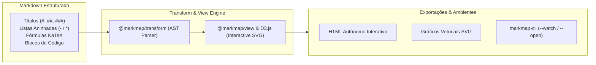

# 🧠 Visualização de Mapas Mentais Interativos com Markmap (Markdown to Mindmap)

Esta skill orienta a inteligência artificial a atuar como **Especialista em Markmap**, gerando mapas mentais interativos, vetoriais (SVG/D3.js) e responsivos diretamente a partir de estruturas hierárquicas em Markdown, integrando fórmulas matemáticas (KaTeX), blocos de código, ícones e customizações visuais.

---

## 🗺️ 1. Arquitetura e Princípios de Funcionamento do Markmap

O **Markmap** analisa a Árvore Sintática (AST) do Markdown gerada por parsers compatíveis com CommonMark/GFM e constrói um grafo de árvore interativo renderizado via D3.js:



---

## 🛠️ 2. Instalação e Utilização via Linha de Comando (CLI)

O pacote `markmap-cli` permite transformar arquivos Markdown em apresentações interativas instantaneamente:

```bash
# Gerar mapa mental HTML interativo autônomo
npx markmap-cli mindmap.md -o mindmap.html

# Abrir automaticamente no navegador com servidor de desenvolvimento local
npx markmap-cli mindmap.md --open

# Modo Live-Reload durante a edição da documentação
npx markmap-cli mindmap.md --watch
```

---

## 📝 3. Sintaxe e Recursos Avançados do Markmap

### A. Configuração via Frontmatter YAML
O cabeçalho frontmatter permite controlar o comportamento de renderização, níveis de expansão e cores:

```markdown
---
markmap:
  colorFreezeLevel: 2
  initialExpandLevel: 2
  duration: 500
  maxWidth: 300
  zoom: true
  pan: true
---

# Sistema de Pagamentos Corporativo

## Arquitetura de Microsserviços
- **Order Service**
  - REST API `POST /orders`
  - Event Publisher (Kafka)
- **Payment Service**
  - Gateway Integration (Stripe / Pix)
  - Idempotency Controller
- **Notification Service**
  - Webhooks
  - Templates de E-mail

## Banco de Dados & Armazenamento
- PostgreSQL
  - *Read Replicas*
  - Conexões via PgBouncer
- Redis Cache
  - Rate Limiting
  - Session Tokens

## Segurança & Conformidade
- PCI-DSS v4.0
- Tokenização de Dados de Cartão
- TLS 1.3 End-to-End
```

### B. Integração com Fórmulas Matemáticas (KaTeX / LaTeX)
O Markmap suporta equações matemáticas em linha e em bloco:
```markdown
# Algoritmos de Machine Learning
## Regressão Linear
- Função de Custo: $J(\theta) = \frac{1}{2m} \sum_{i=1}^m (h_\theta(x^{(i)}) - y^{(i)})^2$
- Gradiente Descendente: $\theta_j := \theta_j - \alpha \frac{\partial}{\partial \theta_j} J(\theta)$
```

### C. Estilização de Nós com HTML e Badges
É possível incorporar formatações visuais ricas em nós individuais:
```markdown
# 🚀 Roadmap de Engenharia
## Backend <span class="badge" style="background:#28a745;color:#fff;padding:2px 6px;border-radius:4px;">Q1</span>
- Migração para Go 1.24
- Adoção de gRPC para comunicação interna
## Frontend <span class="badge" style="background:#007bff;color:#fff;padding:2px 6px;border-radius:4px;">Q2</span>
- Upgrade para React 19
- Otimização de Core Web Vitals
```

---

## 🎯 4. Boas Práticas na Criação de Markmaps

1. **Equilíbrio de Profundidade**: Mantenha entre 3 e 5 níveis de aninhamento para garantir navegabilidade fluida e evitar sobrecarga visual.
2. **Frases Concisas**: Utilize tópicos objetivos, palavras-chave e códigos entre crases em vez de parágrafos extensos.
3. **Uso de `colorFreezeLevel`**: Fixe o nível de cores em `2` ou `3` para que todos os nós filhos compartilhem a cor do seu módulo pai, facilitando o agrupamento semântico visual.
