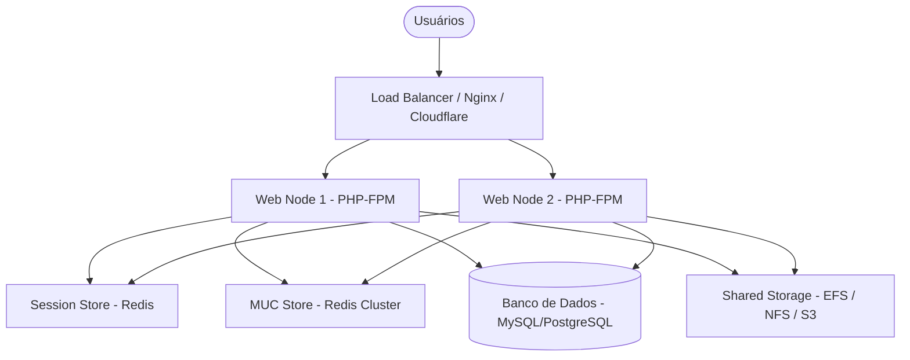

# 🌐 Infraestrutura e Performance Moodle (program-moodle-infra)

Esta skill fornece diretrizes de arquitetura, administração de sistemas e engenharia de confiabilidade (SRE) voltadas ao Moodle LMS. Deve ser ativada sempre que o desenvolvedor/arquiteto precisar planejar topologias de servidores, otimizar a performance da aplicação (PHP/Banco de Dados), configurar sistemas de cache distribuído (MUC), gerenciar o armazenamento compartilhado de dados (`moodledata`) ou orquestrar execuções assíncronas (Cron).

---

## 🎯 Objetivo da Skill
Capacitar o agente a desenhar, otimizar e manter infraestruturas Moodle escaláveis e resilientes de alta disponibilidade, preparadas para suportar milhares de usuários simultâneos, reduzindo o consumo de recursos de banco de dados e eliminando gargalos de I/O de disco.

---

## 🏗️ Topologia de Servidores e Alta Disponibilidade (Cluster Moodle)

Para escalar o Moodle horizontalmente, a arquitetura deve ser dividida em camadas isoladas e stateless (sem estado local):



### 1. Sessões Centralizadas
Em clusters com múltiplos nós web (Web Nodes), as sessões dos usuários devem ser armazenadas de forma centralizada para que a requisição de um usuário possa cair em qualquer nó sem que ele seja desconectado.
*   **Recomendação**: Armazenar sessões no Redis.
*   **Configuração no `config.php`**:
```php
$CFG->session_handler_class = '\core\session\redis';
$CFG->session_redis_host = 'redis-session.example.com';
$CFG->session_redis_port = 6379;
$CFG->session_redis_database = 0;
$CFG->session_redis_prefix = 'moodlesess_';
$CFG->session_redis_acquire_timeout = 3;
```

---

## ⚡ Otimização do PHP (php.ini)

O Moodle é intensivo em processamento PHP. O recurso de maior impacto na performance é a otimização da cache de código compilado (**OPcache**).

### 1. Configurações Recomendadas para o OPcache (`php.ini`):
```ini
opcache.enable=1
opcache.memory_consumption=256       ; Aumentar para 512 em servidores grandes
opcache.max_accelerated_files=10000   ; O Moodle possui milhares de arquivos PHP
opcache.validate_timestamps=0         ; Desabilita checagem de modificação de arquivo em produção (ganho de I/O)
opcache.save_comments=1               ; Obrigatório para o Moodle ler PHPDocs e Annotations
```

### 2. Recursos da Instância PHP
*   `memory_limit = 256M` (mínimo recomendado por processo PHP-FPM; 512M para tarefas administrativas CLI como restore de cursos grandes).
*   `max_execution_time = 30` (baixo tempo em nós web; tarefas demoradas devem rodar via CLI).

---

## 🧠 Moodle Universal Cache (MUC)

O MUC evita que o Moodle precise consultar o banco de dados para recuperar definições de tabelas, configurações de plugins e dados de cursos.

### 1. Configuração do Redis para MUC
*   Use uma instância dedicada ou base de dados separada da instância de sessões do usuário.
*   Configure os mapeamentos da cache no painel administrativo do Moodle (*Administração do Site > Plugins > Caching*), apontando as caches de **Aplicação** e **Sessão** para o Redis.

---

## 📁 Armazenamento Compartilhado (`moodledata`)

O diretório `moodledata` armazena arquivos enviados por alunos e professores, relatórios e arquivos temporários.

*   **Ambiente Single-Server**: Utilize SSDs NVMe locais de alta velocidade. Evite HDDs mecânicos devido ao alto índice de I/O de arquivos pequenos.
*   **Ambiente Multi-Nó (Cluster)**:
    - O diretório `moodledata` deve estar em um storage compartilhado acessível por todos os nós web (ex: Amazon EFS, NFSv4, Azure Files).
    - Para otimização extra de I/O, configure a pasta local de cache temporário do Moodle (`$CFG->localcachedir`) no disco rápido local de cada nó web (ex: `/tmp/moodle-cache`) ao invés do storage de rede compartilhado.
    - **Configuração no `config.php`**:
      ```php
      $CFG->localcachedir = '/var/local/moodlecache';
      ```

---

## ⚙️ Configuração do Cron do Sistema

O cron do Moodle processa tarefas cruciais em segundo plano. Ele **deve** ser disparado através do CLI a cada 1 minuto (nunca utilize o cron via URL web).

*   **Agendamento no Servidor (Linux Crontab)**:
    ```bash
    * * * * * /usr/bin/php /var/www/html/admin/cli/cron.php >/dev/null 2>&1
    ```
*   **Regra de Ouro em Cluster**: Em ambientes escalados horizontalmente, apenas um servidor web da rede deve estar ativo para rodar o cron, ou utilize ferramentas de locks distribuídos no banco para evitar execuções paralelas concorrentes.

---

## 🔗 Habilidades Relacionadas
*   **Moodle Core**: [program-moodle](../moodle/SKILL.md) — Configurações fundamentais do `config.php` e APIs.
*   **Banco de Dados (DBA)**: [program-moodle-dba](../moodle-dba/SKILL.md) — Otimização de queries lentas e tuning PostgreSQL/MySQL.
*   **Plugins & Ciclo de Vida**: [program-moodle-plugins](../moodle-plugins/SKILL.md) — Tarefas agendadas e backup em nível de código.

