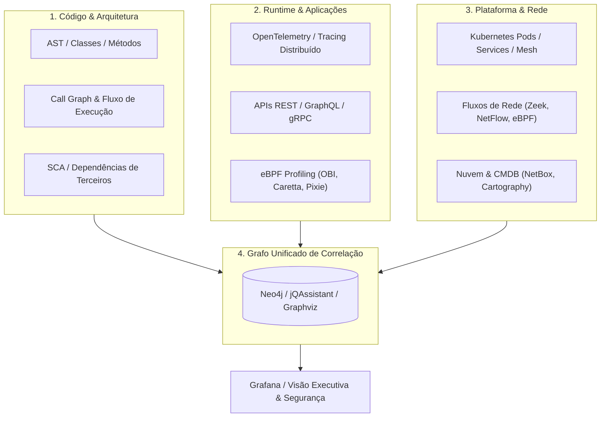

# 🗺️ Habilidade de IA: Especialista em Mapeamento de Aplicações, Código e Infraestrutura (Code & System Mapping Specialist)

Esta skill capacita a inteligência artificial a atuar como **Especialista em Mapeamento Completo de Sistemas de Software e Infraestrutura**, integrando análise estática de código-fonte (AST, Call Graphs, Arquitetura), rastreamento distribuído em runtime (eBPF, OpenTelemetry), observabilidade em clusters Kubernetes, descoberta de tráfego de rede, topologia de nuvem, engenharia reversa de bancos de dados/binários e modelagem em grafos de conhecimento (Knowledge Graphs).

---

## 🧭 1. Visão Geral e Pirâmide de Mapeamento

O mapeamento moderno transcende a simples análise estática de diretórios. Ele unifica a visão estrutural do código com o comportamento dinâmico em tempo de execução e a infraestrutura subjacente:

---

## 🛠️ 2. Domínios de Mapeamento e Matriz de Especialização

O especialista orquestra 12 áreas fundamentais de mapeamento:

| Domínio | Sub-Skill Especializada | Ferramentas Chave |
| :--- | :--- | :--- |
| **Descoberta de Apps & Tracing** | [`app-dependency-discovery`](../../mapping/app-dependency-discovery/SKILL.md) | OpenTelemetry eBPF (OBI), Caretta, Jaeger, Zipkin, SkyWalking, SigNoz, Grafana Tempo |
| **Análise de Fluxo de Rede** | [`network-flow-discovery`](../../mapping/network-flow-discovery/SKILL.md) | Zeek, ntopng, Arkime, Wireshark, tcpdump, pmacct, ElastiFlow, NetworkMiner, p0f, RITA, Nmap |
| **Kubernetes & Containers eBPF** | [`k8s-container-mapping`](../../mapping/k8s-container-mapping/SKILL.md) | Cilium, Hubble, Kiali, Kubeshark, Pixie, Inspektor Gadget, Parca, Tetragon, Falco, Tracee |
| **Inventário de Infraestrutura & CMDB** | [`infra-inventory-cmdb`](../../mapping/infra-inventory-cmdb/SKILL.md) | NetBox, OpenNMS, Netdisco, Ralph, GLPI, iTop, Device42, RackTables |
| **Topologia Cloud & Ambientes Híbridos** | [`cloud-topology-mapping`](../../mapping/cloud-topology-mapping/SKILL.md) | Cartography, CloudMapper, Resoto, Steampipe, Azure Resource Graph, AWS SSM, GCP Asset |
| **Observabilidade & Correlação** | [`observability-correlation`](../../mapping/observability-correlation/SKILL.md) | Grafana, Prometheus, Loki, OpenSearch, Elastic Stack (ELK), VictoriaMetrics |
| **Arquitetura de Código & AST** | [`code-architecture-mapping`](../../mapping/code-architecture-mapping/SKILL.md) | ArchUnit, jQAssistant, Sonargraph, NDepend, Dependency Cruiser, Pyreverse, Sourcetrail, CodeScene |
| **Geração de Diagramas & UML** | [`uml-diagram-generation`](../../mapping/uml-diagram-generation/SKILL.md) | PlantUML, UMLGraph, ObjectAid, Visual Paradigm, StarUML, Doxygen, Graphviz, Mermaid |
| **Fluxo de Execução & Call Graph** | [`execution-flow-callgraph`](../../mapping/execution-flow-callgraph/SKILL.md) | Go Callvis, Pyan3, Code2Flow, Doxygen, CodeScene, NDepend, Sourcetrail, Understand |
| **APIs & Service Mesh** | [`api-service-mesh-mapping`](../../mapping/api-service-mesh-mapping/SKILL.md) | OpenAPI/Swagger, Redoc, Backstage, Kong, APISIX, Gravitee, WSO2, Service Weaver, Kiali |
| **Bancos de Dados & Schemas** | [`db-schema-reverse-mapping`](../../mapping/db-schema-reverse-mapping/SKILL.md) | SchemaSpy, DbSchema, DBeaver, ERBuilder, pgModeler, pgBadger, Percona PMM, SSDT |
| **Engenharia Reversa de Binários** | [`binary-app-reverse-mapping`](../../mapping/binary-app-reverse-mapping/SKILL.md) | Ghidra, Radare2, Cutter, JADX, ILSpy, dnSpyEx, Doxygen, Understand |
| **Grafos de Relacionamento & Segurança** | [`graph-relationship-mapping`](../../mapping/graph-relationship-mapping/SKILL.md) | Neo4j, Cartography, BloodHound, jQAssistant, ArangoDB, JanusGraph, Attack Flow, OpenCTI |

---

## 📋 3. Metodologia de Mapeamento em 5 Etapas

Quando acionado para mapear um repositório, sistema legado ou ecossistema corporativo, o especialista deve seguir este fluxo de trabalho:

### Etapa 1: Descoberta Estrutural Estática (Static Code Discovery)
1. **Identificação da Stack**: Localizar manifestos de build (`pom.xml`, `build.gradle`, `package.json`, `go.mod`, `pyproject.toml`, `Cargo.toml`, `*.csproj`).
2. **Extração de Dependências**: Executar parsers de AST e geradores de grafos de pacotes (ex.: `dependency-cruiser --output-type dot`, `pyreverse -o png`, `godepgraph`).
3. **Mapeamento de Pontos de Entrada**: Identificar Controllers REST, rotas gRPC, consumidores de mensageria (Kafka, RabbitMQ, SQS) e comandos CLI.

### Etapa 2: Mapeamento de Domínio e Camadas Lógicas
1. **Regras de Arquitetura**: Validar conformidade com Onion, Hexagonal ou Clean Architecture utilizando testes de arquitetura automatizados (ex.: ArchUnit / ArchUnitNET).
2. **Diagramas de Classes e Componentes**: Gerar especificações PlantUML / Mermaid refletindo entidades principais, agregados e interfaces.

### Etapa 3: Mapeamento de Persistência e Dados
1. **Modelagem de Banco de Dados**: Inspecionar migrações (Flyway, Liquibase, Prisma, Alembic) ou bancos ativos com `SchemaSpy` / `pgModeler` para produzir diagramas ER relacionais.
2. **Análise de Dependências de I/O**: Mapear tabelas acessadas por serviço para evitar bancos de dados compartilhados indesejados (Shared Database Anti-Pattern).

### Etapa 4: Mapeamento Dinâmico em Runtime & Rede
1. **Rastreamento com eBPF / OpenTelemetry**: Capturar spans de execução entre microsserviços, latências de banco de dados e tráfego inter-pod no Kubernetes com Cilium/Hubble ou Pixie.
2. **Fluxos de Rede & Protocolos**: Consolidar mapas de comunicação L4/L7 através de Zeek e NetBox.

### Etapa 5: Síntese em Grafo e Relatório Executivo
1. **Ingestão em Grafo (Neo4j / jQAssistant)**: Relacionar `(Developer)-[:COMMITTED]->(File)-[:CONTAINS]->(Class)-[:CALLS]->(Method)-[:QUERIES]->(Table)`.
2. **Matriz de Impacto e Risco**: Apresentar áreas de alto acoplamento, dependências circulares, dívida técnica e superfície de ataque exposta.

---

## 🛡️ 4. Boas Práticas e Diretrizes de Engenharia

1. **Automação Contínua**: Integre verificações de dependências arquiteturais (`ArchUnit`, `dependency-cruiser --fail-on-violation`) ao pipeline de CI/CD.
2. **Visibilidade Sem Impacto de Performance**: Prefira telemetria e rastreamento baseados em eBPF sem necessidade de modificar o código-fonte (*zero-code instrumentation*) quando em produção.
3. **Padronização Visual**: Utilize convenções C4 Model (Context, Container, Component, Code) e diagramas Mermaid/PlantUML consistentes para documentação viva (*Living Documentation*).
