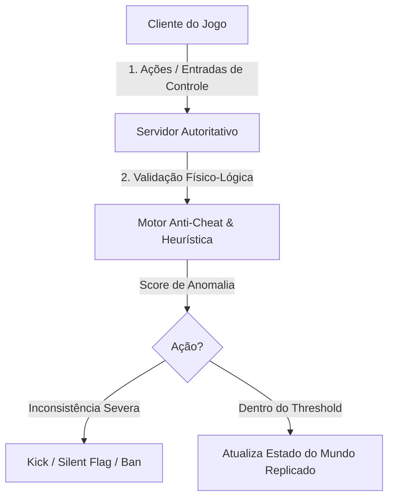

# Segurança, Engenharia Reversa e Hardening em Motores de Jogos (Unity, Unreal, Godot)

Esta skill fornece diretrizes abrangentes para auditoria ofensiva, testes de segurança, engenharia reversa e implementação de defesas e anti-cheat em motores de jogos modernos: **Unity Engine**, **Unreal Engine** e **Godot Engine**.

---

## 🎮 1. Matriz Comparativa de Vetores de Ataque por Motor

| Motor | Formato de Código | Pacote de Assets | Vetores de Ataque Críticos | Ferramentas Típicas de Reversa |
| :--- | :--- | :--- | :--- | :--- |
| **Unity** | C# (Mono IL) ou C++ nativo (IL2CPP) | `.assets`, AssetBundles, Addressables | Dump de `global-metadata.dat`, descompilação de `Assembly-CSharp.dll`, hooking com BepInEx/Frida | `dnSpy`, `ILSpy`, `Il2CppDumper`, `Il2CppInspector`, `AssetRipper` |
| **Unreal Engine** | C++ compilado nativo ou Blueprints | `.pak`, IoStore (`.utoc`/`.ucas`) | Desempacotamento de `.pak`, injeção em RPCs não-autoritativos, comandos de console (`EnableCheats`) | `FModel`, `UModel`, `UnrealPak`, `Cheat Engine`, `Ghidra` |
| **Godot** | GDScript (bytecode `.gdc`), C# ou C++ (GDExtension) | `.pck`, `.zip` | Extração de `.pck` via GDRETools, extração de chave AES da memória RAM, bypass de bytecode | `GDRETools`, `gdsdecomp`, `x64dbg`, `IDA Pro`, `Cheat Engine` |

---

## 🛡️ 2. Hardening e Proteções em Unity Engine

### 2.1 Compilação IL2CPP e Proteção de Metadados
- **IL2CPP Obrigatório**: Em *Project Settings > Player*, defina *Scripting Backend* para `IL2CPP`. O código C# é convertido em C++ nativo e compilado em máquina.
- **Obfuscação e Ofuscação de Metadados**:
  - Remova ou ofusque strings em `global-metadata.dat` (nomes de classes e métodos) usando ferramentas como *BeeByte Obfuscator* ou *Obfuscar*.
  - Aplique criptografia customizada no carregamento do `global-metadata.dat` antes da inicialização do Unity runtime.

### 2.2 Proteção contra Edição de Memória
- Utilize tipos ofuscados para variáveis críticas (vida, moedas, pontuação):
```csharp
public struct ObfuscatedInt
{
    private int _cryptoKey;
    private int _hiddenValue;

    public ObfuscatedInt(int value)
    {
        _cryptoKey = UnityEngine.Random.Range(1000, 99999);
        _hiddenValue = value ^ _cryptoKey;
    }

    public int GetValue() => _hiddenValue ^ _cryptoKey;
    public void SetValue(int value) => _hiddenValue = value ^ _cryptoKey;
}
```

---

## 🛡️ 3. Hardening e Proteções em Unreal Engine

### 3.1 Criptografia de Arquivos `.pak` e IoStore
- Ative criptografia AES-256 no *Project Settings > Crypto* (chave de 256 bits).
- Em builds de produção (*Shipping*), certifique-se de que `bDisableDebugConsole=true` e flags de console de trapaça (`EnableCheats`, `ToggleDebugCamera`) estão desabilitadas via pré-processador C++ `#if !UE_BUILD_SHIPPING`.

### 3.2 Segurança de Rede e Autoridade do Servidor
- **Server-Authoritative Physics & Movement**: O cliente envia comandos de entrada (`MoveForward`, `FireWeapon`), e o servidor calcula posições e impactos, replicando o estado via `ReplicatedUsing`.
- **Validação Estrita de RPCs**:
```cpp
// Validação server-side obrigatória em RPCs
bool AGameCharacter::ServerFireWeapon_Validate(FVector AimDirection)
{
    // Rejeitar se a direção for NaN ou além do campo de visão possível
    return !AimDirection.ContainsNaN() && FVector::DotProduct(GetActorForwardVector(), AimDirection) > -0.2f;
}
```

---

## 🛡️ 4. Hardening e Proteções em Godot Engine

### 4.1 Export Templates Customizados e Criptografia `.pck`
- Compile export templates a partir do código-fonte do Godot usando SCons com chave AES embutida:
  ```bash
  scons platform=windows target=template_release script_encryption_key="MINHA_CHAVE_HEX_256_BITS"
  ```
- Altere os magic bytes e a estrutura de cabeçalho do arquivo de pacotes em `core/io/file_access_pack.cpp` para neutralizar ferramentas automáticas de desempacotamento como GDRETools.

### 4.2 Lógicas Críticas em GDExtension C++
- Transfira lógicas antifraude, validação de regras de combate e algoritmos proprietários de GDScript para módulos compilados C++ nativos (`GDExtension`).

---

## 🔒 5. Arquitetura Anti-Cheat Integrada


